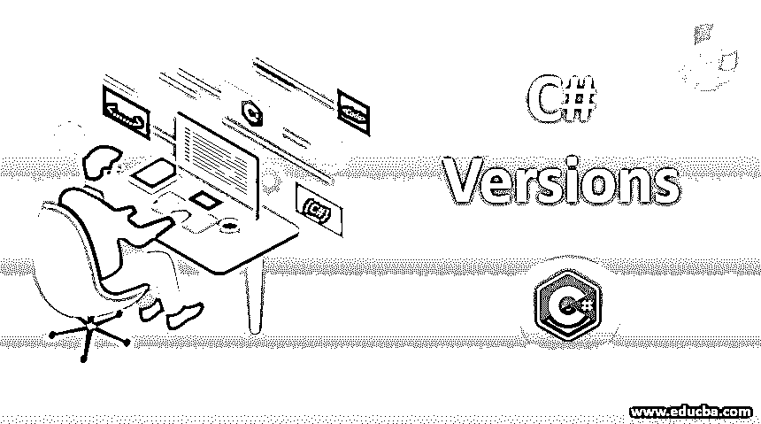

# C#版本

> 原文：<https://www.educba.com/c-sharp-versions/>




## C#版本简介

C#是一种面向对象的语言。它非常简单而且功能强大。这种语言是由微软开发的。C#第一次发布是在 2002 年。此后，以下版本陆续发布。在本文中，我们将讨论不同的版本。

### C#的版本

这里我们将讨论 C#的版本。下面给出了 C#的版本:

<small>网页开发、编程语言、软件测试&其他</small>

#### 1.1.0 版

这个版本就像 java。它缺乏异步能力和一些功能。该版本的主要特性如下

**类:**是用来创建对象的蓝图。

*   每个文件只能有一个公共类。
*   注释可以出现在任何一行的开头或结尾。
*   如果文件中有公共类，文件名必须与公共类的名称匹配。
*   如果存在，package 语句必须是第一行。
*   import 语句必须位于 package 语句(如果有)和 class 声明之间。
*   如果没有 package 或 import 语句，则类声明必须是源代码文件中的第一行。
*   import 和 package 语句适用于源代码文件中的所有类。
*   没有公共类的文件的名称可以不与文件中的任何类名匹配。

**代码:**

```
// declaring public class
public class Test
{
// variable
public int a, b;
// member function
public void display()
{
WriteLine(“Class in C#”);
}
}
```

**结构:**在 Struct 中，我们可以在单个变量下存储不同的数据类型。我们可以在结构中使用用户定义的数据类型。我们必须使用 struct 关键字来定义它。

**代码:**

```
using System;
namespace ConsoleApplication {
// structure
public struct Emp
{
// different data types
public string Name;
public int Age;
public int Empno;
}
class Geeks {
// Main Method
static void Main(string[] args)
{
// Declare P1 of type Person
Person P1;
// P1's data
P1.Name = "Ram";
P1.Age = 21;
P1.Empno = 80;
// Displaying the values
Console.WriteLine("Data Stored in P1 is " +
P1.Name + ", age is " +
P1.Age + " and empno is " +
P1.empno);
}
}
}
```

**接口:**

*   接口用作类的协定。
*   所有接口方法都是隐式公共和抽象的。
*   所有接口变量都是公共的 static final。
*   不允许静态方法。
*   该接口可以扩展多个接口。
*   类可以实现多个接口。
*   实现接口的类应该定义接口的所有方法，或者应该声明它是抽象的。

**文字:**变量使用的值。这就像一个常量值。

**代码:**

```
class Test {
// Main method
public static void Main(String []args)
{
int a = 102;
// octal-form literal
int b = 0145
;
// Hexa-decimal form literal
int c = 0xFace;
Console.WriteLine(a);
Console.WriteLine(b);
Console.WriteLine(c);
}
}
```

**代表:**这就像一个指针。它是保存其他方法的引用类型变量。

#### 2.1.2 版

在这个版本中，做了一些增强。他们在这个版本中添加了 for each 循环，它将执行每个块，直到表达式为假。

#### 3.2.0 版

在这个版本中，他们增加了以下高级功能。

泛型:泛型编程是计算机编程的一种风格，在这种编程中，算法是根据以后将被指定的类型来编写的，这些类型在需要时被实例化为作为参数提供的特定类型。

**匿名方法:**这是一个空白方法。这是使用关键字 delegate 定义的。

*   可空类型:在这个版本之前，我们不能将变量定义为空。所以这个版本克服了这个问题。
*   迭代程序
*   协方差和逆变
*   Getter/setter 独立可访问性:我们可以使用 getter setter 来获取和设置值。

#### 4.3.0 版

这个版本使 C#成为一种强大的编程语言。

*   对象和集合初始化器:有了它的帮助，我们不用调用构造函数就可以访问任何字段。
*   分部方法:顾名思义，它的签名和实现是分开定义的。
*   我们可以通过使用关键字 Var 来定义任何变量。

#### 5.4.0 版

该版本引入了一些有趣的功能:

**动态绑定:**这就像[方法覆盖](https://www.educba.com/method-overriding-in-java/)。这里编译器不决定调用哪个方法。

**代码:**

```
public class ClassA
{
public static class superclass
{
void print()
{
System.out.println("superclass.");
}
}
public static class subclass extends superclass
{
@Override
void print()
{
System.out.println("subclass.");
}
}
public static void main(String[] args)
{
superclass X = new superclass();
superclass Y= new subclass();
X.print();
Y.print();
}
}
```

*   命名/可选参数
*   一般协变和逆变
*   嵌入式互操作类型

这里的主要特点是关键字动态。它在运行时重写编译器。

#### 6.5.0 版

在这个版本中，他们增加了两个新的异步编程模型。

**异步等待**

有了这些，我们很容易检索到关于上下文的信息。这对于长时间运行的操作非常有帮助。在此异步启用关键字 await。在 await 关键字的帮助下，所有的事情都变得异步。所以它同步运行，直到关键字等待。

#### 7.6.0 版

该版本包括以下功能

*   静态进口
*   表达主体成员
*   零传播子
*   在 catch/finally 块中等待
*   仅 getter 属性的默认值
*   异常过滤器
*   自动属性初始化器
*   字符串插值
*   操作员的姓名
*   索引初始值设定项

#### 8.7.0 版

这个版本有以下优点

**Out Variables:** 这个变量基本上用在方法必须返回多个值的时候。关键字 out 用于传递给参数。

**其他重要方面有**

*   元组和解构。
*   引用局部变量和返回。
*   丢弃:这些是只写就绪变量。基本上这是用来忽略局部变量。
*   二进制文字和数字分隔符。
*   抛出表达式
*   模式匹配:我们可以在任何数据类型上使用它。
*   局部函数:在这个函数的帮助下，我们可以在方法体中声明已经在方法中定义的方法。
*   扩展表达体成员。

因此，每个版本都包含了 C#中的新特性，帮助开发人员以高效的方式解决复杂的问题。下一个版本将是 C# 8.0。

### 推荐文章

这是一个 C#版本的指南。在这里，我们将讨论基本概念、各种类型的 C#版本以及示例和代码实现。您还可以浏览我们推荐的其他文章——

1.  [c#中的回文](https://www.educba.com/palindrome-in-c-sharp/)
2.  [C#文字量](https://www.educba.com/c-sharp-literals/)
3.  [C#可空](https://www.educba.com/c-sharp-nullable/)
4.  [c#中的运算符重载](https://www.educba.com/operator-overloading-in-c-sharp/)


