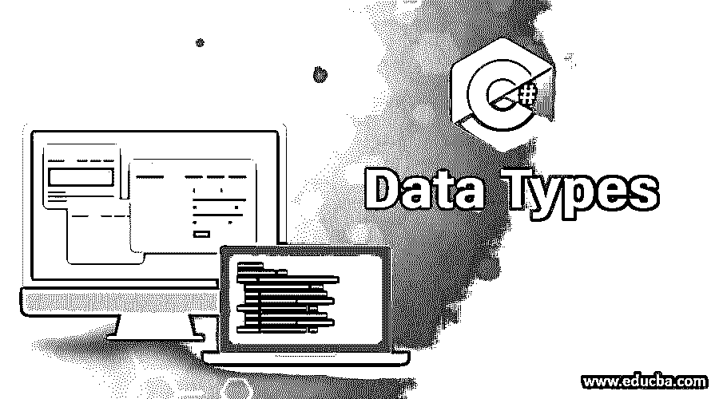
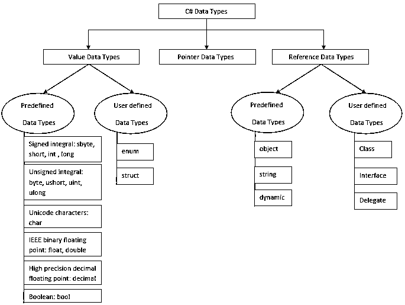
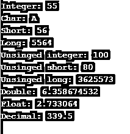
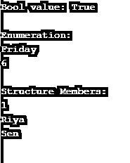
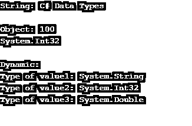

# C#数据类型

> 原文：<https://www.educba.com/c-sharp-data-types/>




## C#数据类型简介

顾名思义，数据类型就是要存储在变量中的数据类型。数据类型用于向编译器或解释器建议要处理哪种数据，以及该数据需要多少内存。

For Ex: int 是一种存储数值的数据类型，需要四个字节。

<small>网页开发、编程语言、软件测试&其他</small>

由于 C#是一种强类型语言，所以在使用它之前有必要声明变量或常量的类型。适当地使用数据类型可以节省内存并提高应用程序的性能。

**语法:**

```
datatype <variable_name> = value;
```

**C #数据类型的例子:**

1.int intVal = 55 在这个例子中:int 是一个数据类型，intVal 是一个变量名称，55 是一个值。

2.char charVal = ' A

3.string strVal = "Hello World！";

4.float floatVal = 15.5f

5\. bool boolVal = true;

### 前三种 C#数据类型

C#数据类型分为三类:




#### 1.值类型

*   将变量的值直接存储在内存中。
*   接受有符号和无符号文本。

C#中有两种类型的值数据类型:

1.  预定义的数据类型，如 int、char、bool 等。
2.  用户定义的数据类型，如 enum、struct 等。

#### 2.参考类型

*   它们存储变量的地址，即它们包含对变量的引用。
*   如果一个变量更改了数据，另一个变量将自动获得更新后的值。

C#中有两种类型的引用数据类型:

1.  预定义的类型，如对象、字符串
2.  用户定义的类型，如类、接口

#### 3.指针类型

*   它们包含变量的内存地址。

指针中使用的符号:

1.  &(与号):地址运算符，决定变量的地址
2.  *(星号):间接运算符，访问地址的值

### 不同数据类型的示例

下面是 C#中不同数据类型的一些例子，

#### 示例 1:一些值类型

```
using System;
public class ValueDataTypes
{
public static void Main()
{
//int - 32-bit signed integer type
int i = 55;
//char - 16-bit Unicode character
char ch = 'A';
//short - 16-bit signed integer type
short s = 56;
//long - 64-bit signed integer type
long l = 5564;
//uint - 32-bit unsigned integer type
uint ui = 100;
//ushort - 16-bit unsigned integer type
ushort us = 80;
//ulong - 64-bit unsigned integer type
ulong ul = 3625573;
//double - 64-bit double precision floating point type
double d = 6.358674532;
//float - 32-bit single-precision floating point type
//float needs 'f' or 'F' as suffix
float f = 2.7330645f;
//decimal - 128-bit precise decimal values with 28-29 significant digits
//decimal needs 'm' or 'M' as suffix
decimal dec = 339.5m;
Console.WriteLine("Integer: " + i);
Console.WriteLine("Char: " + ch);
Console.WriteLine("Short: " + s);
Console.WriteLine("Long: " + l);
Console.WriteLine("Unsinged integer: " + ui);
Console.WriteLine("Unsinged short: " + us);
Console.WriteLine("Unsinged long: " + ul);
Console.WriteLine("Double: " + d);
Console.WriteLine("Float: " + f);
Console.WriteLine("Decimal: " + dec);
}
}
```

**输出:**




#### 示例 2:布尔、枚举和结构数据类型

该结构是一种复合类型，用于存储不同数据类型的相关数据。 [Enum 用于](https://www.educba.com/enum-in-c-sharp/)给整型常量赋值。

```
using System;
public class BoolEnumStruct
{
//declaring enum
enum Days { Saturday, Sunday, Monday, Tuesday, Wednesday, Thursday, Friday };
//declaring structure
struct Student
{
public int Id;
public string FirstName;
public string LastName;
public Student(int id, string fname, string lname)
{
Id = id;
FirstName = fname;
LastName = lname;
}
}
public static void Main()
{
//boolean data type
bool flag = true;
if(flag)
{
Console.WriteLine("Bool value: "+flag);
Console.WriteLine();
}
//Accessing enum value for Friday
Console.WriteLine("Enumeration:");
Console.WriteLine(Days.Friday);
Console.WriteLine((int)Days.Friday);
Console.WriteLine();
//passing values to structure members using constructor
Student student = new Student(1, "Riya", "Sen");
Console.WriteLine("Structure Members:");
Console.WriteLine(student.Id);
Console.WriteLine(student.FirstName);
Console.WriteLine(student.LastName);
}
}
```

**输出:**




#### 示例#3:引用数据类型

```
using System;
public class StrObjDynamic
{
public static void Main()
{
string str = "C# ";
str += "Data Types";
Console.WriteLine("String: "+str);
Console.WriteLine();
//declaring object
object obj;
obj = 100;
Console.WriteLine("Object: "+obj);
//displaying type of object using GetType()
Console.WriteLine(obj.GetType());
Console.WriteLine();
//declaring dynamic variables
dynamic value1 = "Hello World!";
dynamic value2 = 5296;
dynamic value3 = 6.5;
//displaying actual type of dynamic variables using GetType()
Console.WriteLine("Dynamic:");
Console.WriteLine("Type of value1: {0}", value1.GetType().ToString());
Console.WriteLine("Type of value2: {0}", value2.GetType().ToString());
Console.WriteLine("Type of value3: {0}", value3.GetType().ToString());
}
}
```

**输出:**




#### 例子#4:接口

接口可以将属性、方法、事件和索引器作为其成员。它只包含其成员的声明。其成员的实现由隐式或显式实现它的类提供。

```
using System;
interface Shape
{
void rectangle();
}
public class Area : Shape
{
//implementing interface method
public void rectangle()
{
Console.WriteLine("Area of rectangle is Length * Breadth");
}
public static void Main(String[] args)
{
Area area = new Area();
area.rectangle();
}
}
```

**输出:**


#### 例子 5:委托

委托是保存对方法的引用的对象。

```
using System;
public class DelegateDemo
{
// Declaring delegate
public delegate void Sum(int a, int b);
public void SumVal(int a, int b)
{
Console.WriteLine(a +"+"+ b+ " = {0}", a + b);
}
public static void Main(String[] args)
{
DelegateDemo delegateDemo = new DelegateDemo();
// Creating object of delegate
Sum sum = new Sum(delegateDemo.SumVal);
//Passing values to the method using delegate object
sum(100, 100);
}
}
```

**输出:**


### 结论

*   值类型存储在堆栈中。
*   引用类型存储在堆中。
*   当值类型被转换成引用类型时，它被称为装箱(隐式转换过程)**。**
*   当引用类型被转换为值类型时，它被称为 unboxing(显式转换过程)**。**

### 推荐文章

这是 C#数据类型指南。在这里，我们将讨论这些类型以及不同的数据类型示例。你也可以看看下面的文章来了解更多-

1.  [c#中的命名空间](https://www.educba.com/namespaces-in-c-sharp/)
2.  [c#中的 2D 数组](https://www.educba.com/2d-arrays-in-c-sharp/)
3.  [换入 C#](https://www.educba.com/swapping-in-c-sharp/)
4.  [c#中的对象](https://www.educba.com/objects-in-c-sharp/)


