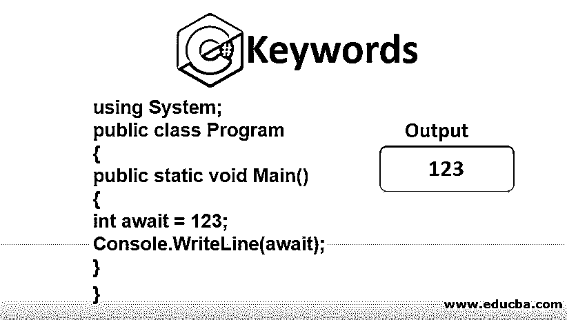
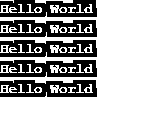

# C#关键字

> 原文：<https://www.educba.com/c-sharp-keywords/>




## C#关键字简介

下面这篇文章是编程世界中一个非常基本的概念。本文涵盖了 C#编程语言中的关键字。是学习编码的敲门砖。我们将通过例子探索 C#中最初级的关键字。让我们开始吧。

**Note: **This article references C# v4.0\. Some keywords may not have been introduced in earlier versions while newer keywords may have been introduced in later versions.

**什么是关键词？**
关键字是[任何编程语言](https://www.educba.com/what-is-a-programming-language/)中的保留字。

<small>网页开发、编程语言、软件测试&其他</small>

它们是留给谁的？
它们是为编译器保留的。

**他们为什么有所保留？**
这些关键字向编译器传达一些特殊的含义。每当编译器遇到一个关键字，它就继续执行与该关键字相关联的某一组指令。

我在程序中的什么地方使用它们？
每个程序都包含关键字和标识符的组合。标识符是用户定义的程序元素。关键字不是用户定义的。因此，它们不能用作标识符。
还记得你学的第一个“你好，世界”节目吗？您使用了一些关键字，如 public、string、static、void 等。

### C#中的关键字类型

下面是 C#中的两种类型的关键字:

#### 形容词（adjective 的缩写）保留关键字

C#中的保留关键字是为程序任何部分的编译器保留的。

**1。基数**

在派生类中，base 关键字用于访问基类的成员。

****例如:****

```
using System;
public class Car
{
public void DisplayInfo(string engine)
{
Console.WriteLine("Engine - {0}", engine);
}
}
public class Ferrari : Car
{
public void DisplayInfo()
{
base.DisplayInfo("1.6 Litre 4-cylinder");
Console.WriteLine("Company - Ferrari");
}
}
public class Program
{
public static void Main()
{
var myCar = new Ferrari();
myCar.DisplayInfo();
}
}
```

****输出:****


**2。bool、byte、char、double、decimal、float、int、long、sbyte、short、string、uint、ulong、ushort**

所有这些[关键字都用来](https://www.educba.com/c-plus-plus-keywords/)指定变量的类型。当你指定一个变量的类型时，你告诉编译器这个变量可以存储的值的类型。例如，int 可以存储整数值，而不是字符串。

****例如:****

```
using System;
public class Program
{
public static void Main()
{
bool varBool = true; // stores either true or false values
byte varByte = 205; // stores unsigned 8-bit integer (0 to 255)
sbyte varSByte = -128; // stores signed 8-bit integer (-128 to 127)
short varShort = -12345; // stores signed 16-bit integer (-32768 to 32767)
ushort varUShort = 65000; // stores unsigned 16-bit integer (0 to 65535)
int varInt = -1234567890; // stores signed 32-bit integer
uint varUInt = 1234567890; // stores unsigned 32-bit integer
long varLong = -9876543210; // stores signed 64-bit integer
ulong varUL = 9876543210; // stores unsigned 64-bit integer
char varChar = 'a'; // stores a single unicode character
string varString = "abc"; // stores a string of characters
float vsrFloat = 0.12F; // stores floating point numbers (4 bytes)
double varDouble = 1.23; // stores large floating point numbers (8 bytes)
decimal varDec = 4.56M; // stores large floating point numbers (16 bytes)
}
}
```

**3。中断、继续、转到**

break 和 continue 语句用于在运行时改变循环的当前迭代。break 关键字中断循环并退出，而不执行剩余的迭代。continue 语句退出循环的当前迭代，继续下一次迭代。

goto 关键字用于将程序的执行跳转到任何一行。该行带有一个在[goto 语句](https://www.educba.com/goto-statement-in-c/)中引用的特定标签。

****例如:****

```
using System;
public class Program
{
public static void Main()
{
for (int i = 1; i &lt; 10; i++)
{
if (i % 2 == 0)
{
Console.WriteLine("{0} is even. Continuing to next iteration.", i);
continue;
}
if (i % 3 == 0)
{
goto myLabel;
}
if (i % 7 == 0)
{
Console.WriteLine("Found 7\. Exiting loop.");
break;
}
continue; // To prevent execution of next statement unless goto statement encountered.
myLabel:
Console.WriteLine("{0} is non-even multiple of 3", i);
}
}
}
```

****输出:****


**4。尝试，捕捉，最后**

关键字 try、catch 和 finally 用于异常处理。任何可能在运行时导致异常的代码都包含在 try 块中。catch 块捕获异常并处理块中定义的一组指令。无论是否抛出异常，finally 块总是被执行。

****例如:****

```
using System;
public class Program
{
public static void Main()
{
int[] myArray = new int[]{1, 2, 3, 4, 5};
try
{
for (int i = 0; i <= 5; i++)
{
Console.WriteLine(myArray[i]);
}
}
catch (Exception e)
{
Console.WriteLine("{0} exception occurred.\n", e.GetType());
}
finally
{
myArray.Dump();
}
}
}
```

**5。类、枚举、接口、结构**

这些关键字用于在 C#中定义用户定义的类型。

****例如:****

```
using System;
public interface Days
{
void DisplayDayOfWeek(int x);
}
public struct StructOfEnums : Days
{
public enum Days
{
Sun = 1,
Mon,
Tue,
Wed,
Thu,
Fri,
Sat
}
public enum OrdinalNum
{
First = 1,
Second,
Third,
Fourth,
Fifth,
Sixth,
Seventh
}
public void DisplayDayOfWeek(int num)
{
Console.WriteLine("{0} day of week is {1}", (OrdinalNum)num, (Days)num);
}
}
public class Program
{
public static void Main()
{
new StructOfEnums().DisplayDayOfWeek(1);
}
}
```

****输出:****


**6。常量，只读**

关键字 const 和 readonly 用于在 C#中定义常量和只读类型字段。常数字段是编译时常数，而只读字段可以在运行时初始化。只读字段可以通过构造函数多次重新分配，但在构造函数退出后不能更改。

****例如:****

```
using System;
public class Program
{
public const double AccelerationOfGravity_g = 9.8;
public readonly double mass;
public Program(double mass)
{
this.mass = mass;
}
public double CalculateWeight()
{
return this.mass * AccelerationOfGravity_g;
}
public static void Main()
{
var body1 = new Program(130.8d);
var body2 = new Program(98.765d);
Console.WriteLine("Weight of body 1 (W = m x g) = {0} newtons", body1.CalculateWeight());
Console.WriteLine("Weight of body 2 (W = m x g) = {0} newtons", body2.CalculateWeight());
}
}
```

****输出:****


**7。一边做，一边**

这些关键字实现 do-while 和 while 循环。

****例如:****

```
using System;
public class Program
{
public static void Main()
{
int i = 0;
do
{
Console.WriteLine("Hello World");
i++;
}
while (i < 5);
}
}
```

****输出:****




**8。如果，否则**

这些关键字在程序中实现 if-then-else 逻辑。

****例如:****

```
using System;
public class Program
{
public static void Main()
{
int i = 1;
if (i == 0)
Console.WriteLine("Hello World");
else
Console.WriteLine("Hey There!");
}
}
```

****输出:****


**9。真，假**

这些关键字表示 the 和 falsy 的布尔值。

****例如****

```
using System;
public class Program
{
public static void Main()
{
bool val = true;
if (val)
Console.WriteLine("Hello World");
else
Console.WriteLine("Hey There!");
}
}
```

****输出:****


10。for，foreach

这些关键字实现了 for 和 [foreach 循环](https://www.educba.com/powershell-foreach-loop/)。

****例如:****

```
using System;
public class Program
{
public static void Main()
{
int[] num = {1, 2, 3, 4, 5};
for (int i = 0; i < num.Length; i++)
Console.Write("{0}\t", i);
Console.WriteLine();
foreach (int i in num)
Console.Write("{0}\t", i * i);
}
}
```

****输出:****


**11。私有、受保护、公共、内部**

这些关键字是 C#中的访问修饰符。它们控制程序的任何部分中任何 C#元素的可访问性。

****例如:****

```
using System;
public class MyClass
{
// ascending order of accessibility
private int a;
protected int b;
internal int c;
public int d;
}
```

**12。新**

用于声明一个新对象。

****例如:****

```
using System;
public class Program
{
public static void Main()
{
var a = new int[3]{1, 2, 3};
}
}
```

**13\. null**

降级空值。

****例如:****

```
Using System;
public class Program
{
public static void Main()
{
string a = null;
Console.Write(a);
}
}
```

****输出:****


**14。返回**

该关键字将控件从当前方法返回到调用方法。

****例如:****

```
using System;
public class Program
{
public static int sum(int x, int y)
{
return x + y;
}
public static void Main()
{
Console.Write("Sum of 5 and 6 is {0}", sum(5, 6));
}
}
```

****输出:****


15。静态

用于将类成员声明为静态。

****例如:****

```
using System;
public class Program
{
public static void Main()
{
Console.WriteLine("Hello World");
}
}
```

****输出:****


16。开关，外壳

这些关键字实现了程序中的切换条件。

****例如:****

```
using System;
public class Program
{
public static void Main()
{
var abc = true;
switch (abc)
{
case true:
Console.WriteLine("Hello World");
break;
case false:
Console.WriteLine("Hey There!");
break;
}
}
}
```

****输出:****


**17。这个**

这个关键字是对当前类实例的引用。

****例如:****

```
using System;
public class Program
{
int myVar;
public Program(int val)
{
this.myVar = val;
}
public static void Main()
{
Program obj = new Program(123);
Console.WriteLine(obj.myVar);
}
}
```

****输出:****

****

**** 

18。使用

该关键字用于在当前程序中包含库。

****例如:****

```
using System;
```

**19。无效**

该关键字用作不返回任何值的方法的返回类型。

****例如:****

```
using System;
public class Program
{
public static void Main()
{
Console.WriteLine("Hello World");
}
}
```

****输出:****


#### B.上下文关键词

在 C#中，上下文关键字不是保留关键字。相反，它们在代码的相关部分传达特殊的含义。这意味着只要不相关，上下文关键字就可以用作有效的标识符。

****例如:****

下面的示例显示了上下文关键字可以在某些代码区域中用作有效的标识符。

```
using System;
public class Program
{
public static void Main()
{
int await = 123;
Console.WriteLine(await);
}
}
```

****输出:****


上下文关键字的一些例子是 async、await、let、nameof、get、set、var、value、join 等。

### 结论

本文涵盖了任何语言编程的基本概念。[关键字是构建](https://www.educba.com/sql-keywords/)块的代码。理解每个关键词所传达的意思是非常重要的。此外，建议探索更多在每个程序中不经常使用的关键字。

### 推荐文章

这是一个 C#关键字的指南。这里我们讨论 C#中保留的和上下文相关的 C#关键字的类型，以及不同的例子和代码实现。你也可以看看下面的文章来了解更多-

1.  [c#中的对象](https://www.educba.com/objects-in-c-sharp/)
2.  [c#中的 2D 数组](https://www.educba.com/2d-arrays-in-c-sharp/)
3.  [c#中的指针](https://www.educba.com/pointers-in-c-sharp/)
4.  [换入 C#](https://www.educba.com/swapping-in-c-sharp/)


