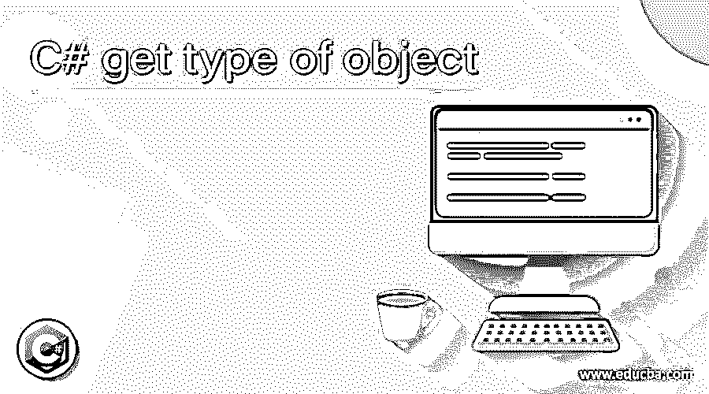
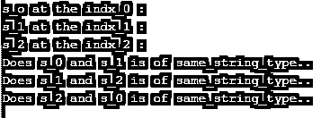

# 获取对象的类型

> 原文：<https://www.educba.com/c-sharp-get-type-of-object/>




## C# get 对象类型的定义

C# get 类型的对象用于获取任何当前实例执行时的确切运行时。表示系统的对象称为系统对象，方法中的 get 类型对象使用它来表示所有。类别中的 NET 类型值。使用 C# comparison 关键字，这使得使用包含 object 的 GetType 方法来确定该方法中存在的任何特定类型的对象成为可能。GetType 方法中存在的类型用于公开与 object 的当前类相关联的所有元数据。

**语法:**

<small>网页开发、编程语言、软件测试&其他</small>

C# get 对象类型的语法表示如下:

```
public data_Type GetType();
```

*   public–这是默认的访问修饰符，用于获取数据和值的类型。
*   data _ type–它是用于使对象在方法中包含该类型的数据类型。
*   GetType()–这是在执行任何当前实例时用于获取确切运行时的方法。

### 如何在 C#中获取对象的类型？

C#中的 Get 类型对象有一个完整的工作流，用来表示程序在执行时运行时的当前状态。C#中的 get type 对象不知道是否使用了任何内部编译或 CLR，也不知道它将如何工作以获得抛弃或获得实际编译，但事实是，最重要的不是系统的编译时间，而是代码的运行时间。

Get type()方法是一种由系统对象组成的方法，它依赖于激发方法表进行操作。

方法表是 CLR 数据结构中不可或缺的组成部分之一，它描述了其中的任务和整个内置特性。

此方法表及其关联的数据结构用于实现放置在不同内存位置的 CLR，以便获得具有其必需方法类型的进程，并包括推断接口类型。

方法表的返回类型是指向初始数据结构的指针，用于访问内存或元素堆中的对象。

当使用 C#中的 get type()对象来实现整个系统和逻辑时，堆中的每个对象都有严格的大小调整特性。根据要求，它可以是 32 位或 64 位。

方法表还具有作为返回类型的指针，该指针被放置成通过也具有指向另一个对象的能力的指针来分离已经放置在现有存储器中的对象的引用。方法表有可能由零组成或为空，因此可进一步用于任何与地址位置相关的同步方法。

方法中存在的 Type 也有一个意义，它主要用于检查和验证 type 对象是否被创建。如果没有对象类型，这意味着如果它不存在，则怀疑它试图使用对方法表的间接调用来创建，该方法表再次由对适当类型的对象的对象引用来管理。可以避免引用对象，因为在发布模式下，它只是对象的 GetType()方法中对象的别名。

### 例子

让我们讨论 C# get 类型对象的例子。

#### 示例#1

这个程序演示了 GetType()方法，该方法在运行和验证时返回整个程序的运行时执行的当前实例，如输出所示。

**代码:**

```
using System;
public class MTst_Class
{
}
public class One_Inherited_Class: MTst_Class
{
}
public class Verify_1
{
public static void Main()
{
MTst_Class m_test = new MTst_Class();
One_Inhrited_Class m_Inhrtd = new One_Inhrited_Class();
object j_0 = m_Inhrtd;
MTst_Class k_0 = m_Inhrtd;
Console.WriteLine("initial_Mtst_class: Value is 0.", m_test.GetType());
Console.WriteLine("m_Inhrtd: Value is 0.", m_Inhrtd.GetType());
Console.WriteLine("object comes out to be j_0 = m_Inhrited class type", j_0.GetType());
Console.WriteLine("MTst_Class K_0 is type of value.", k_0.GetType());
}
}
```

**输出:**


#### 实施例 2

这个程序演示了 C#的 get type()和 type of()方法之间的区别，如输出所示。使用 C#编程语言的 comparison 关键字可以清楚地说明两者的区别。

**代码:**

```
using System;
public class Gt_Type
{
static public void Main()
{
string s_0 = "Welcome";
Type p_9 = typeof(string);
Type w_0 = s_0.GetType();
Console.WriteLine(p_9 == w_0);
object ob_1 = "Everyone";
Type b_0 = typeof(object);
Type m1 = ob_1.GetType();
Console.WriteLine(b_0 == m1);
}
}
```

**输出:**


#### 实施例 3

这个程序演示了 GetType()方法，该方法用于从系统中获取并比较第一种类型的值和第二种类型的值，如输出所示。

**代码:**

```
using System;
class Grtr_Type
{
static public void Main()
{
string st_0 = "Fast";
string st_1 = "Furious_0";
Console.WriteLine("Value for first type: " +st_0.GetType());
Console.WriteLine("Value for second type: " +st_1.GetType());
}
}
```

**输出:**


#### 实施例 4

这个程序演示了使用具有相等条件的对象引用来比较两个字符串，以检查作为输入的两个字符串是否属于相同的类型，如输出中所示。

**代码:**

```
using System;
class GetType_0
static public void Main()
{
string s_0 = "C##";
string s_1 = "DS&A";
int s_2 = 22;
Console.WriteLine("s_o at the indx_0 :", s_0);
Console.WriteLine("s_1 at the indx_1 :", s_1);
Console.WriteLine("s_2 at the indx_2 :", s_2);
Console.WriteLine("Does s_0 and s_1 is of same_string_type..",
Object.ReferenceEquals(s_0.GetType(), s_1.GetType()));
Console.WriteLine("Does s_1 and s_2 is of same_string_type..",
Object.ReferenceEquals(s_1.GetType(), s_2.GetType()));
Console.WriteLine("Does s_2 and s_0 is of same_string_type..",
Object.ReferenceEquals(s_2.GetType(), s_0.GetType()));
}
}
```

**输出:**




### 结论

C# get type 方法在 C#编程中起着重要的作用，因为它用于获取引用和数据类型以及关于对象的更多细节。它有助于使整个对象定位和内部功能简化，以便针对存储位置和元素寻址进行分析和操作。

### 推荐文章

这是一个 C#获取对象类型的指南。这里我们讨论定义，如何在 C#中获取对象的类型？，及其语法和示例。您也可以看看以下文章，了解更多信息–

1.  [C#事件处理程序](https://www.educba.com/c-sharp-eventhandler/)
2.  [C#检查对象类型](https://www.educba.com/c-sharp-check-object-type/)
3.  [C#对象序列化](https://www.educba.com/c-sharp-object-serialization/)
4.  [C#对象到 XML](https://www.educba.com/c-object-to-xml/)


