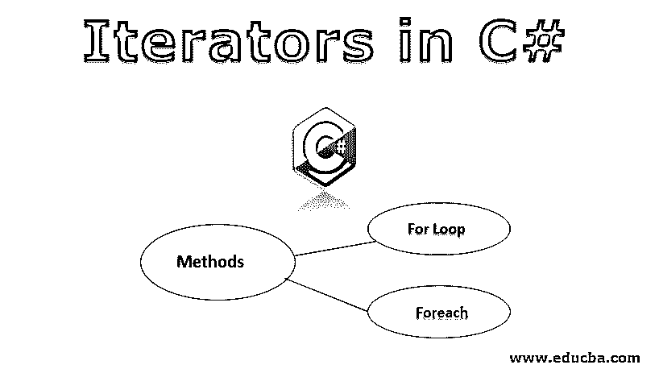
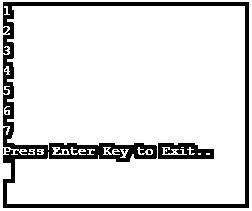
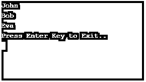
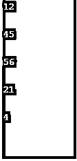
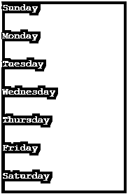
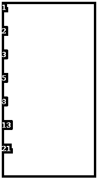
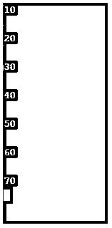

# C#中的迭代器

> 原文：<https://www.educba.com/iterators-in-c-sharp/>




## C#中迭代器的介绍

迭代器是一种用于检索元素并在数组、列表等中逐个执行迭代的方法。yield return 语句与 iterator 方法一起用于返回集合的元素，yield break 用于停止迭代。它总是存储当前位置，并在下一次迭代发生时返回下一个元素。IEnumerable 和 IEnumerator 对象值是 yield 的返回类型。在这个主题中，我们将学习 C#中的迭代器。

### C#迭代器方法

下面的例子展示了循环、foreach 循环和枚举器等各种方法的迭代。

<small>网页开发、编程语言、软件测试&其他</small>

#### 1.For 循环

**举例:**

```
using System;
using System.Collections.Generic;
using System.Linq;
using System.Text;
using System.Threading.Tasks;
namespace Iterators
{
class Iterator
{
static void Main(string[] args)
{
for (int i = 1; i <= 7; i++)
{
Console.WriteLine( i);
}
Console.WriteLine("Press Enter Key to Exit..");
Console.ReadLine();
}
}
}
```

for 循环由三条语句组成。首先，执行初始化，然后是布尔表达式的条件。之后，执行迭代器来改变初始化变量的值。这个 for 循环过程一直持续到条件为假，当条件为假时，for 循环终止。

**输出:**




#### 2.ForEach 循环

**例子** **:**

```
using System;
using System.Collections.Generic;
using System.Linq;
using System.Text;
using System.Threading.Tasks;
namespace Iterators
{
class Iterator
{
static void Main(string[]args)
{
string[] values = new string[3] { "John", "Bob", "Eva" };
foreach (string name in values)
{
Console.WriteLine(name);
}
Console.WriteLine("Press Enter Key to Exit..");
Console.ReadLine();
}
}
}
```

一个 [foreach 循环沿着](https://www.educba.com/powershell-foreach-loop/)内的关键字被用来迭代条目。关键字用于在每次迭代中选择项目。第一项被迭代并存储在第二项之后的元素中，依此类推。foreach 的迭代次数取决于集合中元素的数量。在此示例中，集合由三个值组成，因此 foreach 的数目将出现三次并显示这些值。

**输出:**




#### 3.计数器

**例#1**

```
using System;
using System.Collections.Generic;
using System.Linq;
using System.Text;
using System.Threading.Tasks;
namespace Iterators
{
class Iterator
{
public static IEnumerable<string> GetArray()
{
int[] array = new int[] { 12, 45, 56, 21, 4 };   // initializing array elements
foreach (var element in array)   // iterating array element
{
yield return element.ToString();   // returning elements
}
}
public static void Main(string[]args)         // main method
{
IEnumerable<string> elements = GetArray();  // storing array element
foreach(var element in elements)
{
Console.WriteLine(element);
Console.ReadKey();
}
}
}
}
```

在此示例中，有一个包含五个元素的元素数组，foreach 用于每个元素的迭代。yield 语句用于在每次迭代后返回元素。IEnumerable 接口存储每个元素，而 foreach 用于显示迭代返回的元素。这个迭代器用于一个方法中。

**输出:**




**例 2**

```
using System;
using System.Collections.Generic;
using System.Linq;
using System.Text;
using System.Threading.Tasks;
namespace Iterators
{
class Iterator
{
public static IEnumerable<string> GetList()
{
List<string> list = new List<string>();
list.Add("Sunday");     // adding elements to list
list.Add("Monday");
list.Add("Tuesday");
list.Add("Wednesday");
list.Add("Thursday");
list.Add("Friday");
list.Add("Saturday");
foreach(var element in list)        //iteration of list elements
{
yield return element;               //returning elements after iteration
}
}
public static void Main(string[]args)    // main method
{
IEnumerable<string> elements = GetList();          // storing elements
foreach(var element in elements)
{
Console.WriteLine(element);
Console.ReadKey();
}
}
}
}
```

在此示例中，使用了 list 集合，并使用 list.add 方法在列表中添加元素。这里的列表由七个元素组成。foreach 用于每个元素的迭代。yield 语句用于在每次迭代后返回元素。IEnumerable 接口存储每个元素，而 foreach 用于显示迭代返回的元素。

**输出:**




**例 3**

```
using System;
using System.Collections.Generic;
using System.Linq;
using System.Text;
using System.Threading.Tasks;
namespace Iterators
{
class Iterator
{
public static void Main(string[] args)
{
foreach(var item in fib(6))  // iteration of elements
{
Console.WriteLine(item);
}
}
public static IEnumerable<int> fib(int number)
{
int x = 0, y = 1;
// yield return x;
//yield return y;
for (int i=0; i<=number; i++)
{
int temp = x;
x = y;
y = temp + y;
yield return y;        // returning the element
Console.ReadKey();
}
}
}
}
```

在这个例子中，生成了[斐波那契数列](https://www.educba.com/fibonacci-series-in-javascript/)，并且在一个运算符中使用了迭代器。这个的实现和我们在方法中使用迭代器一样，除了在这个中操作符是用来返回东西的。

**输出:**




**例#4**

```
using System;
using System.Collections.Generic;
using System.Linq;
using System.Text;
using System.Threading.Tasks;
namespace Iterators
{
class Iterator
{
static void Main()
{
List<int> list = new List<int>();
list.Add(10);          // adding elements to list
list.Add(20);
list.Add(30);
list.Add(40);
list.Add(50);
list.Add(60);
list.Add(70);
List<int>.Enumerator a = list.GetEnumerator();
Write(a);
}
static void Write(IEnumerator<int> a)
{
while (a.MoveNext())
{
int value = a.Current;
Console.WriteLine(value);
Console.ReadKey();
}
}
}
}
```

在上面的例子中，使用了列表集合。List.add 方法用于在列表中添加元素。这里的列表包含七个元素。使用 MoveNext 和 Current。MoveNext 基本上是跟踪下一个元素是否存在，并返回布尔值，如果元素可用，则返回 true，如果没有元素，则返回 false，而 current 用于检索当前元素。

**输出:**




### 迭代器的优缺点

优点和缺点解释如下

#### 优势

1.  迭代器可以用作方法和 get 访问器。
2.  它可以用作运算符或属性。
3.  迭代器易于阅读和实现。
4.  迭代器用于泛型和非泛型集合。

#### 不足之处

1.  迭代器在列表回溯中没有用。
2.  因为迭代器存储位置，所以不能更新迭代结构。
3.  静态构造函数、静态终结器和实例构造函数中不使用迭代器。

### 结论

因此，为了遍历值序列，迭代器可以与 foreach 语句一起使用。Yield 可以与 iterator 一起多次使用，以返回元素。这很容易实现，而且非常方便。

### 推荐文章

这是 C#中迭代器的指南。在这里，我们讨论一些例子来展示使用各种方法的迭代，比如循环、foreach 循环和枚举器。您也可以阅读以下文章，了解更多信息——

1.  [c#中的析构函数](https://www.educba.com/destructor-in-c-sharp/)
2.  [c#中的方法覆盖](https://www.educba.com/method-overriding-in-c/)
3.  [C# For 循环](https://www.educba.com/c-sharp-for-loop/)
4.  [c#中的静态构造函数](https://www.educba.com/static-constructor-in-c-sharp/)


