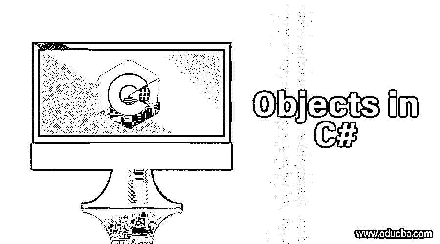

# C#中的对象

> 原文：<https://www.educba.com/objects-in-c-sharp/>




## C#中的对象简介

以下文章概述了 C#中的对象。众所周知，C#是一种面向对象的编程语言，发音为 C Sharp。虽然 C#是从 C++演化而来的，但两者是有区别的。基本的区别可以通过 [C++ vs C#](https://www.educba.com/c-plus-plus-vs-c-sharp/) 来了解。

对象是一个类的实例。这里，内存是动态分配的，用于提供给定程序的输出。那么，如何解释这种动态分配呢？创建对象是为了访问在类下定义的不同函数或变量。因此，一个对象不知道它实际上要访问哪种数据类型。所以从被访问的元素中获取值后，它会动态地安排内存。

<small>网页开发、编程语言、软件测试&其他</small>

### 创建对象

一般来说，可以用两种方法创建对象。其中之一是使用“新建”命令。

该对象的一般语法如下:

```
Class-name object-name = new Class-name();
```

然后，通过使用对象名，我们可以访问在类中定义的各自的方法和变量。

定义对象的另一种方式是引用另一个对象。比如赋值。

**代码:**

```
Class-name object-name1 = new Class-name();
Class-name object-name2;
Object-name2=object-name1;
```

我们可以使用对象 object-name1 和 object-name2 来访问类中的变量和方法。

### C#中的对象示例

在这里，我们将为 C#中创建对象的每种方式提供一个示例。

下面是一个求一个数的平方的程序。

**代码:**

```
using System;
class Square
{
public int side;
public Square(int a)
{
side=a;
}
public int Sq()
{
return side*side;
}
}
class First
{
static void Main(String [] args)
{
int result;
Square s= new Square(4);
result=s.Sq();
Console.WriteLine("Square of the given number is " + result);
}
}
```

**输出:**


*   我们已经创建了一个类 Square，并在类中编写了两个函数。一个函数也是构造函数(函数名与类名相同)，用于输入数值，另一个用于进行实际操作。
*   在包含 main 函数的类 First 中，我们已经初始化了对象' s ',并传入了参数，我们实际上希望对该参数执行平方运算。
*   我们声明了一个可变的结果。我们正在传递对象访问方法' Sq '的输出，该方法执行实际的操作。
*   最后，在我们的控制台中输出平方结果。

对于我们创建对象的下一种方式，示例如下:

**代码:**

```
using System;
class Square
{
public int side;
public Square(int a)
{
side=a;
}
public int Sq()
{
return side*side;
}
}
class First
{
static void Main(String [] args)
{
int result1,result2;
Square s1= new Square(4);
Square s2;
s2=s1;
result1=s1.Sq();
result2=s2.Sq();
Console.WriteLine("Square of the given number is " + result1);
Console.WriteLine("Square of the given number is " + result2);
}
}
```

**输出:**


作为扩展，我们甚至可以用一个对象给变量赋值。让我们看看我们能做些什么。

**代码:**

```
using System;
class Square
{
public int Side;
public Square(int side)
{
Side=side;
}
public int Sq()
{
return Side*Side;
}
}
class First
{
static void Main(String [] args)
{
int result1,result2,result3;
Square s1= new Square(4);
Square s2= new Square(6);
result1=s1.Sq();
result2=s2.Sq();
s2.Side=7;
result3=s2.Sq();
Console.WriteLine("Square of the given number is " + result1);
Console.WriteLine("Square of the given number is " + result2);
Console.WriteLine("Square of the given number is " + result3);
}
}
```

这里，我们访问了变量，并将其值从 6 更改为 7。然后，在将值初始化为新变量 result 3 之后，输出被打印出来。

**输出:**


至此，我们已经创建了一个对象，并通过单一的文本格式引用它。现在让我们看看如果我们需要一个对象数组来存储和操作我们的数据会怎么样。

**代码:**

```
using System;
class Square
{
public int Side;
public void Sqr(int side)
{
Side=side;
}
public int Sq()
{
return Side*Side;
}
}
class First
{
static void Main(String [] args)
{
int result1,result2,result3;
Square[] sq = new Square[3];
sq[0]= new Square();
sq[1]= new Square();
sq[2]= new Square();
sq[0].Side=13;
sq[1].Side=85;
sq[2].Side=25;
result1=sq[0].Sq();
result2=sq[1].Sq();
result3=sq[2].Sq();
Console.WriteLine("Square of the given number is " + result1);
Console.WriteLine("Square of the given number is " + result2);
Console.WriteLine("Square of the given number is " + result3);
}
}
```

在上面的程序中，和以前一样，我们创建了一个对象数组，并给每个对象赋值。然后，我们执行第二个函数来生成两个数的平方。

**输出:**


作为一个练习，你能试着用一个对象数组加载 3 个科目中 5 个学生的分数吗？

### 结论

如上所述，我们已经成功地用不同的方法创建了一个对象，并用它来给变量赋值和调用类中的函数。但是在这里，我们需要理解并遵循一些基于访问修饰符的规则。一个对象不能使用属于另一个类的“私有”访问修饰符来访问变量/函数。但是可以访问相同的类变量或函数，尽管是用私有修饰符声明的。因此，这样，就有了一套针对类、变量、函数和对象定义的规则。尝试用不同的访问修饰符以不同的方式创建对象，并检查输出，以了解对象的范围并不断学习。

### 推荐文章

这是 C#中对象的指南。在这里，我们讨论用 C#创建对象的不同方法，并给出例子和代码实现。您也可以阅读以下文章，了解更多信息——

1.  [c#中的析构函数](https://www.educba.com/destructor-in-c-sharp/)
2.  [C#交错数组](https://www.educba.com/c-sharp-jagged-arrays/)
3.  [C#函数](https://www.educba.com/csharp-functions/)
4.  Java 中的[对象](https://www.educba.com/object-in-java/)


