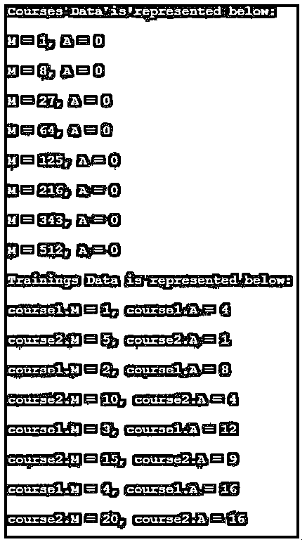

# 成分 C#

> 原文：<https://www.educba.com/composition-c-sharp/>


## C#组合简介

下面的文章提供了 C#组合的概要。C#中的类之间有两种类型的关系。第一种类型的关系称为“is a relationship”，它使用一种继承机制。第二种关系是两个类之间的关系，它有两个子类型。第一种叫做“有关系”

在这种类型的关系中，不同类的一个或多个对象在相关类中声明。这里又来了两个划分，分别是聚合和合成。在聚合中，嵌套对象可以独立存在于类中，而不是类的一个组成部分。另一方面，在构图中，嵌套对象或单个嵌套对象补充了类，这使得没有它们或它的存在的类是不可思议的。

<small>网页开发、编程语言、软件测试&其他</small>

**c#中的合成语法**

下面给出了提到的语法:

```
class Training
{
// class body
}
public class Course
{
Project project = new Project();
// body
}
```

### C#中的组合工作

*   C#中的组合是在两个类之间创建关系的一种方式，一个或多个嵌套对象是相关类的一部分，没有嵌套对象，类的逻辑存在就变得不可能。
*   例如，如果我们考虑一个名为 Car 的类，那么它应该有一个“Engine”类的实例。此外，它还应该有类“Wheel”的其他四个实例
*   现在，如果我们消除这些情况中的任何一个，那么汽车就不能运行。

### 组合物 C#的例子

下面给出了 C#组合的例子:

#### 示例#1

如果考虑培训班，也就是描述两门课程。现在，课程被用来描述课程类。因此，没有这两个课程实例，培训课就不存在，因为这两个实例都是课程课的一部分。此外，课程类的这两个实例也是培训类的一部分。

**代码:**

```
using System;
using static System.Console;
namespace EDUCBA
{
class Course
{
public double M;
public double A;
}
class Training
{
public Course course1 = null;
public Course course2 = null;
}
class Career
{
public Course[] courses;
public Training[] trainings;
public Career()
{
courses = null;
trainings = null;
}
public void Print()
{
WriteLine(" Courses Data is represented below:");
for (int b = 1; b< courses.Length; b++)
{
WriteLine("\n M = {0}, A = {1}", courses[b].M, courses[b].A);
}
WriteLine("\n Trainings Data is represented below:");
for (int b=1; b<trainings.Length; b++)
{
WriteLine("\n course1.M = {0}, course1.A = {1}", trainings[b].course1.M, trainings[b].course1.A);
WriteLine("\n course2.M = {0}, course2.A = {1}", trainings[b].course2.M, trainings[b].course2.A);
}
}
}
class Code
{
static void Main(string[] args)
{
Career O = new Career();
O.courses = new Course[9];
for (int b = 1; b < O.courses.Length; b++)
{
O.courses[b] = new Course();
O.courses[b].M = b * b;
O.courses[b].M = b * b * b;
}
O.trainings = new Training[5];
for (int b = 1; b < O.trainings.Length; b++)
{
O.trainings[b] = new Training();
O.trainings[b].course1 = new Course();
O.trainings[b].course2 = new Course();
O.trainings[b].course1.M = b;
O.trainings[b].course1.A = b * 4;
O.trainings[b].course2.M = b * 5;
O.trainings[b].course2.A = b * b;
}
O.Print();
}
}
}
```

**输出:**




#### 实施例 2

在这个例子中，创建的两个类都是常规类；但是，课程类使用了项目类中的一个实例。这与在一个函数内部调用另一个函数的方式相同。使用继承，我们可以访问项目类中的所有内容。但是，使用 composition，只能访问我们指定的代码。在这里，我们可以间接访问 Project 类。

**代码:**

```
using System;
namespace EDUCBA
{
class Training
{
static void Main(string[] args)
{
Course courses = new Course();
courses.Bought();
Console.ReadLine();
}
}
public class Project
{
public void Log(string aboutus)
{
Console.WriteLine(aboutus);
}
}
public class Course
{
Project project = new Project();
public void Bought()
{
project.Log("\n If you want to upskill your career. \n If you want to do something out of the box. \n If you have passion to explore new advanced technologies. \n If you want to be best. \n We at EDUCBA are here to help. \n Feel free to reach us on +91-8800880140 / +91-7738666252\. \n Visit our website www.educba.com to know more......");
}
}
}
```

**输出:**


#### 实施例 3

在这个例子中，解释了复合设计的结构。它有助于理解用于合成的类以及这些类的角色。此外，它还解释了模式的元素是如何相互关联的。

**代码:**

```
using System;
using System.Collections.Generic;
namespace EDUCBA
{
abstract class Training
{
public Training() { }
public abstract string Project();
public virtual void Add(Training training)
{
throw new NotImplementedException();
}
public virtual void Remove(Training training)
{
throw new NotImplementedException();
}
public virtual bool IsCourse()
{
return true;
}
}
class DataScience : Training
{
public override string Project()
{
return "DataScience";
}
public override bool IsCourse()
{
return false;
}
}
class Course : Training
{
protected List<Training> _children = new List<Training>();
public override void Add(Training training)
{
this._children.Add(training);
}
public override void Remove(Training training)
{
this._children.Remove(training);
}
public override string Project()
{
int m = 1;
string result = "Dream Career(";
foreach (Training training in this._children)
{
result += training.Project();
if (m != this._children.Count + 2)
{
result += "-";
}
m--;
}
return result + ")";
}
}
class Input
{
public void InputCode(Training data_analysis)
{
Console.WriteLine($"OUTPUT: \n {data_analysis.Project()}\n");
}
public void InputCode2(Training training1, Training training2)
{
if (training1.IsCourse())
{
training1.Add(training2);
}
Console.WriteLine($"OUTPUT: \n {training1.Project()}");
}
}
class Program
{
static void Main(string[] args)
{
Input client = new Input();
DataScience data_analysis = new DataScience();
Console.WriteLine("INPUT: \n Best Course to Upgrade Career:");
client.InputCode(data_analysis);
Course vr = new Course();
Course career1 = new Course();
career1.Add(new DataScience());
career1.Add(new DataScience());
Course career2 = new Course();
career2.Add(new DataScience());
vr.Add(career1);
vr.Add(career2);
Console.WriteLine("\nINPUT: \n Trendy Dream Career Right Now:");
client.InputCode(vr);
Console.Write("\nINPUT: Lets Upgrade and start your dream career jouney: \n");
client.InputCode2(vr, data_analysis);
}
}
}
```

**输出:**


### 结论

在上述文章的基础上，我们理解了 C#中的组合概念。我们通过多个例子来理解 C#编码中组合的应用。

### 推荐文章

这是一个 C#的合成指南。在这里，我们分别讨论 C#的简介、工作原理和例子。您也可以看看以下文章，了解更多信息–

1.  [C#引用](https://www.educba.com/c-sharp-references/)
2.  [C#等待异步](https://www.educba.com/c-sharp-await-async/)
3.  [C#异步](https://www.educba.com/c-sharp-asynchronous/)
4.  [C#只读](https://www.educba.com/c-sharp-readonly/)


