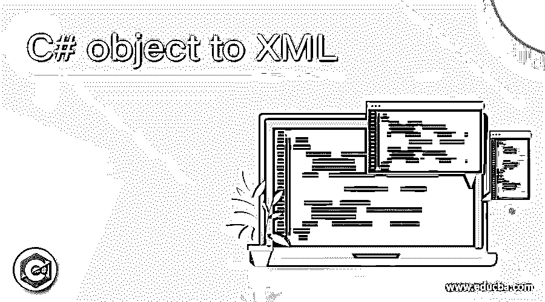
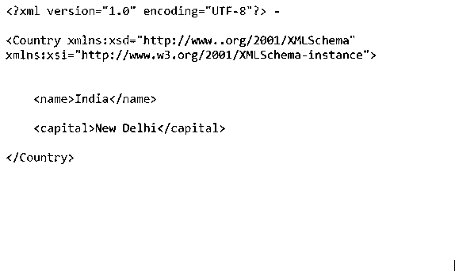
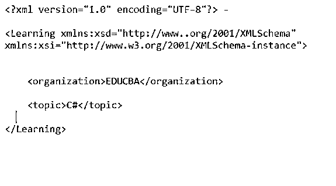
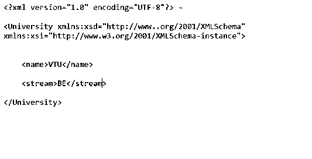

# C#对象到 XML

> 原文：<https://www.educba.com/c-sharp-object-to-xml/>




## XML 的 C#对象简介

将对象的状态存储在某种形式的介质(如硬盘、流等)中的过程。被称为序列化。C#中的对象可以序列化为 XML 格式，为了能够将 C#中的对象转换为 XML，我们将使用一个名为 XmlSerializer()的函数，它将给定的 C#对象序列化为 XML 格式。另一个名为 XmlTextWriter()的函数输出序列化的 XML 字符串，并在 C#中执行对象的序列化。它使对象能够通过互联网传输，写入文件变得更容易，复杂的服务可以有效地执行。

**语法:**

<small>网页开发、编程语言、软件测试&其他</small>

```
XmlSerializer variable_name = new XmlSerializer();
```

其中 variable_name 表示 XmlSerializer 类的实例。

**用 C#将对象转换成 XML 的步骤如下:**

*   将对象的状态存储在某种形式的介质(如硬盘、流等)中的过程。称为序列化，C#中的对象可以用 XML 格式序列化。
*   为了能够将 C#中的对象转换为 XML，我们将使用一个名为 XmlSerializer()的函数，它将给定的 C#对象序列化为 XML 格式，并使用另一个名为 XmlTextWriter()的函数来输出序列化的 XML 字符串。
*   在 C#中执行对象的序列化使对象能够在互联网上传输，写入文件变得更容易，复杂的服务可以有效地执行。

### 例子

让我们讨论 C#对象到 XML 的例子。

#### 示例#1

C#程序将给定的 C#对象转换为 XML 格式，并将内容写入存储在指定位置的 XML 文件，然后显示该文件的内容:

**代码:**

```
using System.Xml.Serialization;
using System.IO;
//a class called Country is defined within which the two strings are defined
public class Country
{
public string name = "India";
public string capital = "New Delhi";
}
//main method is called
static void Main(string[] args)
{
//an instance of the class country is created
Country c = new Country();
//an instance of the XmlSerializer class is created
XmlSerializer inst = new XmlSerializer(typeof(Country));
//an instance of the TextWriter class is created to write the converted XML string to the file
TextWriter writer = new StreamWriter(@ "C:\Users\admin\Desktop\check.xml");
inst.Serialize(writer, c);
writer.Close();
}
```

上述程序的输出如下面的快照所示:




在上面的程序中，定义了一个名为 Country 的类，其中定义了两个字符串 name 和 capital。然后调用 main 方法，在该方法中创建 XmlSerializer 类的实例，以将 C#对象 Country 序列化为 XML 格式。然后创建 TextWriter 类的实例，将转换后的 XML 字符串写入文件的指定位置。XML 格式的文件内容作为输出显示在屏幕上。输出显示在上面的快照中。

#### 实施例 2

C#程序将给定的 C#对象转换为 XML 格式，并将内容写入存储在指定位置的 XML 文件，然后显示该文件的内容:

**代码:**

```
using System.Xml.Serialization;
using System.IO;
//a class called Learning is defined within which the two strings are defined
public class Learning
{
public string organization = "EDUCBA";
public string topic = "C#";
}
//main method is called
static void Main(string[] args)
{
//an instance of the class Learning is created
Country c = new Learning();
//an instance of the XmlSerializer class is created
XmlSerializer inst = new XmlSerializer(typeof(Learning));
//an instance of the TextWriter class is created to write the converted XML string to the file
TextWriter writer = new StreamWriter(@ "C:\Users\admin\Desktop\check.xml");
inst.Serialize(writer, c);
writer.Close();
}
```

上述程序的输出如下面的快照所示:




在上面的程序中，定义了一个名为 Learning 的类，其中定义了两个字符串 organization 和 topic。然后调用 main 方法，在该方法中创建 XmlSerializer 类的实例，以将 C#对象学习序列化为 XML 格式。然后创建 TextWriter 类的实例，将转换后的 XML 字符串写入文件的指定位置。XML 格式的文件内容作为输出显示在屏幕上。输出显示在上面的快照中。

#### 实施例 3

C#程序将给定的 C#对象转换为 XML 格式，并将内容写入存储在指定位置的 XML 文件，然后显示该文件的内容:

**代码:**

```
using System.Xml.Serialization;
using System.IO;
//a class called University is defined within which the two strings are defined
public class University
{
public string name = "VTU";
public string stream = "BE";
}
//main method is called
static void Main(string[] args)
{
//an instance of the class University is created
Country c = new University();
//an instance of the XmlSerializer class is created
XmlSerializer inst = new XmlSerializer(typeof(University));
//an instance of the TextWriter class is created to write the converted XML string to the file
TextWriter writer = new StreamWriter(@ "C:\Users\admin\Desktop\check.xml");
inst.Serialize(writer, c);
writer.Close();
}
```

上述程序的输出如下面的快照所示:




在上面的程序中，定义了一个名为 University 的类，其中定义了两个字符串 name 和 stream。然后调用 main 方法，在该方法中创建 XmlSerializer 类的实例，以将 C#对象大学序列化为 XML 格式。然后创建 TextWriter 类的实例，将转换后的 XML 字符串写入文件的指定位置。XML 格式的文件内容作为输出显示在屏幕上。输出显示在上面的快照中。

### 结论

在本文中，我们学习了使用 XmlSerializer()函数在 C#中将对象转换为 XML 的概念，通过编程示例及其输出，了解了在 C#中将对象转换为 XML 的定义、语法和步骤。

### 推荐文章

这是一个 C#对象到 XML 的指南。在这里，我们还将讨论 C#中的简介、将 Object 转换为 XML 的步骤以及不同的示例。您也可以看看以下文章，了解更多信息–

1.  [C#局部函数](https://www.educba.com/c-sharp-local-functions/)
2.  [C # out of memory 异常](https://www.educba.com/c-sharp-outofmemoryexception/)
3.  [C#目录信息](https://www.educba.com/c-sharp-directoryinfo/)
4.  [C# SOAP](https://www.educba.com/c-sharp-soap/)


