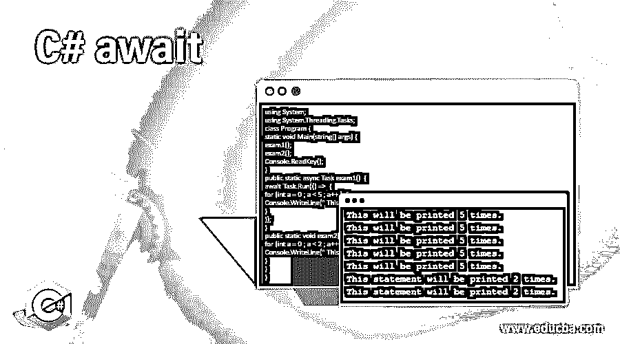
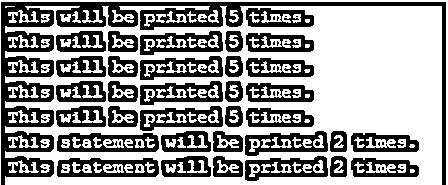
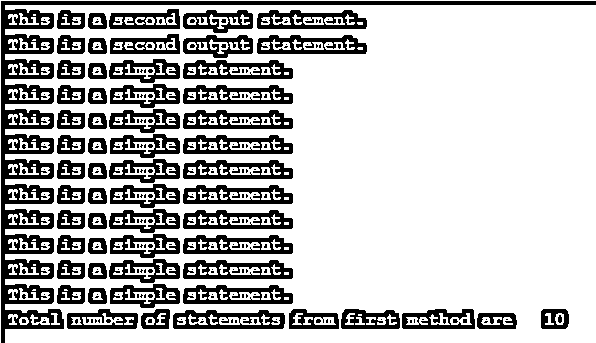

# C#等待

> 原文：<https://www.educba.com/c-sharp-await/>




## C# await 简介

C#编程语言中的 await 关键字用于挂起所有包含的异步方法，直到异步方法所呈现的操作完成。为了让开发人员以异步方式调用多个函数，async 和 await 被高度使用和推荐。只要简单实现 await 函数和 async，就可以继承异步编程的几乎所有特性。现在让我们继续理解实现 await 关键字的标准语法。

**语法:**

<small>网页开发、编程语言、软件测试&其他</small>

await 关键字的标准语法很简单，它包括后跟函数或方法的关键字。语法如下:

```
await anyFunction();
```

这里，我们的语法以 await 关键字开始，后面是一个函数，可以是程序中的任何函数。自由是调用 await 关键字并将其传递给语法中的任何方法类或函数。

### await 关键字在 C#中是如何工作的？

接下来，我们将了解 await 关键字在 C#中的实际工作方式，基本上，await 关键字会暂停异步方法的操作，直到操作数完成操作。然后，在异步操作完成后，await 关键字返回操作结果(如果有)。同样的 await 关键字不能阻止异步方法的任何威胁，在挂起封闭的异步方法后，程序的控制权返回给程序调用方。这就是 await 关键字的工作方式，以及在实现 await 关键字的同时如何编程流。接下来，我们将实现 await 关键字，看看它在实际例子中是如何工作的。

### C# await 的例子

现在我们已经理解了 await 关键字是什么以及它是如何工作的，让我们继续用例子来演示 await 关键字。对于我们的第一个例子，我们将简单地使用一个方法，一个 print 语句和一个 await 关键字。

#### 示例#1

**代码:**

```
using System;
using System.Threading.Tasks;
class Program {
static void Main(string[] args) {
first_meth();
Console.ReadKey();
}
public static async Task first_meth() {
await Task.Run(() =>  {
for (int a = 0 ; a < 2; a++ )  {
Console.WriteLine(" Simple demonstration of await keyword.");
}
});
}
}
```

**输出:**


**代码解释:**这是 await 关键字的一个非常简单的演示，这里我们有单个方法和 main 方法。main 方法调用第一个方法，并且必然会被执行。该方法具有 await 关键字的实现。输出将是打印两次的打印语句。

#### 实施例 2

正如所料，输出是打印两次的语句。对于我们的下一个例子，我们将有两个不同的方法，这两个方法没有任何依赖关系，我们将通过 main 方法调用它们。该程序的代码如下:

**代码:**

```
using System;
using System.Threading.Tasks;
class Program {
static void Main(string[] args) {
exam1();
exam2();
Console.ReadKey();
}
public static async Task exam1()  {
await Task.Run(() =>  {
for (int a = 0 ; a < 5 ; a++ )  {
Console.WriteLine(" This will be printed 5 times.");
}
});
}
public static void exam2() {
for (int a = 0 ; a < 2 ; a++ ) {
Console.WriteLine(" This statement will be printed 2 times. ");
}
}
}
```

**输出:**




**代码解释:**对于我们的第一个例子，我们有两个完全独立的不同方法，我们从程序的 main 方法中调用这些方法。从所需的系统文件开始，我们有了带有 main 方法的类程序，在 main 方法中我们调用了两个要声明的方法。我们的第一个方法 exam1 被初始化，await 关键字后跟一个 lambda 函数，for 语句打印输出语句。然后我们有第二个方法 exam2，它有一个语句的，它将多次打印输出语句。

#### 实施例 3

正如所料，输出语句与代码中提到的一样，接下来，我们将使用另一个示例实现 await 关键字，在这个示例中，我们有三个方法和几个打印语句。

**代码:**

```
using System;
using System.Threading.Tasks;
class Program {
static void Main(string[] args) {
Console.WriteLine("\n");
callMethod();
Console.ReadKey();
}
public static async void callMethod() {
Task<int> task = exam1();
exam2();
int total = await task;
exam3(total);
}
public static async Task<int> exam1() {
int total = 0;
await Task.Run(() =>
{
for (int a = 0 ; a < 10 ; a++ )  {
Console.WriteLine(" This is a simple statement. ");
total += 1;
}
});
return total;
}
public static void exam2()  {
for (int a = 0 ; a < 2 ; a++ )  {
Console.WriteLine(" This is a second output statement.");
}
}
public static void exam3(int total) {
Console.WriteLine(" Total number of statements from first method are   " + total);
}
}
```

**输出:**




对于我们的第三个例子，我们有三个不同的方法，我们从 main 方法调用这些方法。对于我们的 main 方法，我们调用 callMethod，它有一个调用 exam1 方法的任务，因此 exam1 被执行。根据程序，这里的 exam1 方法不会首先执行，因为它有 await 关键字，所以它将移动到下一个方法 exam1，exam2 方法将执行，这是一个语句，如 for 循环中所述打印两次。然后我们的 exam1 方法将被打印出来，后面跟着 exam3，exam3 方法是一个单独的语句。总共将打印 13 条输出语句。最后一条语句将打印我们从 exam1 方法中打印该语句的次数。如前所述，总共有 13 条打印语句，用多种方法简单执行 await 关键字。

### 结论

总之，await 关键字用于暂停事件，并将程序控制权交还给调用者。当我们有多个方法和函数时，这个功能被广泛使用。await 关键字用于将控件返回给调用方，并且只能在 async 方法中应用。

### 推荐文章

这是一个 C# await 指南。在这里，我们还讨论了 C# await 的介绍，await 关键字如何与不同的例子一起工作。您也可以看看以下文章，了解更多信息–

1.  [C#排序字典](https://www.educba.com/c-sharp-sorteddictionary/)
2.  [将对象转换为 JSON C#](https://www.educba.com/convert-object-to-json-c-sharp/)
3.  [C# FileNotFoundException](https://www.educba.com/c-sharp-filenotfoundexception/)
4.  [C#包含()](https://www.educba.com/c-sharp-contains/)


