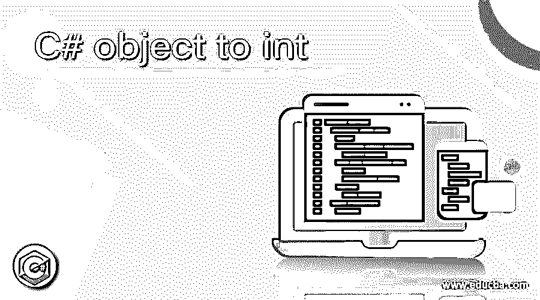

# C#对象到 int

> 原文：<https://www.educba.com/c-sharp-object-to-int/>




## C# object to int 简介

C#中的对象可以转换为等效的 32 位有符号整数，并且能够将 C#中的对象转换为等效的 32 位有符号整数。我们在 C#中使用了一个名为 Convert 的函数。ToInt32(Object)函数，其中 Object 表示要转换为等效的 32 位有符号整数的特定对象的值。它也表示为 int32，使用该函数转换的特定对象的值应该在 32 位有符号整数的范围内，并且该函数为给定对象返回等效的 32 位有符号整数。在这个主题中，我们将学习 C# object to int。

**C #中声明对象到整数转换的语法如下:**

<small>网页开发、编程语言、软件测试&其他</small>

```
int Convert.ToInt32(object value);
```

其中 Object 表示要转换为等效的 32 位有符号整数(也表示为 int32)的特定对象的值。

**C #中把对象转换成整数的步骤如下:**

*   C#中的对象可以被转换成等效的 32 位有符号整数，为了能够将 C#中的对象转换成等效的 32 位有符号整数，我们使用了 C#中的一个函数 convert。ToInt32(对象)函数。
*   作为要转换的参数传递的对象。ToInt32(Object)函数表示特定对象的值，该值将被转换为等效的 32 位有符号整数，也表示为 Int32。
*   使用此函数转换的特定对象的值应该在 32 位有符号整数的范围内。
*   Convert 返回等效的 32 位有符号整数。ToInt32(Object)给定对象的函数。

### 将 C#对象转换为 int 的示例

下面举几个例子

#### 示例#1

C#程序确定给定对象的类型，然后将给定对象的值转换为其等效的有符号整数，并在屏幕上显示输出:

**代码:**

```
using System.Text;
using System;
//defining a namespace called std
namespace std
{
//defining a class called check
class check
{
//main method is called
static void Main()
{
//an object called first is defined
object first = 'S';
//an object called second is defined
object second = 10.23456m;
//obtaining the data type of each object using GetType() function
Console.WriteLine("The type of the first object is: {0}", first.GetType());
Console.WriteLine("The type of the first object is: {0}", first.GetType());
Console.WriteLine("\n");
//using Convert.ToInt32() function to convert the first and second objects to their equivalent integer types
int firstresult = Convert.ToInt32(first);
int secondresult = Convert.ToInt32(second);
//displaying the value and type of the equivalent integer types of first and second objects
Console.WriteLine("The value of first object after converting it to integer using Convert.ToInt32() function is: {0}", firstresult);
Console.WriteLine("The type of first object after converting it to integer using Convert.ToInt32() function is: {0}", firstresult.GetType());
Console.WriteLine("\n");
Console.WriteLine("The value of second object after converting it to integer using Convert.ToInt32() function is: {0}", secondresult);
Console.WriteLine("The type of second object after converting it to integer using Convert.ToInt32() function is: {0}", secondresult.GetType());
Console.ReadLine();
}
}
}
```

上述程序的输出如下面的快照所示:


在上面的程序中，定义了一个名为 std 的名称空间。然后定义了一个名为 check 的类。然后调用 main 方法，其中定义了两个对象 first 和 second 来存储不同的数据类型对象。然后使用 GetType()函数获得每个对象的数据类型，并显示在屏幕上。然后是皈依者。ToInt32()函数用于将每个对象转换为其等效的整数类型。然后，每个对象的转换值作为输出显示在屏幕上。然后，使用 GetType()函数获得的它们各自的数据类型将作为输出显示在屏幕上。

#### 实施例 2

C#程序确定给定对象的类型，然后将给定对象的值转换为其等效的有符号整数，并在屏幕上显示输出:

**代码:**

```
using System.Text;
using System;
//defining a namespace called std
namespace std
{
//defining a class called check
class check
{
//main method is called
static void Main()
{
//an object called first is defined
object first = 12.34f;
//an object called second is defined
object second = 10.45m;
//obtaining the data type of each object using GetType() function
Console.WriteLine("The type of the first object is: {0}", first.GetType());
Console.WriteLine("The type of the first object is: {0}", first.GetType());
Console.WriteLine("\n");
//using Convert.ToInt32() function to convert the first and second objects to their equivalent integer types
int firstresult = Convert.ToInt32(first);
int secondresult = Convert.ToInt32(second);
//displaying the value and type of the equivalent integer types of first and second objects
Console.WriteLine("The value of first object after converting it to integer using Convert.ToInt32() function is: {0}", firstresult);
Console.WriteLine("The type of first object after converting it to integer using Convert.ToInt32() function is: {0}", firstresult.GetType());
Console.WriteLine("\n");
Console.WriteLine("The value of second object after converting it to integer using Convert.ToInt32() function is: {0}", secondresult);
Console.WriteLine("The type of second object after converting it to integer using Convert.ToInt32() function is: {0}", secondresult.GetType());
Console.ReadLine();
}
}
}
```

上述程序的输出如下面的快照所示:


在上面的程序中，定义了一个名为 std 的名称空间。然后定义了一个名为 check 的类。然后调用 main 方法，其中定义了两个对象 first 和 second 来存储不同的数据类型对象。然后使用 GetType()函数获得每个对象的数据类型，并显示在屏幕上。然后是皈依者。ToInt32()函数用于将每个对象转换为其等效的整数类型。然后，每个对象的转换值作为输出显示在屏幕上。然后，使用 GetType()函数获得的它们各自的数据类型将作为输出显示在屏幕上。

### 结论

在本文中，我们学习了在 C#中使用 Convert 将对象转换为整数的概念。ToInt32()函数通过定义、语法和步骤，在 C#中通过编程示例及其输出将对象转换为整数。

### 推荐文章

这是一个 C#对象到 int 的指南。这里我们讨论在 C#中使用 Convert 将对象转换为整数的概念。ToInt32()。您也可以看看以下文章，了解更多信息–

1.  [C#局部函数](https://www.educba.com/c-sharp-local-functions/)
2.  [C #λ表达式](https://www.educba.com/c-sharp-lambda-expression/)
3.  [C# SOAP](https://www.educba.com/c-sharp-soap/)
4.  [C#基础](https://www.educba.com/c-sharp-base/)


