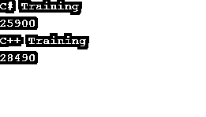
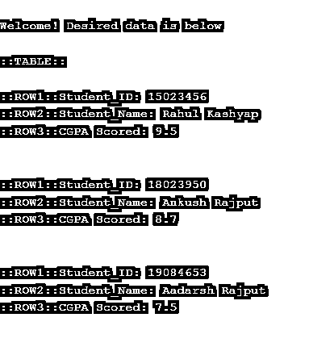

# C#对象序列化

> 原文：<https://www.educba.com/c-sharp-object-serialization/>


## C#对象序列化简介

要转换序列或字节流中的对象，所使用的过程称为序列化。对于对象到数据库、文件或内存的传输，我们使用序列化。为了在需要时准确地重新创建或恢复对象，序列化扮演着至关重要的角色，因为它保存了对象的状态。通过这一陈述，我们的意思是使用 web 服务，通过简单地将对象从一个域转移到另一个域，可以将对象转移到任何远程位置。序列化的反向过程称为反序列化，因为它是将序列化的字节序列转换为对象的过程。

**C#对象序列化语法:**

<small>网页开发、编程语言、软件测试&其他</small>

对于 C#中对象的序列化，一个名为[Serializable]的属性。如果没有以正确的方式提及该属性，则在运行时会引发 SerializableException。

下面是语法:

```
public static void SomeData()
{
string aoo = "Heyoo! Thank you for visiting us....";
FileStream boo = new FileStream(@"D:\EduCBA.txt", FileMode.Create,FileAccess.Write, FileShare.None);
BinaryFormatter coo = new BinaryFormatter();
coo.Serialize(boo, aoo);
boo.Close();
}
```

**C#对象反序列化语法:**

下面是语法:

```
public static void AnotherData()
{
FileStream boo = new FileStream(@"D:\EduCBA.txt", FileMode.Open,FileAccess.Read, FileShare.Read);
BinaryFormatter doo = new BinaryFormatter();
string eoo = "";
eoo = (string)doo.Deserialize(boo);
boo.Close();
Console.WriteLine("EduCBA’s-se-ria-li-za-tion-&-de-se-ria-li-za-tion-in-C#-exam-ple");
Console.WriteLine("\n");
Console.WriteLine(eoo);
}
```

### C#对象序列化使用示例

让我们讨论 C#对象序列化的例子。

#### 示例#1

在下面的代码中，我们必须序列化 EduCBA 类，所以我们使用了[Serializable]。为了防止代码执行后出现任何错误，应该提到这个属性。在提到我们想要序列化的类的属性之后，我们描述了我们的类的四个属性，即字符串“CourseName1”和整数值“CoursePrice1 ”,类似地，字符串“CourseName2”和整数值“CoursePrice2”。要以只读模式打开文件“E:\EDUCBA.txt ”,需要创建一个对象 hello 对象“hello ”,最后，我们使用前面提到的属性显示“yum”。

**代码:**

```
using System;
using System.IO;
using System.Linq;
using System.Runtime.Serialization;
using System.Runtime.Serialization.Formatters.Binary;
using System.Text;
using System.Threading.Tasks;
namespace Careerplan
{
[Serializable]
class EduCBA
{
public String CourseName1;
public int CoursePrice1;
public String CourseName2;
public int CoursePrice2;
static void Main(string[] rahul)
{
EduCBA yum = new EduCBA();
yum.CourseName1 = "C# Training";
yum.CoursePrice1 = 25900;
yum.CourseName2 = "C++ Training";
yum.CoursePrice2 = 28490;
IFormatter formatter = new BinaryFormatter();
Stream hello = new FileStream(@"E:\EDUCBA.txt",FileMode.Create,FileAccess.Write, FileShare.None);
formatter.Serialize(hello, yum);
hello.Close();
hello = new FileStream(@"E:\EDUCBA.txt",FileMode.Open,FileAccess.Read, FileShare.Read);
hello.Close();
Console.WriteLine(yum.CourseName1);
Console.WriteLine(yum.CoursePrice1);
Console.WriteLine(yum.CourseName2);
Console.WriteLine(yum.CoursePrice2);
Console.ReadKey();
}
}
}
```

**输出:**




#### 实施例 2

在下面的代码中，我们必须序列化 CBA 类，所以我们使用了[Serializable]。为了防止代码执行后出现任何错误，应该提到这个属性。在提到我们想要序列化的类的属性之后，我们描述了我们的类的九个属性，即“student_ID1”是一个整数值,“student_name1”是一个字符串,“CGPA1”是一个双精度值，这意味着它包含带小数点的数值，类似地，“student_ID2”是一个整数值,“student_name2”是一个字符串,“CGPA2”是一个双精度值,“student_ID3”是一个整数,“student_name3”是一个字符串,“CGPA3”是一个双精度值。要以只读模式打开一个文件“E:\EDUCBA.txt ”,需要创建一个对象 hello 和一个对象“learn ”,最后，我们使用前面提到的属性在不同的行和文本中显示“ID ”,文本中提到了数据实际代表的内容。

**代码:**

```
using System;
using System.IO;
using System.Linq;
using System.Threading.Tasks;
using System.Text;
using System.Runtime.Serialization.Formatters.Binary;
using System.Runtime.Serialization;
namespace StudentData
{
[Serializable]
class CBA
{
public int student_ID1;
public String student_name1;
public double CGPA1;
public int student_ID2;
public String student_name2;
public double CGPA2;
public int student_ID3;
public String student_name3;
public double CGPA3;
static void Main(string[] annie)
{
CBA ID = new CBA();
ID.student_ID1 = 15023456;
ID.student_name1 = "Rahul Kashyap";
ID.CGPA1 = 9.5;
ID.student_ID2 = 18023950;
ID.student_name2 = "Ankush Rajput";
ID.CGPA2 = 8.7;
ID.student_ID3 = 19084653;
ID.student_name3 = "Aadarsh Rajput";
ID.CGPA3 = 7.5;
IFormatter eduCBA = new BinaryFormatter();
Stream learn = new FileStream(@"E:\EDUCBA.txt",FileMode.Create,FileAccess.Write, FileShare.None);
eduCBA.Serialize(learn, ID);
learn.Close();
learn = new FileStream(@"E:\EDUCBA.txt",FileMode.Open,FileAccess.Read, FileShare.Read);
learn.Close();
Console.Write("\n");
Console.Write("Welcome! Desired data is below");
Console.Write("\n");
Console.Write("\n");
Console.Write("::TABLE::");
Console.Write("\n");
Console.Write("\n");
Console.Write("::ROW1::");
Console.WriteLine("Student_ID: {0}", ID.student_ID1);
Console.Write("::ROW2::");
Console.WriteLine("Student_Name: {0}", ID.student_name1);
Console.Write("::ROW3::");
Console.WriteLine("CGPA Scored: {0}", ID.CGPA1);
Console.Write("\n");
Console.Write("\n");
Console.Write("::ROW1::");
Console.WriteLine("Student_ID: {0}", ID.student_ID2);
Console.Write("::ROW2::");
Console.WriteLine("Student_Name: {0}", ID.student_name2);
Console.Write("::ROW3::");
Console.WriteLine("CGPA Scored: {0}", ID.CGPA2);
Console.Write("\n");
Console.Write("\n");
Console.Write("::ROW1::");
Console.WriteLine("Student_ID: {0}", ID.student_ID3);
Console.Write("::ROW2::");
Console.WriteLine("Student_Name: {0}", ID.student_name3);
Console.Write("::ROW3::");
Console.WriteLine("CGPA Scored: {0}", ID.CGPA3);
}
}
}
```

**输出:**




#### 实施例 3

在下面的示例中，对于对象的序列化，我们首先创建了一个流(FileStream)对象“boo ”,然后为 BinaryFormatter 对象“coo”创建了一个对象，然后我们调用了“coo”。Serialize(boo，aoo)”这是一个二进制格式化程序。C#中序列化对象的 Serialize()方法。

同样，对于对象的反序列化，我们首先创建了一个流(FileStream)对象“boo ”,用于读取序列化的输出，然后我们为 BinaryFormatter 对象“doo”创建了一个对象，然后我们调用了“doo”。反序列化(boo)”，这是一个二进制格式化程序。Deserialize()方法，用于 C#中对象的反序列化。

**代码:**

```
using System;
using System.IO;
using System.Runtime.Serialization.Formatters.Binary;
namespace EDUCBA
{
class Rahul
{
public static void SomeData()
{
string aoo = "Heyoo! Thank you for visiting us....";
FileStream boo = new FileStream(@"D:\EduCBA.txt", FileMode.Create,FileAccess.Write, FileShare.None);
BinaryFormatter coo = new BinaryFormatter();
coo.Serialize(boo, aoo);
boo.Close();
}
public static void AnotherData()
{
FileStream boo = new FileStream(@"D:\EduCBA.txt", FileMode.Open,FileAccess.Read, FileShare.Read);
BinaryFormatter doo = new BinaryFormatter();
string eoo = "";
eoo = (string)doo.Deserialize(boo);
boo.Close();
Console.WriteLine("EduCBA’s-se-ria-li-za-tion-&-de-se-ria-li-za-tion-in-C#-exam-ple");
Console.WriteLine("\n");
Console.WriteLine(eoo);
}
static void Main(string[] foo)
{
SomeData();
AnotherData();
Console.ReadLine();
}
}
}
```

**输出:**


### 结论

基于以上讨论，我们理解了 C#中对象的序列化以及 C#中同一对象的反序列化。我们也理解了序列化的重要性。我们已经讨论了与 C#序列化和 C#反序列化相关的各种示例，以及两者的语法。

### 推荐文章

这是一个 C#对象序列化的指南。在这里，我们还讨论了介绍，语法，参数，和 C#对象序列化工作与不同的例子。您也可以看看以下文章，了解更多信息–

1.  [C#目录信息](https://www.educba.com/c-sharp-directoryinfo/)
2.  [C#基础](https://www.educba.com/c-sharp-base/)
3.  [C#堆栈溢出异常](https://www.educba.com/c-sharp-stackoverflowexception/)
4.  [C#秒表](https://www.educba.com/c-sharp-stopwatch/)


