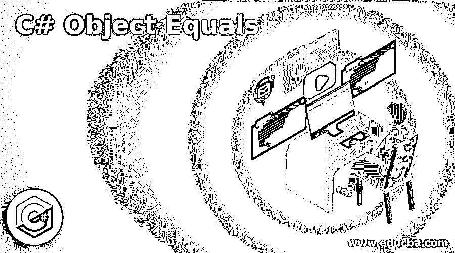

# C#对象等于

> 原文：<https://www.educba.com/c-object-equals/>




## C#对象等于简介

为了比较当前实例是否等于给定的对象，我们在 C#中使用了一个名为 Equals(Object) function 的函数，该函数将与当前实例进行比较的对象作为参数，如果与当前实例进行比较的对象与当前实例相同，则返回 true，如果与当前实例进行比较的对象与当前实例不同，则返回 false，并且该函数在中可用。NET 5.0 版等 35 个版本。

**声明 Equals()函数的语法:**

<small>网页开发、编程语言、软件测试&其他</small>

```
Equals(Object);
```

其中对象是要与其当前实例进行比较的对象。

### Equals(对象)函数的工作原理

*   为了比较当前实例是否等于给定的对象，我们使用了 C#中的 Equals(Object)函数。
*   Equals(Object)函数将要与其当前实例进行比较的对象作为参数。
*   如果作为参数与其当前实例进行比较的对象与当前实例相同，Equals(Object)函数返回 true。
*   如果作为参数与其当前实例进行比较的对象与当前实例不同，Equals(Object)函数将返回 false。
*   Equals(Object)函数在中可用。NET 5.0 版等 35 个版本。

### C#对象等于的示例

下面给出了 C#对象等于的例子:

#### 示例#1

C#程序创建一个对象，并将其作为参数传递给 Equals(Object)函数，以将其与当前实例进行比较并显示结果。

**代码:**

```
using System.IO;
using System;
public class check
{
public static void Main()
{
//declaring a Boolean variable called firstvalue and storing a Boolean value in it
bool firstvalue = false;
//declaring an object called secondvalue and storing an expression in it
object secondvalue = 1 * 0;
//using Equals(object) method to compare the firstvalue with the current instance secondvalue and storing the result in a variable called result
bool result = firstvalue.Equals(secondvalue);
//based on the result, displaying if the firstvalue is equal to the secondvalue or not
if (result)
{
Console.WriteLine("The first value {0} is equal to the second value {1}", firstvalue, secondvalue);
}
else
{
Console.WriteLine("The first value {0} is not equal to the second value {1}", firstvalue, secondvalue);
}
}
}
```

**输出:**


在上面的程序中，我们定义了一个名为 firstvalue 的布尔变量，并在其中存储了一个布尔值。然后我们定义一个名为 secondvalue 的对象，并在其中存储一个表达式。然后，我们使用 Equals(Object)函数来比较存储在 firstvalue 变量中的值和存储在 secondvalue 对象中的值，然后将其结果存储在一个名为 result 变量的变量中。然后使用 if 条件语句，根据获得的结果，我们显示第一个值是否等于第二个值。

#### 实施例 2

C#程序创建一个对象，并将其作为参数传递给 Equals(Object)函数，以将其与当前实例进行比较并显示结果。

**代码:**

```
using System.IO;
using System;
public class check
{
public static void Main()
{
//declaring a Boolean variable called firstvalue and storing a Boolean value in it
bool firstvalue = true;
//declaring an object called secondvalue and storing an expression in it
object secondvalue = 10 /10;
//using Equals(object) method to compare the firstvalue with the current instance secondvalue and storing the result in a variable called result
bool result = firstvalue.Equals(secondvalue);
//based on the result, displaying if the firstvalue is equal to the secondvalue or not
if (result)
{
Console.WriteLine("The first value {0} is equal to the second value {1}", firstvalue, secondvalue);
}
else
{
Console.WriteLine("The first value {0} is not equal to the second value {1}", firstvalue, secondvalue);
}
}
}
```

**输出:**


在上面的程序中，我们定义了一个名为 firstvalue 的布尔变量，并在其中存储了一个布尔值。然后我们定义一个名为 secondvalue 的对象，并在其中存储一个表达式。然后，我们使用 Equals(Object)函数来比较存储在 firstvalue 变量中的值和存储在 secondvalue 对象中的值，然后将其结果存储在一个名为 result 变量的变量中。然后使用 if 条件语句，根据获得的结果，我们显示第一个值是否等于第二个值。

#### 实施例 3

C#程序创建一个对象，并将其作为参数传递给 Equals(Object)函数，以将其与当前实例进行比较并显示结果。

**代码:**

```
using System.IO;
using System;
public class check
{
public static void Main()
{
//declaring a Boolean variable called firstvalue and storing a Boolean value in it
bool firstvalue = true;
//declaring an object called secondvalue and storing an expression in it
object secondvalue = 10 - 5;
//using Equals(object) method to compare the firstvalue with the current instance secondvalue and storing the result in a variable called result
bool result = firstvalue.Equals(secondvalue);
//based on the result, displaying if the firstvalue is equal to the secondvalue or not
if (result)
{
Console.WriteLine("The first value {0} is equal to the second value {1}", firstvalue, secondvalue);
}
else
{
Console.WriteLine("The first value {0} is not equal to the second value {1}", firstvalue, secondvalue);
}
}
}
```

**输出:**


在上面的程序中，我们定义了一个名为 firstvalue 的布尔变量，并在其中存储了一个布尔值。然后我们定义一个名为 secondvalue 的对象，并在其中存储一个表达式。然后，我们使用 Equals(Object)函数来比较存储在 firstvalue 变量中的值和存储在 secondvalue 对象中的值，然后将其结果存储在一个名为 result 变量的变量中。然后使用 if 条件语句，根据获得的结果，我们显示第一个值是否等于第二个值。

### 推荐文章

这是一个 C#对象等于指南。这里我们分别讨论 equals(object)函数的介绍、工作原理和例子。您也可以看看以下文章，了解更多信息–

1.  [C#局部函数](https://www.educba.com/c-sharp-local-functions/)
2.  [C#目录信息](https://www.educba.com/c-sharp-directoryinfo/)
3.  [C# SOAP](https://www.educba.com/c-sharp-soap/)
4.  [C# Compare()](https://www.educba.com/c-sharp-compare/)


