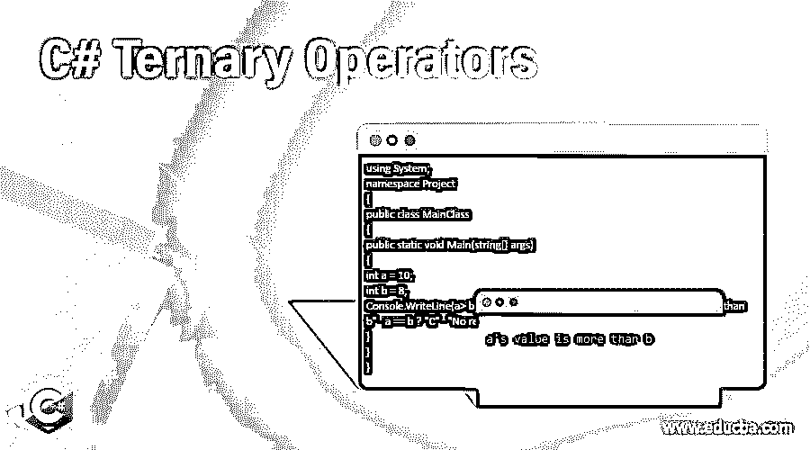

# C#三元运算符

> 原文：<https://www.educba.com/c-sharp-ternary-operators/>




## C#三元运算符简介

在 c#中，用于代替条件语句 if 和 else 的决策操作符被称为三元操作符，它由三个参数组成，其中第一个参数用于比较，如果比较结果为真，则返回第二个参数，如果比较结果为假，则返回第三个参数，该操作符可以被认为是使用 if-else 语句的一种优化方式。

****语法:****

<small>网页开发、编程语言、软件测试&其他</small>

```
Boolean Expression ? First statement : Second statement
```

上面的语法表示三元运算符。它由三部分组成。语法的第一部分是 before？.它返回布尔值 true 或 false，因为它是一个条件表达式。语法的第二部分在“？”之前和“:”之后，如果第一部分的条件表达式的结果为真，则执行该操作。如果作为第一部分的条件表达式的结果为 false，则执行“:”语句之后的语法的第三部分。

### C#三元运算符的工作原理

以下是三元运算符的不同例子。

#### 1.使用 If Else 比较两个值

考虑下面使用 if-else 语句比较两个值的 C#程序。

****代号:****

```
using System;
namespace Project
{
class MainClass
{
public static void Main(string[] args)
{
int a = 30;
int b = 40;
if (a < b)
{
Console.WriteLine("a's value is less than b");
}
else
{
Console.WriteLine("b's value is less than a");
}
}
}
}
```

**输出:**


在上面的程序中，定义了两个变量 a 和 b，并给它们赋值。使用 if-else 条件语句将它们的值相互比较，找出哪个值更大。上面的程序由 20 行代码组成，用来比较两个值。通过使用三元运算符，可以将相同的代码优化为 14 行，该运算符在下面的代码中使用:

#### 2.使用三元运算符比较两个值

考虑下面使用三元运算符比较两个值[的 C#程序。](https://www.educba.com/ternary-operator-javascript/)

****代号:****

```
using System;
namespace Project
{
class MainClass
{
public static void Main(string[] args)
{
int a = 40;
int b = 30;
Console.WriteLine((a < b) ? "a's value is more than b" : "b's value is less than a");
}
}
}
```

**输出:**


在上面的程序中，定义了两个变量 a 和 b，并给它们赋值。使用三元运算符将它们的值相互比较，找出哪个值更大。执行条件语句，并将语句的结果赋给变量 res。如果条件语句的结果为 true，则“？”后的第二个语句，也就是 a 的值大于 b，打印出来；否则，将打印“:”b 的值小于 a 之后的第三条语句。

#### 3.嵌套三元运算符

当第二个或第三个参数跟在“？”后面时或者':'后又是一个条件语句，那么这个运算符就叫做嵌套三元运算符。例如，考虑下面的程序:

**代码:**

```
using System;
namespace Project
{
public class MainClass
{
public static void Main(string[] args)
{
int a = 10;
int b = 8;
Console.WriteLine(a> b ? "a's value is more than b" : a < b ? "a's value is less than b" : a == b ? "C" : "No result");
}
}
}
```

**输出:**


在上面的程序中，定义了两个变量 a 和 b，并给它们赋值。在 C#中，使用三元运算符将它们的值相互比较，以确定哪个值更大或者它们是否相等。执行条件语句，并将语句的结果赋给变量 res。如果条件语句的结果为 true，则“？”后的第二个语句这也是一个条件语句 a

******Note: Ternary operators cannot execute statements****. It only returns an expression or value present in the second part or third part depending on the conditional statement’s result in the first part.

### C#三元运算符的示例

以下是 C#中三元运算符的不同示例。

#### 示例#1

C#程序使用嵌套的三元运算符找出给定数字中的最大值。

**代码:**

```
using System;
using System.IO;
using System.Text;
//Define Namespace
namespace program
{
//Define class
public class large
{
//Define main method
public static void Main(string[] args)
{
//Define three variables to take the input
int x;
int y;
int z;
//Get the input from the users
Console.Write("First number must be entered : ");
x = Convert.ToInt32(Console.ReadLine());
Console.Write("Second number must be entered: ");
y = Convert.ToInt32(Console.ReadLine());
Console.Write("Third number must be entered : ");
z = Convert.ToInt32(Console.ReadLine());
//largest number is found out by using nested ternary operator
int large = (x>y)?((x>z)?x:z):(y>z?y:z);
//display the largest number
Console.WriteLine("{0} is the largest number", large);
Console.ReadLine();
}
}
}
```

**输出:**


#### 实施例 2

C#程序使用三元运算符来找出一个给定的数是否为偶数。

**代码:**

```
using System;
// Define Namespace
namespace program
{
// Define class
public class check
{
// Define main method
public static void Main(string[] args)
{
//Assign the number which need to be checked if it is even or not
int number = 8;
bool ifitisEven;
//Logic to check if ithe given number is even or not
ifitisEven = (number % 2 == 0) ? true : false ;
Console.WriteLine(ifitisEven);
}
}
}
```

**输出:**


### 结论

在本教程中，我们通过定义理解了 C#中三元运算符的概念，然后理解了 C#中三元运算符的工作原理。然后，我们了解使用嵌套三元运算符和简单三元运算符的不同 C#程序，以及它们使用程序的工作方式，程序的输出快照中包含程序的结果。

### 推荐文章

这是一个 C#三元运算符的指南。在这里，我们讨论的介绍和不同的 C#程序使用嵌套的三元运算符和简单的三元运算符。您也可以看看以下文章，了解更多信息–

1.  [c#中的按位运算符](https://www.educba.com/bitwise-operators-in-c-sharp/)
2.  [c#中的逻辑运算符](https://www.educba.com/logical-operators-in-c-sharp/)
3.  [SQL 中的三元运算符](https://www.educba.com/ternary-operator-in-sql/)
4.  [c#中异常的类型](https://www.educba.com/types-of-exception-in-c-sharp/)


**