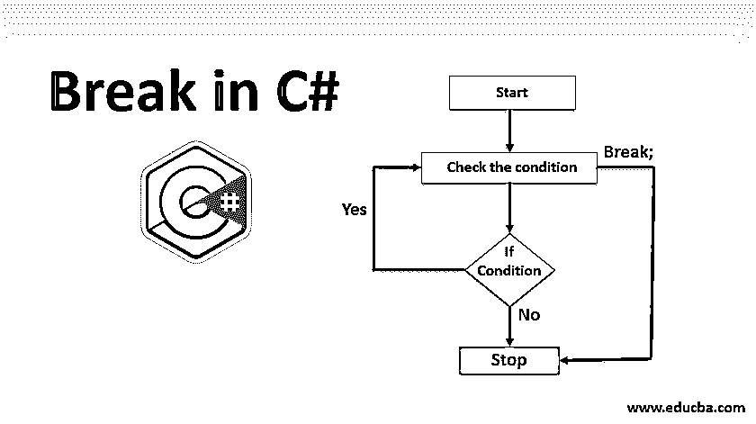
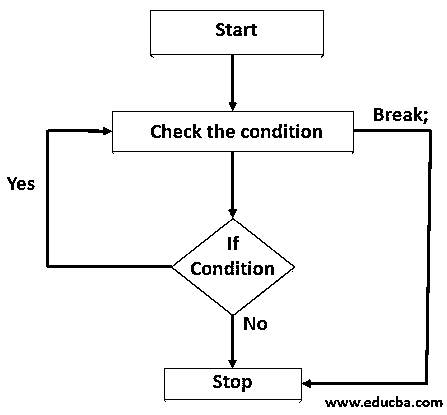
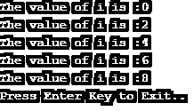

# C#中断

> 原文：<https://www.educba.com/break-in-c-sharp/>




## C#中的 Break 介绍

一般来说，当我们在谈论终止某个执行时，我们是在给出这样做的条件。但在很多情况下，我们并没有一个确切的条件来走出某些循环或条件。在这里，使用 break 语句，我们匹配条件以退出当前执行，并将控制权传递给下一个即将到来的语句。它通过避免特定阶段的特定操作来帮助我们继续执行。在[编程语言](https://www.educba.com/what-is-a-programming-language/)中，我们经常会遇到带有 break 的语句。Break 语句类似于它在这里用来打破逻辑的意思。和其他编程语言一样，c#也有 break 语句。你一定也在 switch 案例中看到过 [break 语句。在每个 case 之后的 switch cases 中，我们发现如果不匹配，这个 break 语句将从那个 case 中出来并向前移动。](https://www.educba.com/break-statement-in-c-plus-plus/)

**语法:**

<small>网页开发、编程语言、软件测试&其他</small>

Break 语句的语法非常简单，如下所示:

```
break;
```

只有关键字 break 和分号。定义一个 break 语句只不过是把控制权按顺序交给下一个操作。Break 语句是应用于及时脱离特定情况并停止进一步执行的规则。

### 流程图




*   上面的流程图简单地显示了 break 语句的工作原理，在流程的开始，它检查特定的条件。如果满意，则循环继续。在循环获得 break 语句的地方。或者，该循环使用 break 语句从循环中退出的条件。
*   流程是毫不费力的，只需要通过执行一些例子来理解它。
*   熟悉 break 语句的最好方法是编写代码，并尝试不同场景的输出。
*   Break 语句非常简单。但是很多人对它感到困惑，因为它跳出了循环，开始了进一步的执行过程。
*   在很多情况下我们会用到这些语句，尤其是在嵌套循环中。在[中，嵌套循环内部循环](https://www.educba.com/nested-loop-in-c-plus-plus/)在特定事件中获取 break 语句以退出循环。

### C#中 Break 语句是如何工作的？

假设我们有一个程序，我们在这个程序中运行循环。我们的要求是，如果循环到达 5，停止循环的执行，并开始运行序列中的代码。如果你仔细看例子，打破陈述更有可能作为一个意义。它在指定位置中断执行流，控制将传递给下一个所需的操作。

### C#中 Break 语句的示例

C#中 Break 语句的示例如下:

#### 示例#1

计划到 10 点才说不。如果超过 10，则中断循环。

```
using System;
public class EvenNo {
public static void Main(string[] args) {
for(int i=0;i<=20;i++){
Console.WriteLine(i);
if(i==10){
break;
}
}
} }
```

**输出:**


在上面的程序中，我们使用了一个循环。在这里，我们已经给出了如果 I 小于等于 20，则进一步执行的条件。我们在 for 循环中给出了 if 条件，如果 I 的值达到 10，那么停止执行 for 循环。这个场景是我们通过 break 语句实现。在编辑器中尝试这个例子，您将得到如上所示的输出。

#### 实施例 2

现在，我们将看到开关情况下的 break 语句

```
using System;
public class Switch
{
public static void Main(string[] args)
{
int n=2;
switch (n)
{
case 1:
Console.WriteLine("Current value of n is: 1");
break;
case 2:
Console.WriteLine("Current value of n is: 2");
break;
case 3:
Console.WriteLine("Current value of n is: 3");
break;
case 4:
Console.WriteLine("Current value of n is: 4");
break;
default:
Console.WriteLine("Please give the correct no.");
break;
}
}
}
```

**输出:**


在上面的程序中，我们使用了一个开关盒。在这方面，我们正在检查多个案例。从案例一开始，我们对照给定的条件检查案例。如果[开关案例](https://www.educba.com/switch-case-in-shell-scripting/)与特定条件不匹配，它用中断语句中断该案例，并跳转到下一个案例。它一直执行，直到得到匹配的案例。如果案例匹配，则执行该案例并显示输出。在最坏的情况下，如果没有一个条件得到满足，那么执行将得到 switch case 语句中提到的缺省情况，关键字为 default。再次执行该语句后，它得到 break 语句，操作结束。

#### 实施例 3

我们将在这里看到带有 do-while 循环的 break 语句:

```
using System;
public class Program
{
public static void Main(string[] args)
{
int i = 0;
do
{
Console.WriteLine("The value of i is :{0}", i);
i+=2;
if (i == 10)
break;
}while (i < 20);
Console.WriteLine("Press Enter Key to Exit..");
Console.ReadLine();
}
}
```

**输出:**




在上面的程序中，我们使用了带有 break 语句的 do-while 循环。我们已经检查了 I 的值，我们将 I 的值增加 2。一旦循环到达 10 点，我们就中断循环。但是我们有条件检查到 20 点。根据我们的要求，我们在循环的中间中断执行。到目前为止，我们已经看到了 break 语句的例子。这展示了我们如何在不同的循环和 if 条件下使用 break 语句。这些是检查 break 语句工作情况的非常基本的示例。在合适的编辑器中尝试这些示例。当我们在程序内部执行任何一个循环，并且需要在执行过程中中断它的时候，我们使用 break 语句和关键字 break 和分号。在中断的这个时候，语句将执行从循环中取出。之后，控制转移到序列中的下一个执行语句。

### 结论

每种语言都有一个 break 语句来结束循环，或者在某个特定的点出现一个条件。这完全取决于需求。在任何语言中，这都是一个很小但很有用的语句，因此，对于 c#也是如此。尝试使用 break 语句。

### 推荐文章

这是一个在 C#中中断语句的指南。这里我们讨论 c#中 break 语句的介绍和工作原理，并给出例子。您也可以阅读以下文章，了解更多信息——

1.  [C# while 循环](https://www.educba.com/c-sharp-while-loop/)
2.  [基本 C#命令](https://www.educba.com/c-sharp-commands/)
3.  [C#最后](https://www.educba.com/c-sharp-finally/)
4.  [C#排序集](https://www.educba.com/c-sharp-sortedset/)


