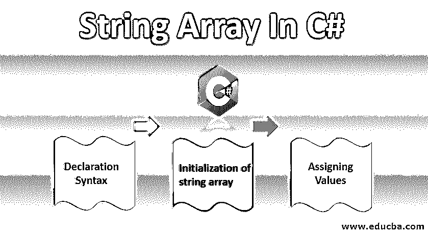
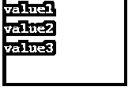
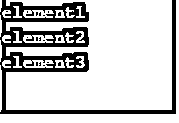
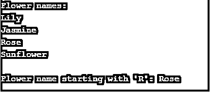

# C#中的字符串数组

> 原文：<https://www.educba.com/string-array-in-c-sharp/>




## C#中的字符串数组简介

要理解 C#中的字符串数组，我们先来理解什么是数组和字符串。

**数组**:顺序存储的同类型变量的集合，每个变量都可以用它的索引号来访问。索引数组从零开始。

<small>网页开发、编程语言、软件测试&其他</small>

例如五个整数的数组


**字符串数组:**是字符串的数组。就像一个雇员姓名:**的字符串数组:**的字符数组。


1.  它是固定的
2.  它可以是单个或多个

### 声明语法

有两种方法可以声明字符串数组:

1.带大小的声明

通过使用字符串类对象:

```
String[] variable_name = new String[size];
```

通过使用字符串关键字:

```
string[] *variable_name* = new string[*size*];
```

2.没有大小的声明

```
String[] variable_name;
```

```
string[] variable_name;
```

### 字符串数组的初始化

可以使用 new 关键字初始化字符串数组。我们无法在不指定大小的情况下初始化字符串数组。有两种方法可以初始化字符串数组。

1.申报时:

```
string[] *variable_name* = new string[*size*];
```

2.声明后:

```
string [] *variable_name*; 
```

```
*variable_name* = new string[*size*];
```

### 赋值

字符串数组的值可以在初始化时赋值，也可以使用索引号来赋值。

**举例:**

```
string[] stringer = new stringArr[3]{"value1","value2","value3"};
```

运筹学

```
string[] stringArr = new stringArr[3]; 
```

```
stringArr[0] = "value1";
```

```
stringArr[1] = "value2"; 
```

```
stringArr[2] = "value3";
```

### C#中的字符串数组示例

下面是一些例子:

#### 1.使用索引号访问数组元素

**代码:**

```
using System;
public class StringArray
{
public static void Main()
{
// Array Declaration and Initialization
string[] stringArr = new string[3] {"value1", "value2", "value3"};
// Accessing elements using index
Console.WriteLine(stringArr[0]);
Console.WriteLine(stringArr[1]);
Console.WriteLine(stringArr[2]);
}
}
```

**输出**:




#### 2.使用 for 循环访问数组元素

**代码:**

```
using System;
public class StringArray
{
public static void Main()
{
// Array Declaration and Initialization
string[] stringArr= new string[3] {"element1", "element2", "element3"};
// Accessing elements using for loop
for(int i=0;i<stringArr.Length;i++)
{
Console.WriteLine(stringArr[i]);
}
}
}
```

**输出:**




1.  除此之外，我们可以在字符串数组上执行许多操作，如搜索、排序、将字符串数组转换为字符串或将字符串转换为字符串数组等等。让我们看看下面例子中的一些操作:
2.  **在字符串数组中搜索:**在字符串数组中搜索一个单词或者说一个字符串有很多种方法。一种是使用数组类的 Find()方法。此方法返回数组中与指定谓词定义的条件匹配的第一个元素

**举例**:

**代码:**

```
using System;
public class StringSearch
{
public static void Main()
{
try {
// Creating and initializing string array of flower names
String[] flowerArr = new String[]{"Lily", "Jasmine", "Rose", "Sunflower"};
// Print values of the string array
Console.WriteLine("Flower names:");
for (int i = 0; i < flowerArr.Length; i++)
{
Console.WriteLine("{0}", flowerArr[i]);
}
Console.WriteLine();
//Search for flower name that starts with 'R'
string result = Array.Find(flowerArr, name => name.StartsWith("R", StringComparison.CurrentCultureIgnoreCase));
//Print result
Console.Write("Flower name starting with 'R': {0}", result);
}
catch (Exception e)
{
Console.Write("{0}", e.Message);
}
}
}
```

**输出:**




在一个字符串数组中排序:我们可以用很多方法来排序一个字符串数组。这里我们将使用数组对其进行排序。排序()

**举例:**

**代码:**

```
using System;
public class StringSort
{
public static void Main()
{
try
{
// declaring and initializing string array
String[] stringArr = new String[] {"Cat", "Creature", "Culture", "Cow"};
// Sorting in ascending order.
Array.Sort(stringArr);
// reverse array to sort it in descending order
Array.Reverse(stringArr);
// print sorted array
foreach(string val in stringArr)
{
Console.Write(val + " ");
}
}
catch(Exception ex)
{
Console.Write(ex.Message);
}
}
}
```

**输出:**


将字符串转换为字符串数组:我们可以轻松地将字符串转换为字符串数组，反之亦然，如下例所示:

**举例:**

**代码:**

```
using System;
public class StringToStringArray { public static void Main()
{
try
{
string str = "Hello world";
//convert string to string array
string[] strArr = new string[]{ str };
//print string array
foreach(string s in strArr)
{
Console.Write(s);
}
}
catch(Exception ex)
{
Console.Write(ex.Message);
}
}
}
```

**输出:**

*

* 

显示的输出不是字符串，而是字符串数组。将字符串数组转换为字符串的示例:

```
using System;
public class StringArrayToString { public static void Main()
{
try{
}
string[] strArr = new string[2]; strArr[0] = "Good";
strArr[1] = "Morning!";
//converting string array to string
string str = string.Join("", strArr);
//print string
Console.WriteLine(str);
catch(Exception ex)
{
Console.Write(ex.Message);
}
}
}
```

**输出:**

*

* 

### 字符串数组和字符串列表

从上面的例子中，我们可以说字符串数组非常类似于字符串列表。但是它们之间有两个主要区别:

1.  我们不能调整字符串数组 e 的大小。如果你有一个大小为 4 的字符串数组，那么你不能在其中添加 5 个元素。另一方面，列表可以随时调整大小，您可以在列表中添加任意数量的元素。
2.  列表比数组慢，因此在字符串数组上执行的操作将比

我们可以将字符串数组转换为列表，如下所示:

```
using System;
using System.Collections.Generic;
using System. Linq;
public class StringArrayToList
{
public static void Main()
{
string[] strArray = new string[]{ "string", "array", "to", "list"};
//converting string array to list
List<string> list = strArray.ToList();
//print list
foreach (string item in the list)
{
Console.WriteLine(item);
}
}
}
```

**输出:**

*T2】*


 *### 2D 字符串数组

C#还支持多维字符串数组，多维字符串数组的最简单形式是 2D 字符串数组。

**举例:**

**代码:**

```
using System;
public class TwoDimensionalArray
{
public static void Main()
{
string[,] strArr = new string[,]
{
{"Twenty", "Forty"},
{"Thirty", "Fifty"}
};
for (int i = 0; i <= strArr.GetUpperBound(0); i++)
{
string s1 = strArr[i, 0]; string s2 = strArr[i, 1];
Console.WriteLine("{0}, {1}", s1, s2);
}
}
}
```

**输出:**


### 结论

1.  C#中的字符串数组用于在单个
2.  二维的[字符串数组被用来](https://www.educba.com/string-array-in-javascript/)表示任何矩阵类型的
3.  字符串数组的性能比用于存储的其他集合更快
4.  他们强烈地

### 推荐文章

这是一个 C#中字符串数组的指南。这里我们讨论 C#中字符串数组的介绍、声明语法、字符串数组的初始化以及实例。您也可以浏览我们推荐的其他文章，了解更多信息——

1.  [c#中的斐波那契数列](https://www.educba.com/fibonacci-series-in-c-sharp/)
2.  [C#交错数组](https://www.educba.com/c-sharp-jagged-arrays/)
3.  [C 编程中的数组](https://www.educba.com/arrays-in-c-programming/)
4.  [String vs StringBuilder](https://www.educba.com/string-vs-stringbuilder/)


*