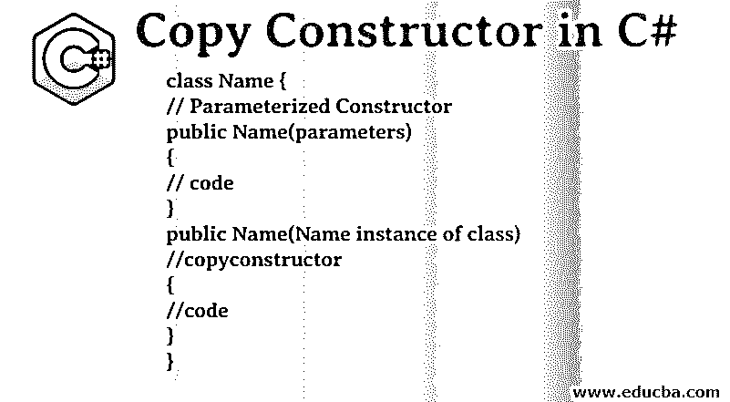
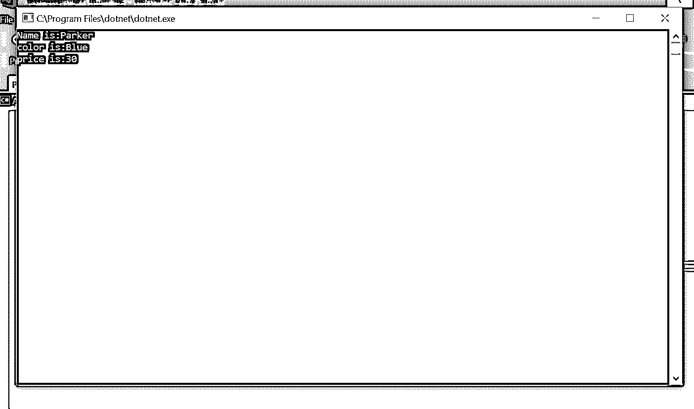
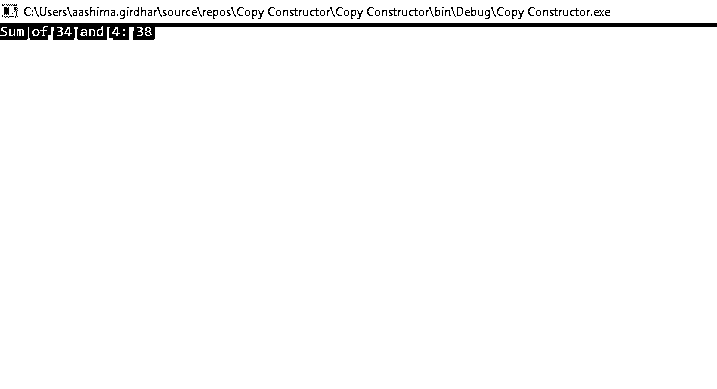

# C#中的复制构造函数

> 原文：<https://www.educba.com/copy-constructor-in-c-sharp/>




## C#中的复制构造函数简介

复制另一个对象的变量并创建一个新对象的构造函数称为复制构造函数。在 C#中，复制构造函数也是参数化构造函数。参数化构造函数是包含同一类类型的参数的构造函数。每当我们想要将新实例初始化为现有实例的值时，复制构造函数就很有用。因此，复制构造函数基本上是将一个对象的值发送给另一个对象，而不影响现有对象的值。

### C#中复制构造函数是如何工作的？

在 C#中，如果我们想审计一个类或者记住类的旧值，我们可以使用复制构造函数。C#不提供复制构造函数。但是，我们可以将复制构造函数与另一个构造函数一起使用。

<small>网页开发、编程语言、软件测试&其他</small>

**语法**

```
class Name {
// Parameterized Constructor
public Name(parameters)
{
// code
}
public Name(Name instance of class)   //copyconstructor
{
//code
}
}
```

构造函数的名称与其类名相同。构造函数的方法签名由方法名及其参数列表组成。一个类中可以有任意数量的构造函数。复制构造函数不是类中唯一的构造函数。复制构造函数需要另一个构造函数来创建对象。下面的示例显示了如何使用类的复制构造函数。

#### 示例 1:没有复制构造函数

**代码**

```
class Demo
{
//variables
string name;
int age;
public Demo(string name, int age) //parameterized constructor
{
this.name = name;
this.age = age;
}
public void getData()
{
Console.WriteLine("Name is:{0}", name);
Console.WriteLine("Age is:{0}", age);
}
}
class Program
{
// Main method
static void Main(string[] args)
{
Demo obj = new Demo("John",20);
obj.getData();
Console.ReadLine();
}
}
```

在上面的例子中，只有一个参数化的构造函数，它有两个变量。getData()用于显示对象的值。

**输出:**

**T2】**


 **#### 使用复制构造函数

**代码**

```
class Demo
{
string name;
int age;
public Demo(string name, int age) //paramertrized constructor
{
this.name = name;
this.age = age;
}
public Demo(Demo d) //copy constructor
{
this.name = d.name;
this.age = d.age;
}
public void getData()
{
Console.WriteLine("Name is:{0}", name);
Console.WriteLine("Age is:{0}", age);
}
}
class Program
{
//main method
static void Main(string[] args){
Demo obj = new Demo("John",20);
obj.getData();
Demo obj1 = new Demo(obj); //new object
obj1.getData();
Console.ReadLine();
}
}
```

在上面的例子中，Demo 是一个包含两个构造函数的类。复制构造函数总是与另一个构造函数一起使用。复制构造函数将一个对象的名称和年龄属性发送给另一个对象。下面是上面程序的输出，第一个值是现有对象的，复制构造函数复制这些值并创建一个与现有对象具有相同值的新对象。

#### 示例 2

**代码**

```
class pen
{
// variables
private string name;
private string color;
private int price;
//  Copy constructor
public pen(pen a)
{
name = a.name;
color = a.color;quantity = a.price;
}
// Parameterized constructor
public pen(string name, string color, int price){
this.name = name;
this.color = color;
this.quantity =price;
}
public void getPendetails()
{Console.WriteLine("Name is:{0}", name);
Console.WriteLine("color is:{0}", color);
Console.WriteLine("price is:{0}", price);
}
// Main Method
public static void Main()
{
// Create a new object.
pen p1 = new pen("Parker", "Blue", 30);
pen p2 = new pen(p1);
p2.getPendetails();
Console.ReadLine();
}}
}
```

在上面的程序中，我们为定义类属性的类 pen 初始化了三个变量。复制构造函数将笔的属性从一个对象复制到另一个对象。main()函数用参数化构造函数的参数值初始化一个对象。然后使用 getPendetails()显示这些值。新对象不会影响现有的对象值。输出如下所示。

**输出:**




#### 示例 3

**代码**

```
class Calculate
{
//variables
private int a;
private int b;
public Calculate(int x, int y) // parameterized constructor
{
a = x;
b = y;
}
public Calculate(Calculate cal)  //copy constructor
{
a = cal.a;
b = cal.b;
}
public int getSum()
{
return a + b;
}
}
class Sum
{
// main method
static void Main(string[] args)
{
// create a new object
Calculate c1 = new Calculate(34, 4);
Calculate c2 = new Calculate(c1);
c2.getSum();
Console.ReadLine();
}
}
```

现在让我们来理解一下上面的程序。

该类包含变量 a 和 b 以及两个构造函数，即一个参数化构造函数和一个复制构造函数。

**代码**

```
class Calculate
{
//variables
private int a;
private int b;
public Calculate(int x, int y) //parameterized constructor
{
a = x;
b = y;
}
public Calculate(Calculate cal) //copy constructor
{
a = cal.a;
b = cal.b;
}
public int getSum()
{
return a + b;
}
}
```

复制构造函数将 cal 对象的值发送到 a 和 b 中。函数 gets()返回 a 和 b 的和。main()在类 sum 中，它将 c1 初始化为参数，然后将对象 c1 的值发送到对象 c2。使用 getSum()显示 a 和 b 的总和。

**代码**

```
class Sum
{
// main method
static void Main(string[] args)
{
Calculate c1 = new Calculate(34, 4);
Calculate c2 = new Calculate(c1);
c2.getSum();
Console.ReadLine();
}
}
```

**输出:**




### **c#中复制构造函数的规则**

 ***   复制构造函数的名称应该与类名相同。
*   复制构造函数需要另一个构造函数来复制对象。
*   复制构造函数没有返回类型。
*   复制构造函数不能是最终的、静态的和抽象的。

### 结论

因此，每当您想要将一个对象值复制到其他对象时，可以使用复制构造函数。这是一种告诉编译器如何将一个对象的值复制到另一个对象中的方法。当我们向一个对象传递参数时就会发生这种情况。ICloneable 接口还可以通过向类中添加克隆方法来使用，从而复制现有对象。在复制构造函数中，您可以通过给定一个唯一的 ID 或通过复制一些必填字段而不复制其他字段来指定自定义行为。

### 推荐文章

这是 C#中复制构造函数的指南。这里我们讨论复制构造函数如何在 C#中工作，包括规则、语法和适当的示例代码。你也可以浏览我们的文章来了解更多-

1.  [C#函数](https://www.educba.com/csharp-functions/)
2.  [复制 C++中的构造函数](https://www.educba.com/copy-constructor-in-c/)
3.  [C 语言中的构造函数](https://www.educba.com/constructor-in-c/)
4.  [c#中的构造函数](https://www.educba.com/constructor-in-c-sharp/)


****