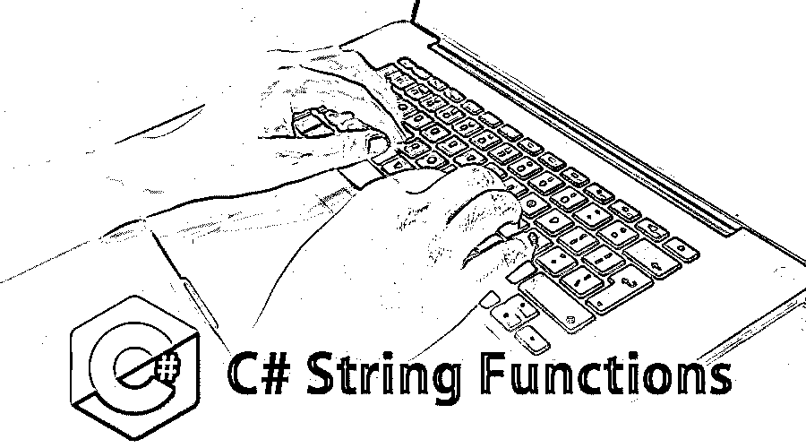

# C#字符串函数

> 原文：<https://www.educba.com/c-sharp-string-functions/>




## C#字符串函数简介

字符串是 C#编程语言中最重要的部分，也是包括 C#在内的现代语言中重要的数据类型之一。字符串数据类型在[中定义。NET](https://www.educba.com/install-dot-net/) 基础类库，它是一个字符集合，其中每个字符都是一个 Unicode 字符。关键字字符串是一个系统对象。字符串类型，用于表示称为文本和字符串的字符的顺序集合。关键字由两种类型组成，称为 string 和 String，用于声明字符串变量。string 和 string 都相当，所以您可以使用您更喜欢的命名约定来定义 String 变量。若要避免 NullReferenceException，请在 null 的情况下用空值初始化字符串。

### C#中的字符串函数示例

C#编程中提供了预定义的字符串函数，让我们借助例子来看看如何在 C#编程中使用字符串函数

<small>网页开发、编程语言、软件测试&其他</small>

#### 1.克隆()

Clone 返回 String 的一个实例。换句话说，它返回该数据的另一个副本。返回值仅仅是相似数据的另一个视图。 [Clone()方法](https://www.educba.com/clone-in-c-sharp/)不带任何参数。

**例**:

```
String _string1="StringFunctions";
String _string2 = (String)_string1.Clone();
// To display both strings
Console.WriteLine("String : {0}", _string1);
Console.WriteLine("Clone String : {0}", _string2);
```

**输出**:

字符串:StringFunctions

克隆字符串:字符串函数

#### 2.比较()

CompareTo()方法用于将字符串实例与特定的字符串对象进行比较。它检查字符串是否出现在与特定字符串相同的位置。一旦与字符串进行比较，它将返回一个整数值作为输出。

**举例:**

```
string _string1 = "Welcome";
string _string2 = " Welcome ";
string _string3 = "C# Coding";
Console.WriteLine(_string1.CompareTo(_string2));
Console.WriteLine(_string2.CompareTo(_string3));
```

**输出:**

Zero

One

#### 3.包含()

Contains()方法用于返回一个值，该值表示特定的子字符串是否存在于该字符串中。如果在这个字符串中找到了特定的子字符串，则返回 true，否则返回 false。这个方法的返回值不是 true 就是 false，是一个布尔值。

**举例:**

```
string _string1 = " Welcome ";
string _string2 = " Welcome ";
string _string3 = "StringFunctions";
Console.WriteLine(_string1\. Contains(_string2));
Console.WriteLine(_string2\. Contains(_string3));
```

**输出:**

真实的

错误的

#### 4\. EndsWith()

[EndsWith()](https://www.educba.com/endswith-in-javascript/) 方法用于验证特定字符串是否匹配该字符串的末尾。如果特定的字符串出现在这个字符串的末尾，那么结果将为真，否则为假。这个方法的返回值不是 true 就是 false，是一个布尔值。

**举例:**

```
string _string1 = " Welcome ";
string _string2 = " ome ";
string _string3 = "ing";
Console.WriteLine(_string1\. EndsWith(_string2));
Console.WriteLine(_string2\. EndsWith(_string3));
```

**输出:**

真实的

错误的

#### 5.等于()

Equals()方法用于比较两个特定的字符串对象是否具有相同的值。如果两个字符串具有相似的值，则返回 true，否则返回 false。Equals()方法的返回值为 true 或 false 布尔值。

**举例:**

```
string _string1 = " Welcome ";
string _string2 = " Welcome ";
string _string3 = "Strings";
Console.WriteLine(_string1\. Equals(_string2));
Console.WriteLine(_string2\. Equals(_string3));
```

**输出:**

真实的

错误的

#### 6\. GetHashCode()

GetHashCode()方法用于获取指定字符串的哈希码。它返回一个整数值。GetHashCode()的返回值是 string 对象的哈希代码。

**举例:**

```
string _ string1 = "String Functions";
Console.WriteLine(_string1.GetHashCode());
```

**输出:**

One billion eighty-five million three hundred and eighty-five thousand six hundred and fifty-eight

#### 7.GetType()

GetType()方法用于获取当前对象的类型。它返回系统。用于反射的当前实例的类型。

**举例:**

```
string _string1 = "String Functions";
Console.WriteLine(_string1.GetType ());
```

**输出:**

系统。线

#### 8\. IndexOf()

[IndexOf()用于](https://www.educba.com/javascript-indexof/)获取字符串中特定字符的索引。它以整数值的形式返回特定字符第一次出现的索引位置。

**举例:**

```
string _string1 = "String Functions";
int index = _string1.IndexOf('t');
Console.WriteLine(index);
```

**输出:**

One

#### 9\. ToLower()

这个 C#字符串函数用于将字符串转换成小写。它返回一个小写的字符串。ToLower()的返回值是一个字符串。

**举例:**

```
string _string1 = "String Functions";
string _string2 = _string1.ToLower();
Console.WriteLine(_string2 );
```

**输出:**

字符串函数

#### 10.假发戴上

ToUpper()方法用于将字符串转换成大写。ToUpper()的返回值是一个字符串。

**举例:**

```
string _string1 = "String Functions";
string _string2 = _string1.ToUpper();
Console.WriteLine(_string2 );
```

**输出:**

字符串函数

#### 11.插入()

Insert()方法用于在指定的索引号处插入特定的字符串。索引号从 0 开始。插入特定字符串后，它返回一个新的修改后的字符串。Insert()的返回值是一个新修改的字符串。

**举例:**

```
string _string1 = "String Functions";
string _string2 = _string1.Insert(6,"-");
Console.WriteLine(_string2 );
```

**输出:**

字符串函数

#### 12.长度

Length 是一个字符串属性，返回字符串中的字符数，这里空格算作字符。

**举例:**

```
string _string1 = "String Functions";
Console.WriteLine(_string1.Length);
```

**输出:**

Sixteen

#### 13.替换()

C#中的这个字符串函数用于替换字符以获得另一个字符串，其中该字符串中某个特定字符的所有出现都被替换为另一个指定的字符。

**举例:**

```
string _string1 = "Strings in F#";
string _string2 = _string1.Replace('F','C');
Console.WriteLine(_string2 );
```

**输出:**

C#中的字符串

#### 14.拆分()

Split()方法用于根据数组中指定的字符值来拆分字符串。这个方法的返回值是[字符串数组](https://www.educba.com/string-array-in-javascript/)。

**举例:**

```
string _string1 = "Welcome C Sharp";
string[] _string2 = _string1.Split(' ');
foreach (string _string3 in _string2)
{
Console.WriteLine(_string3);
}
```

**输出:**

欢迎 C
准时

#### 15.子字符串()

[SubString()](https://www.educba.com/substring-function-in-java/) 方法用于从当前出现的字符串中检索一个子字符串。参数“startIndex”将表示子串的初始位置，然后子串将继续到字符串的末尾。返回值类型是 System。字符串。

**举例:**

```
string _string1 = " Hello C Sharp";
string _string2 = _string1.Substring(5);
string _string3 = " StringFunction";
string _string4 = _string3.Substring(0,8);
string _string5 = " StringFunction";
string _string6 = _string5.Substring(6,4);
Console.WriteLine(_string2);
Console.WriteLine(_string4);
Console.WriteLine(_string6);
```

**输出:**

升 c 调

斯特林夫

功能

### 结论

在本文中，我们学习了 C#中字符串的基础知识，以及如何使用 C#中可用的字符串函数。希望这篇文章能帮助你理解使用 C#的字符串方法

### 推荐文章

这是 C#字符串函数的指南。这里我们借助例子和输出讨论了如何在 C#编程中使用字符串函数。您也可以浏览我们推荐的其他文章，了解更多信息——

1.  [C#命令](https://www.educba.com/c-sharp-commands/)
2.  [c#的用途](https://www.educba.com/uses-of-c-sharp/)
3.  [C#面试问答](https://www.educba.com/c-sharp-interview-questions-and-answers/)
4.  [c#中的字符串数组](https://www.educba.com/string-array-in-c-sharp/)


