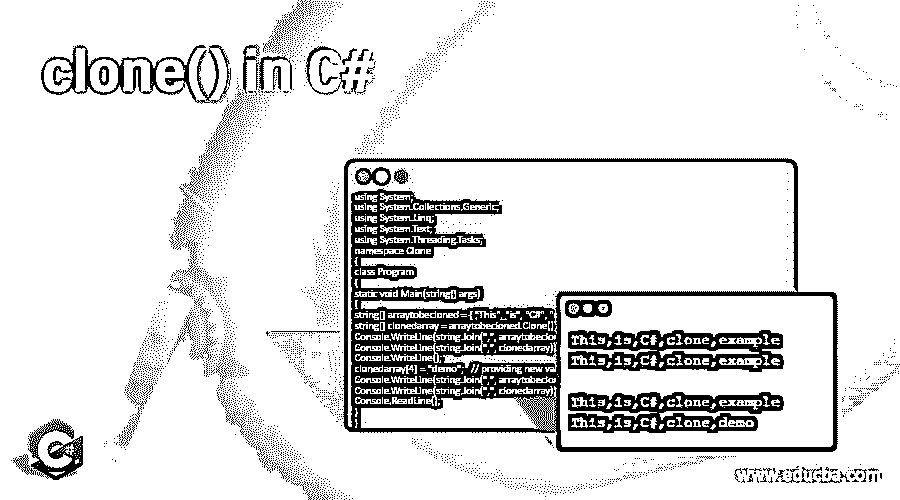
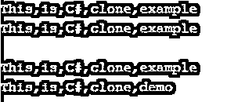
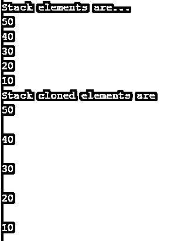

# C#中的 clone()

> 原文：<https://www.educba.com/clone-in-c-sharp/>




## C#中的 clone()简介

C#中的 Clone()是一个 string 方法，用于返回对象的精确副本。它返回字符串的实例。回归的只是观点不同的文案。如果我们想克隆一个数组，这个方法也很有用。对于数组，它创建一个具有相同数量元素的数组副本。还使用了 ICloneable 接口，它调用 Clone 方法来复制数据。这个方法不需要任何参数。

**实现 clone()的语法**

<small>网页开发、编程语言、软件测试&其他</small>

```
public object Clone()
```

**实现 ICloneable()的语法**

```
public interface ICloneable
{
object Clone();
}
```

如你所见，它不需要任何参数，它返回一个引用。

如果我们想修改克隆的对象，我们可以这样做，但这样做不会修改原始对象。

使用 clone()方法对开发人员来说很容易，因为他们需要编写更少的代码，这很容易理解。除此之外不需要其他特殊属性，它复制所有类型的属性。我们只能在类内部调用这个方法。它返回 object，所以我们在使用这个方法时需要进行造型。最好在所有要克隆的类中实现这个方法。我们可以通过使用两种技术来实现它。深层副本 2。浅抄。

浅层复制是创建一个新对象，然后将当前对象的非静态字段复制到新对象。另一方面，深度复制是创建一个新对象，然后将当前对象的非静态字段复制到新对象。

### C#中 clone()的示例

下面的例子展示了如何在 C#中实现 Clone()和 ICloneable 接口。

#### 示例#1

**代码**

```
using System;
using System.Collections.Generic;
using System.Linq;
using System.Text;
using System.Threading.Tasks;
namespace Clone
{
class Program
{
static void Main(string[] args)
{
string s1 = "This is C# programming";
string s2 = (String)s1.Clone();
// Displaying both the strings
Console.WriteLine("String to be cloned : {0}", s1);
Console.WriteLine("Cloned String : {0}", s2);
Console.ReadLine();
}
}
}
```

在上面的例子中，我们需要克隆一个字符串。Clone()用于克隆这个字符串对象。它基本上返回数据的另一个副本。所以我们可以说，返回值是另一个视图的相同数据。这个方法不需要参数。在输出中，您可以看到它显示了原始字符串和克隆字符串，克隆字符串是原始字符串的精确副本。

**输出**


#### 实施例 2

**代码**

```
using System;
using System.Collections.Generic;
using System.Linq;
using System.Text;
using System.Threading.Tasks;
namespace Clone
{
class Program
{
static void Main(string[] args)
{
// array initialization
string[] arraytobecloned = { "This", "is", "C#", "clone", "example"};
string[] clonedarray = arraytobecloned.Clone() as string[];   //cloning array
// display original and cloned arrays
Console.WriteLine(string.Join(",", arraytobecloned));
Console.WriteLine(string.Join(",", clonedarray));
Console.WriteLine();
Console.ReadLine();
}
}
}
```

在上面的例子中，定义了一个包含一组元素的数组，它需要被克隆。Clone()用于克隆数组的所有元素。在输出中，您可以看到它已经创建了一个数组的类似副本。

**输出**


#### 实施例 3

**代码**

```
using System;
using System.Collections.Generic;
using System.Linq;
using System.Text;
using System.Threading.Tasks;
namespace Clone
{
class Program
{
static void Main(string[] args)
{
string[] arraytobecloned = { "This", "is", "C#", "clone", "example" };
string[] clonedarray = arraytobecloned.Clone() as string[];
Console.WriteLine(string.Join(",", arraytobecloned));
Console.WriteLine(string.Join(",", clonedarray));
Console.WriteLine();
clonedarray[4] = "demo";   // providing new value to cloned array element
Console.WriteLine(string.Join(",", arraytobecloned));       // displaying arrays
Console.WriteLine(string.Join(",", clonedarray));
Console.ReadLine();
}
}
}
```

在上面的例子中，定义了一组包含不同元素的数组。clone()方法用于克隆这些元素。我们还可以改变克隆数组中任何元素的值。在输出中，首先，它显示给定的数组和克隆的数组。我们也可以通过传递它的索引位置来改变这个值。传递该值后，它将显示带有一组新值的克隆数组。这意味着我们可以修改克隆数组的值，而不会扰乱原始数组元素的值。

**输出**




#### 实施例 4

**代码**

```
using System;
using System.Collections.Generic;
using System.Linq;
using System.Text;
using System.Threading.Tasks;
namespace Clone
{
class Employee : ICloneable    // implementing ICloneable interface
{
int empcode;
string name;
public Employee(int empcode, string name)
{
this.empcode = empcode;
this.name = name;
}
public object Clone()
{
return new Employee(this.empcode, this.name);
}
public override string ToString()
{
return string.Format("empcode = {0}, name = {1},",
this.empcode,
this.name
);
}
}
class Program
{
static void Main()      // main method
{
Employee e1 = new Employee(10, "John");
Employee e2 = e1.Clone() as Employee;
Console.WriteLine("1\. {0}", e1);
Console.WriteLine("2\. {0}", e2);
Console.ReadLine();
}
}
}
```

在上面的示例中，实现了 ICloneable 接口，并使用 clone()方法来克隆对象。有一个带有参数个数的公共构造函数，在这个克隆之后，这个方法被调用。

**输出**


#### 实施例 5

**代码**

```
using System;
using System.Collections;
using System.Collections.Generic;
using System.Linq;
using System.Text;
using System.Threading.Tasks;
using System;
using System.Collections;
using System.Collections.Generic;
using System.Linq;
using System.Text;
using System.Threading.Tasks;
namespace Clone
{
class Program
{
static void Main(string[] args)
{
//declare and initialize a stack
Stack stack1 = new Stack();
stack1.Push(10);
stack1.Push(20);
stack1.Push(30);
stack1.Push(40);
stack1.Push(50);
Console.WriteLine("Stack elements are...");
foreach (int val in stack1)
{
Console.WriteLine(val);
}
Stack stack2 = (Stack)stack1.Clone();
Console.WriteLine("Stack cloned elements are");
foreach (int val in stack2)
{
Console.WriteLine(val);
Console.ReadLine();
}
}
}
}
```

在上面的例子中，定义了一个堆栈，并使用 push 方法插入元素。堆栈。clone()方法用于克隆堆栈及其所有元素。使用 foreach 显示包含所有元素的原始堆栈和克隆堆栈。

**输出**




### 结论

所以 Clone()用于复制对象并返回实例。使用这种方法，我们可以用相同数量的元素克隆数组。也实现了 ICloneable，它基本上是调用克隆方法来复制数据。实现克隆并不好，因为它让开发人员更容易编写代码。

### 推荐文章

这是 C#中 clone()的使用指南。在这里，我们讨论 C#中对 Clone()的介绍，以及各种示例和适当的语法。您也可以浏览我们的其他相关文章，了解更多信息——

1.  [C#系统。IO](https://www.educba.com/c-sharp-system-dot-io/)
2.  [c#中异常的类型](https://www.educba.com/types-of-exception-in-c-sharp/)
3.  [c#中的分部](https://www.educba.com/partial-in-c-sharp/)
4.  [c#中的定时器](https://www.educba.com/timer-in-c-sharp/)


