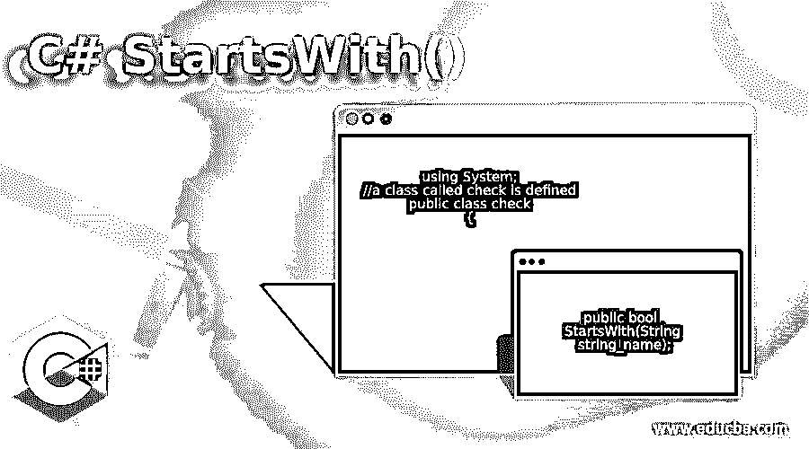

# C#以()开头

> 原文：<https://www.educba.com/c-sharp-startswith/>




## C# StartsWith()简介

在 C#中，用于检查给定字符串的起始实例是否与另一个字符串匹配的方法称为 StartsWith()方法。如果字符串与给定字符串的开始实例匹配，则返回 true，如果使用 StartsWith()方法，则返回 false。如果给定字符串的起始实例与另一个字符串的引用不匹配，则可以使用 C#中的 for each 循环一次检查多个字符串，并且该方法还可以使用作为参数传递给该方法的不同数据类型的不同数量的参数进行重载。

**语法:**

<small>网页开发、编程语言、软件测试&其他</small>

C# StartsWith()方法的语法如下:

```
public bool StartsWith(String string_name);
```

其中，字符串名称是与给定字符串的起始实例相匹配的字符串的名称。

### 使用()启动 C#的工作

C# StartsWith()方法的工作原理如下:

*   每当需要确定任何字符串的开头是否匹配给定字符串的开头时，我们就使用 C#中的 StartsWith()方法。
*   C#中的 StartsWith()方法是一个字符串方法，它返回一个布尔值，该值可以是 true 或 false。
*   如果字符串匹配给定字符串的开始实例，StartsWith()方法返回 true。
*   如果字符串匹配给定字符串的开始实例，StartsWith()方法返回 false。

### C# StartsWith()的示例

下面是一些例子:

#### 示例#1

演示如何使用 StartsWith()方法检查任何字符串的开头是否与给定字符串的开头匹配的 C#程序:

**代码:**

```
using System;
//a class called check is defined
public class check
{
//main method is called within which a string variable is defined to store the string value which is checked to see if there is a match of beginning instance in this string with reference to the other string compared
public static void Main(string[] args)
{
string string1 = "Welcome to C#";
//StartsWith() method is used to check if there is a match to the beginning instance of the given string with reference to the other string passed as a parameter to it
bool bval1 = string1.StartsWith("Welcome");
bool bval2 = string1.StartsWith("w");
Console.WriteLine("The string Welcome matches the beginning instance of the given string Welcome to C#: {0}", bval1);
Console.WriteLine("The string w matches the beginning instance of the given string Welcome to C#: {0}", bval2);
}
}
```

**输出:**


在上面的程序中，定义了一个名为 check 的类。然后调用 main 方法，在该方法中定义一个字符串变量来存储字符串值，该字符串值被检查以查看该字符串中的开始实例是否与所比较的另一个字符串相匹配。然后，使用 StartsWith()方法参照作为参数传递给它的另一个字符串，检查给定字符串的开始实例是否匹配。对照给定字符串 Welcome to C#检查第一个字符串 Welcome，以确定 Welcome to C#中是否有匹配 Welcome 字符串的开始实例，并且返回的输出为 True，因为 Welcome 出现在 Welcome to C#中，而当对照给定字符串 Welcome to C#检查 w 时，以确定 Welcome to C#中是否有匹配字符串 w 的开始实例，并且返回的输出为 False，因为 w 不出现在 Welcome to C#中。

#### 实施例 2

示例 2:演示如何使用 StartsWith()方法检查任何字符串的开头是否与给定字符串的开头匹配的 C#程序:

**代码:**

```
using System;
//a class called check is defined
public class check
{
//main method is called within which a string variable is defined to store the string value which is checked to see if there is a match of beginning instance in this string with reference to the other string compared
public static void Main(string[] args)
{
string string1 = "Learning is fun";
//StartsWith() method is used to check if there is a match to the beginning instance of the given string with reference to the other string passed as a parameter to it
bool bval1 = string1.StartsWith("l");
bool bval2 = string1.StartsWith("Learning");
Console.WriteLine("The string l matches the beginning instance of the given string Welcome to C#: {0}", bval1);
Console.WriteLine("The string Learning matches the beginning instance of the given string Welcome to C#: {0}", bval2);
}
}
```

**输出:**


在上面的程序中，定义了一个名为 check 的类。然后调用 main 方法，在该方法中定义一个字符串变量来存储字符串值，该字符串值被检查以查看该字符串中的开始实例是否与所比较的另一个字符串相匹配。然后，使用 StartsWith()方法参照作为参数传递给它的另一个字符串，检查给定字符串的开始实例是否匹配。对照给定的字符串检查第一个字符串 l 学习是否有趣发现学习中是否有开始实例匹配字符串 l 是有趣的，并且返回的输出为假，因为 l 不在学习中是有趣的，而当对照给定的字符串检查学习时，学习是有趣发现学习中是否有开始实例匹配字符串学习是有趣的，并且返回的输出为真，因为学习中存在学习是有趣的。

在 C#中使用 StartsWith()方法有几个好处。它们是:

*   StartsWith()方法用于检查一个给定字符串的开始实例，并引用另一个字符串，同时考虑字母的大小写。
*   通过利用 for each 循环，StartsWith()方法可用于一次参照多个字符串检查给定字符串的开始实例。

### 推荐文章

这是 C# StartsWith()的指南。在这里，我们还讨论了 c# startswith()的介绍和工作原理，以及不同的例子和它的代码实现。您也可以看看以下文章，了解更多信息–

1.  [c#中的 Web 服务](https://www.educba.com/web-services-in-c-sharp/)
2.  [C#排序集](https://www.educba.com/c-sharp-sortedset/)
3.  [C#最后](https://www.educba.com/c-sharp-finally/)
4.  [C#排序列表](https://www.educba.com/c-sharp-sortedlist/)


