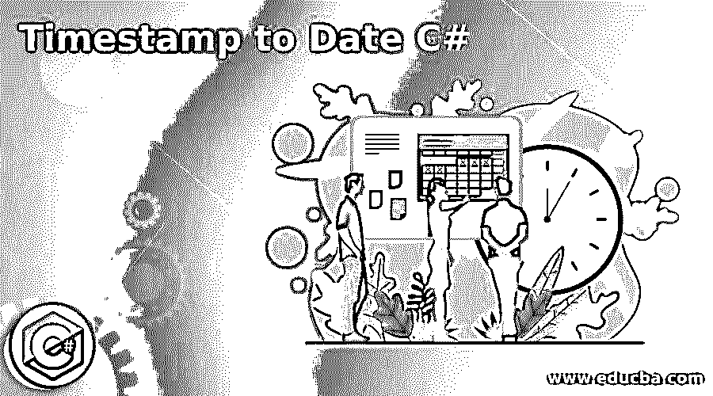
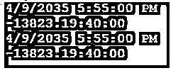

# 时间戳到日期 C#

> 原文：<https://www.educba.com/timestamp-to-date-c-sharp/>




## C#时间戳简介

下面的文章提供了一个 C#时间戳的概要。C#中的 Timestamp 给出了从 Unix 的第一个纪元开始计算的以秒为单位的时间表示。这个时间戳然后根据需要被转换成日期，其中时间戳需要被转换成日期格式以便正确表示。日期和时间表示对于获取任何文件或文件夹的信息都是必要的。有时还需要时间戳到日期的转换，以获得关于包的准确细节，这在表示中起着重要的作用。

**时间戳到日期的语法 C#**

<small>网页开发、编程语言、软件测试&其他</small>

对于 C#中时间戳到日期的转换，epochs 起着至关重要的作用，而 epochs 又有不同的语法和转换过程，表示如下:

*   选择一个传统的日期。
*   然后尝试将 System.date 时间转换为 UNIX epoch 时间。
*   添加要转换的 UNIX 时间戳所需的秒数。
*   字符串中的日期和时间使用某种标准表示形式，该表示形式用于格式化方法中的日期时间对象。
*   然后，需要相应地打印日期和时间，以验证是否反映了更改。

### C#中如何把时间戳转换成日期？

时间戳和日期戳在日常生活中起着非常重要的作用；基于此，一些重要和关键的信息可以在包装时甚至在生产时被检索到。

在 C#中将时间戳转换为日期的步骤如下:

*   C#中的 Timestamp 总是以 Unix 格式出现，其中用于转换的 epochs 在从一种格式的 timestamp 到日期格式的转换中起着重要的作用。
*   首先，获取带有时间的常规日期，然后调用作为标准库的一部分的 System.date time 来执行操作和转换。
*   转换后的格式应为日期的 Unix 纪元格式；否则，它将与时间戳不兼容；如前所述，时间戳明确支持 Unix shell。
*   为 Unix 时间戳创建了一些秒数，以便附加并转换它。
*   一旦字符串中的日期和时间字符串与标准兼容，并且包含与方法中的 DateTime 对象的格式设置，就可以使用该方法始终保持它。
*   该方法包括将日期转换为时间，反之亦然。此外，还需要使它们在两个方向上等价。
*   版本兼容性在这方面也很重要，因为它有助于 C#查询各自的时代和版本。NET 4.6 及以上的所有上述功能和标准库支持这一点，使插件改变到各自的。
*   有些取决于 UTC 计时，它有自己的一套规则和限制，如它不会随着季节的变化而变化，而是具有跟踪当地时区的一天时间节省时间的权限，根据情况提前或推迟四个小时。

### 到目前为止的时间戳示例 C#

下面是 C#中时间戳的例子:

#### 示例#1

这个程序演示了 UNIX 时间戳到日期时间戳的转换，Unix 时间戳支持日期 2019 年 10 月 17 日，时间为下午 3:58，如输出所示。

**代码:**

```
using System;
namespace My_Workspce
{
class Progrm_1
{
static void Main (string [] args)
{
double timestmp = 1413561532;
System.DateTime dat_Time = new System.DateTime(1965, 1, 1, 0, 0, 0, 0);
dat_Time = dat_Time.AddSeconds(timestmp);
string print_the_Date = dat_Time.ToShortDateString() +" "+ dat_Time.ToShortTimeString();
System.Console.WriteLine(print_the_Date);
}
}
}
```

**输出:**


**说明:**

*   这个例子非常简单。此外，它有助于简化带有日期转换的 Unix 中的总时间戳，因为它包含 system.datetime 对象，该对象负责添加秒并通过两者进一步操作时间戳。
*   它使表达和理解变得容易。它可以是考虑转换成所示日期的任何时间格式。

#### 实施例 2

这个程序演示了 Unix 时间戳到日期时间的转换，其中时间戳还包括计算毫秒的转换和反映，也如下面的输出所示。

**代码:**

```
using System;
namespace My_Workspace
{
class Program_test_0
{
static void Main (string [] args)
{
long time_srch = 124045809621000;
time_srch /=1000;
DateTime rslt = DateTimeOffset.FromUnixTimeMilliseconds(time_srch).DateTime;
Console.WriteLine(rslt);
}
}
}
```

**输出:**


**说明:**

*   时间戳从时间到日期的 Unix 转换有时包括毫秒的计算，如果秒也出现相同或对于任何关于时间的详细信息，这种长类型时间戳与日期的转换有助于将秒和毫秒也添加到最终结果中，如上面的输出所示。
*   也可以采用带有字符串的 epoch，但是为了保持版本兼容性，采用带有时间戳的 long。

#### 实施例 3

这个程序演示了 C#中所有可能的转换，包括时间戳转换中的减法或日期时间转换中的负值，如下面的输出所示。

**代码:**

```
using System;
namespace Myworkspace_0
{
class Program_1
{
static void Main (string[] args)
{
System.DateTime dt_1 = new System.DateTime(1997, 6, 3, 22, 15, 0);
System.DateTime dt_2 = new System.DateTime(1960, 12, 6, 13, 2, 0);
System.DateTime dt_3 = new System.DateTime(1998, 10, 12, 8, 42, 0);
System.TimeSpan dfnr_1 = dt_2.Subtract(dt_1);
System.DateTime dt_4 = dt_3.Subtract(dfnr_1);
System.TimeSpan dfrn_2 = dt_2 - dt_3;
System.DateTime dt_5 = dt_1 - dfrn_2;
Console.WriteLine(dt_5);
Console.WriteLine(dfrn_2);
Console.WriteLine(dt_4);
Console.WriteLine(dfrn_2);
}
}
}
```

**输出:**




**说明:**

*   C#中的这个减法函数用于同步日期时间戳，并以定制的方式获取设置的值，如果该值位于输出中所示的指定范围内，可以相应地进行更改。

### 结论

C#或任何其他编程语言中的 Timestamp to date 根据需求的类型以不同的方式运行。处理时间戳非常重要，因为每个应用程序都以某种方式包含这些时间戳，以在一个地方维护一致性和细节，供以后参考。

### 推荐文章

这是一个指南时间戳日期 C#。这里我们讨论一下入门，C#中如何把时间戳转换成日期？和示例。您也可以看看以下文章，了解更多信息–

1.  [C#引用](https://www.educba.com/c-sharp-references/)
2.  [C#等待异步](https://www.educba.com/c-sharp-await-async/)
3.  [C#异步](https://www.educba.com/c-sharp-asynchronous/)
4.  [C#只读](https://www.educba.com/c-sharp-readonly/)


