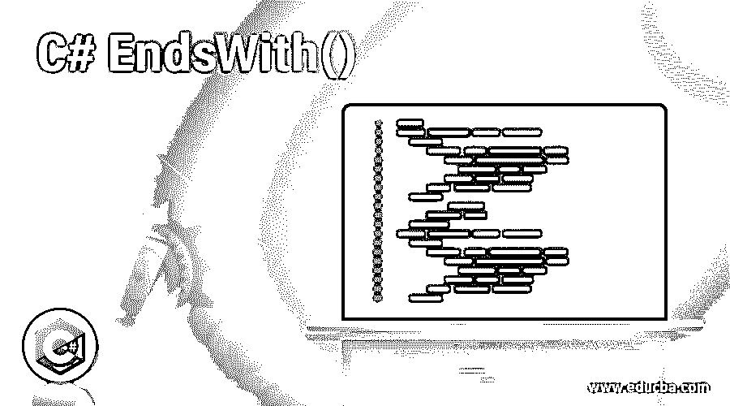

# C# EndsWith()

> 原文：<https://www.educba.com/c-sharp-endswith/>




## C# EndsWith 简介()

在 C#中，用于检查给定字符串是否匹配字符串末尾的方法称为 EndsWith()方法。如果给定的字符串匹配字符串的结尾，则返回 True，如果给定的字符串不匹配字符串的结尾，则返回 false，这表示返回类型是 System。引发 boolean and ArgumentNullException。如果必须与字符串结尾匹配的输入字符串为 null，则还可以使用此方法检查区分大小写和区分区域性的比较。

**语法**

<small>网页开发、编程语言、软件测试&其他</small>

C# EndsWith()方法的语法如下:

```
public bool EndsWith(String string)
public bool EndsWith(String, Boolean, CultureInfo)
public bool EndsWith (String, StringComparison)?
```

其中 string 是指定的字符串，字符串的结尾必须与之匹配。

如果我们希望忽略字母的大小写，Boolean 将被设置为 true，如果我们希望考虑字母的大小写，它将被设置为 false。

CultureInfo 描述指定字符串和表示字符串结尾的字符串的比较方式。

StringComparison 是描述如何比较指定字符串和表示字符串结尾的字符串的枚举值之一。

### C# EndsWith()方法的工作原理

*   每当需要比较给定的字符串和表示字符串结尾的字符串，以确定表示字符串结尾的字符串是否与给定字符串的结尾匹配时，我们就使用 C#中的 EndsWith()方法。
*   如果给定的字符串和表示字符串结尾的字符串与给定字符串的结尾匹配，则使用 EndsWith()方法返回的值为 true。
*   如果给定的字符串和表示字符串结尾的字符串与给定字符串的结尾不匹配，则使用 EndsWith()方法返回的值为 false。
*   如果要与表示字符串末尾的字符串匹配以匹配给定字符串末尾的给定字符串为 Null，则会引发 ArgumentNullException。

### C# EndsWith()的示例

下面提到了不同的例子:

#### 示例#1

C#程序，演示 EndsWith()方法来匹配给定的字符串与表示字符串末尾的字符串与给定字符串的末尾

**代码:**

```
using System;
//a class called program is defined
public class program
{
//main method is called
public static void Main(string[] args)
{
//a string variable is used to store the string whose end of the string mjst be compared with the string representing the end of the string
string str1 = "C Sharp";
//another string variable is used to store the end of the string to compare with the end of the given string
string str2 = "arp";
//another string variable is used to store the end of the string to compare with the end of the given string
string str3 = "C";
//EndsWith() method is used to compare the end of the given string and the string representing the end of a given string
Console.WriteLine("If the end of the given string matches with the string representing the end of the string:{0} ", str1.EndsWith(str2));
Console.WriteLine("If the end of the given string matches with the string representing the end of the string:{0} ",str1.EndsWith(str3));
}
}
```

**输出:**


在上面的程序中，定义了一个名为 program 的类。然后调用 main 方法，在该方法中使用一个字符串变量来存储字符串，该字符串的结尾必须与表示该字符串结尾的字符串进行比较。然后使用另一个字符串变量来存储字符串的结尾，以便与给定字符串的结尾进行比较。然后，另一个字符串变量用于存储字符串的结尾，以便与给定字符串的结尾进行比较。然后使用 EndsWith()方法比较给定字符串的结尾和表示给定字符串结尾的字符串，根据给定字符串的结尾与表示字符串结尾的字符串是否匹配，返回 true 或 false。

#### 实施例 2

C#程序，演示 EndsWith()方法来匹配给定的字符串与表示字符串末尾的字符串与给定字符串的末尾

**代码:**

```
using System;
//a class called program is defined
public class program
{
//main method is called
public static void Main(string[] args)
{
//a string variable is used to store the string whose end of the string must be compared with the string representing the end of the string
string str1 = "Learning";
//another string variable is used to store the end of the string to compare with the end of the given string
string str2 = "Learn";
//another string variable is used to store the end of the string to compare with the end of the given string
string str3 = "ing";
//EndsWith() method is used to compare the end of the given string and the string representing the end of a given string
Console.WriteLine("If the end of the given string matches with the string representing the end of the string:{0} ", str1.EndsWith(str2));
Console.WriteLine("If the end of the given string matches with the string representing the end of the string:{0} ",str1.EndsWith(str3));
}
}
```

**输出:**


在上面的程序中，定义了一个名为 program 的类。然后调用 main 方法，在该方法中使用一个字符串变量来存储字符串，该字符串的结尾必须与表示该字符串结尾的字符串进行比较。然后使用另一个字符串变量来存储字符串的结尾，以便与给定字符串的结尾进行比较。然后，另一个字符串变量用于存储字符串的结尾，以便与给定字符串的结尾进行比较。然后使用 EndsWith()方法比较给定字符串的结尾和表示给定字符串结尾的字符串，根据给定字符串的结尾与表示字符串结尾的字符串是否匹配，返回 true 或 false。最后，输出如上面的快照所示。

### 推荐文章

这是一个 C# EndsWith()的指南。在这里，我们通过定义、语法和编程示例及其输出来讨论 C#中 EndsWith()方法的概念。您也可以看看以下文章，了解更多信息–

1.  [C#数据网格视图](https://www.educba.com/c-sharp-data-grid-view/)
2.  [C# StringReader](https://www.educba.com/c-sharp-stringreader/)
3.  [c#中的泛型](https://www.educba.com/generics-in-c-sharp/)
4.  [DataReader C#](https://www.educba.com/datareader-c-sharp/)


