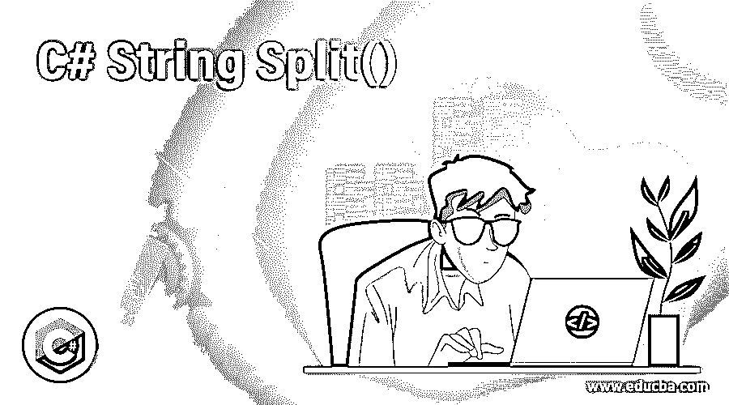
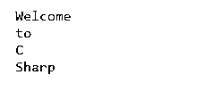
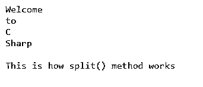
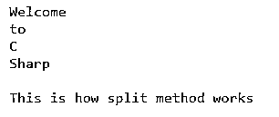

# C#字符串拆分()

> 原文：<https://www.educba.com/c-sharp-string-split/>




## C#字符串拆分简介()

用于将由用于拆分的分隔符分隔的给定字符串划分为字符串数组的方法称为 C# String split()方法，拆分的分隔符是由字符串组成的数组或由字符组成的数组或仅由字符组成的数组，以及由子字符串组成的数组，子字符串的分隔符是 Unicode 字符数组或指定字符串的元素，该方法通过使用 C#中的 Split()方法返回，并且 ArgumentOutofRangeException 和 ArgumentException 异常是在使用此方法时作为异常处理的一部分引发的。

**语法**

<small>网页开发、编程语言、软件测试&其他</small>

C# String Split()方法的语法如下:

```
public String[] Split(String[] separator, int count, StringSplitOptions options);
public String[] Split(params Char[] character)
public String[] Split(Char[], Int32)
public String[] Split(Char[], Int32, StringSplitOptions)
public String[] Split(Char[], StringSplitOptions)
public String[] Split(String[], Int32, StringSplitOptions)
public String[] Split(String[], StringSplitOptions)
```

其中 separator 是分隔给定字符串中子字符串的字符串数组

count 记录要返回的子字符串的最大数量

选项可以移除空条目选项以丢弃返回数组中的空数组元素，或者移除选项 none 以包含返回数组中的空数组元素。

### C# String Split()方法的工作原理

*   每当需要根据分隔字符串数组或字符数组或只是字符的分隔符来划分字符串时，我们就使用 String split()方法。
*   分隔字符串的分隔符可以是字符串数组或字符数组，或者只是字符。
*   使用 string split()方法返回基于给定分隔符分隔的给定字符串的子字符串。
*   使用 Split()方法时，ArgumentOutofRangeException 和 ArgumentException 异常是异常处理的一部分。

### C#字符串拆分的示例()

下面是 C# String Split()的例子:

#### 示例#1

C#程序演示 String Split()方法来分隔用逗号分隔的字符串

**代码:**

```
using System;
//a class called check is defined
public class check
{
//main method is called
public static void Main(string[] args)
{
//a string variable is used to store the string consisting of delimiters
string str = "Welcome,to,C,Sharp";
//a string array is used to store the array of strings returned by using string split method
string[] str2 = str.Split(',');
foreach (string s in str2)
{
Console.WriteLine(s);
}
}
}
```

**输出:**




在上面的程序中，调用了一个名为 check 的类。然后调用 main 方法，在该方法中定义一个 string 变量来存储由分隔符组成的字符串，分隔符可用于将给定的字符串分隔成一个子字符串数组，然后定义一个 string 数组来存储使用 string split()方法返回的子字符串数组，该数组作为输出显示。输出显示在上面的快照中。

#### 实施例 2

演示 string split()方法的 C#程序，用于将由多个分隔符组成的给定字符串分成一个字符串数组:

**代码:**

```
using System;
//a namespace called program is defined
namespace program
{
//a class called check is defined
class check
{
//main method is called
static void Main(string[] args)
{
//a string variable is used to store the string consisting of multiple delimiters
string str1 = "Welcome,to-C|Sharp";
//a string array is defined to store the array of substrings returned by using the split() method on the given string
string[] str2 = str1.Split(new char[] { ',', '-', '|' }, StringSplitOptions.RemoveEmptyEntries);
for (int j = 0; j < str2.Length; j++)
{
Console.WriteLine(str2[j]);
}
Console.WriteLine("\nThis is how split() method works");
Console.ReadLine();
}
}
}
```

**输出:**




在上面的程序中，创建了一个名为 program 的名称空间。然后定义名为 check 的类，在该类中调用 main 方法。然后定义一个字符串变量来存储由多个分隔符组成的字符串。然后，我们使用 split()方法将给定的字符串分成一个子字符串数组，显示为输出。输出显示在上面的快照中。

#### 实施例 3

C#程序，演示 String IndexOf()方法来分隔由多个分隔符组成的给定字符串，并将返回值存储在一个列表中:

**代码:**

```
using System;
using System.Collections.Generic;
//a namespace called program is created
namespace program
{
//a class called check is defined
class check
{
//main method is called
static void Main(string[] args)
{
//a string variable is defined to store the string consisting of multiple delimiters
string str = "Welcome-to,C|Sharp";
//a list is defined to store the substrings separated from the given string consisting of delimiters
IList<string> listname = new List<string>(str.Split(new char[] { '-', ',', '|' }, StringSplitOptions.RemoveEmptyEntries));
for (int j = 0; j < listname.Count; j++)
{
Console.WriteLine(list[j]);
}
Console.WriteLine("\nThis is how split method works");
Console.ReadLine();
}
}
}
```

**输出:**




在上面的程序中，创建了一个名为 program 的名称空间。然后定义一个名为 check 的类，在这个类中调用 main 方法。然后定义一个字符串变量来存储由多个分隔符组成的字符串。然后，通过使用 string split()方法，可以通过创建一个新的列表，将给定的字符串拆分为存储在列表中的字符串数组。输出显示在上面的快照中。

### 推荐文章

这是一个 C#字符串拆分()的指南。在这里，我们通过字符串拆分方法的定义、字符串拆分方法的语法，以及通过编程示例及其输出来讨论 C#中字符串拆分方法的概念。您也可以看看以下文章，了解更多信息–

1.  [IEnumerable C#](https://www.educba.com/ienumerable-c-sharp/)
2.  的 C#名称
3.  [c#中的分部](https://www.educba.com/partial-in-c-sharp/)
4.  [C#序列化](https://www.educba.com/c-serialization/)


