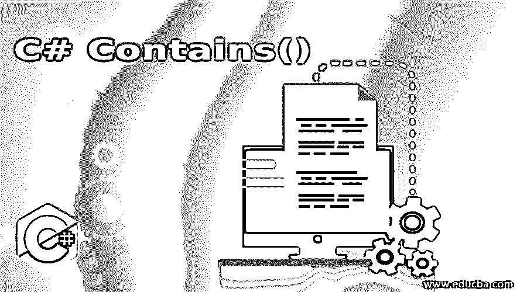

# C#包含()

> 原文：<https://www.educba.com/c-sharp-contains/>




## C# Contains()方法简介

在 C#中，用于检查给定字符串中是否存在某个字符串的方法称为 Contains()方法。如果该字符串存在于给定的字符串中，则返回 true，如果该字符串不存在于给定的字符串中，则返回 false，因此返回类型为 System。引发 boolean and ArgumentNullException。如果必须检查其中是否出现字符串的输入字符串为空，并且检查给定字符串是否出现是基于区分大小写的。

**语法:**

<small>网页开发、编程语言、软件测试&其他</small>

```
public bool Contains(String string)
```

其中 string 是给定的字符串，必须检查该字符串是否在其中出现。

Bool 是 Contains 方法返回的布尔值，如果该字符串存在于给定的字符串中，则设置为 true，如果该字符串不存在于给定的字符串中，则设置为 false。

### C#中 Contains()方法的使用

*   每当需要查找一个字符串在另一个字符串中的出现时，我们使用 Contains 方法来检查给定的字符串，以查找另一个字符串在其中的出现。
*   如果字符串存在于给定的字符串中，则 True 是 contains()方法返回的值。
*   如果给定字符串中不存在该字符串，则 contains()方法返回 False 值。
*   如果输入字符串为空，则引发 ArgumentNullException，必须检查该字符串是否在其中出现，并且检查该字符串是否出现给定的字符串是基于区分大小写的。

### 实现 C# Contains()的示例

下面是 C# Contains()的例子:

#### 示例#1

C#程序来演示 Contains()方法来检查给定的字符串，以找到该字符串在给定字符串中的出现位置。

**代码:**

```
using System;
//a class called program is defined
public class program
{
//main method is called
public static void Main(string[] args)
{
//a string variable is used to store the string which will be checked to find the occurrence of another string within it
string st1 = "C Sharp";
//another string variable is used to store the string which will be checked for in the given string
string st2 = " ";
//another string variable is used to store the string which will be checked for in the given string
string st3 = "Welcome";
//Contains() method is used to check the string for the occurrence of another string within it
Console.WriteLine("If there is occurrence of the string in the given string:{0} ", st1.Contains(st2));
Console.WriteLine("If there is occurrence of the string in the given string:{0} ",st1.Contains(st3));
}
}
```

**输出:**


**说明:**在上面的程序中，定义了一个名为 program 的类。然后调用 main 方法，在该方法中，使用一个字符串变量来存储字符串，并检查该字符串，以找到其中出现的另一个字符串。然后使用另一个字符串变量来存储在第一个字符串中搜索其出现的字符串。然后，再次使用另一个字符串变量来存储在第一个字符串中搜索其出现的字符串。然后使用 Contains()方法检查字符串中是否出现另一个字符串。如果在第一个字符串中出现另一个字符串，则返回 True 如果在第一个字符串中没有出现另一个字符串，则返回 false。

#### 实施例 2

C#程序来演示 Contains()方法来检查给定的字符串，以找到该字符串在给定字符串中的出现位置。

**代码:**

```
using System;
//a class called program is defined
public class program
{
//main method is called
public static void Main(string[] args)
{
//a string variable is used to store the string which will be checked to find the occurrence of another string within it
string st1 = "Welcome to C Sharp";
//another string variable is used to store the string which will be checked for in the given string
string st2 = "#";
//another string variable is used to store the string which will be checked for in the given string
string st3 = "Welcome";
//Contains() method is used to check the string for the occurrence of another string within it
Console.WriteLine("If there is occurrence of the string in the given string:{0} ", st1.Contains(st2));
Console.WriteLine("If there is occurrence of the string in the given string:{0} ",st1.Contains(st3));
}
}
```

**输出:**


**说明:**在上面的程序中，定义了一个名为 program 的类。然后调用 main 方法，在该方法中，使用一个字符串变量来存储字符串，并检查该字符串，以找到其中出现的另一个字符串。然后使用另一个字符串变量来存储在第一个字符串中搜索其出现的字符串。然后，再次使用另一个字符串变量来存储在第一个字符串中搜索其出现的字符串。然后使用 Contains()方法检查字符串中是否出现另一个字符串。如果在第一个字符串中出现另一个字符串，则返回 True 如果在第一个字符串中没有出现另一个字符串，则返回 false。

### **结论**

在本教程中，我们通过 Contains()方法的定义，Contains()方法的语法，通过编程实例及其输出，了解了 C#中 Contains()方法的概念。

### 推荐文章

这是一个 C#包含()的指南。在这里，我们讨论 C# Contains()方法的介绍及其工作原理，并给出示例和代码实现。您也可以浏览我们推荐的其他文章，了解更多信息——

1.  [c#中的随机数生成器是什么？](https://www.educba.com/random-number-generator-in-sharp/)
2.  [Java | Working | Applications 中的静态构造函数](https://www.educba.com/static-constructor-in-java/)
3.  [c#中的 text writer |示例](https://www.educba.com/textwriter-in-c-sharp/)
4.  如何在 C#中使用静态构造函数？


