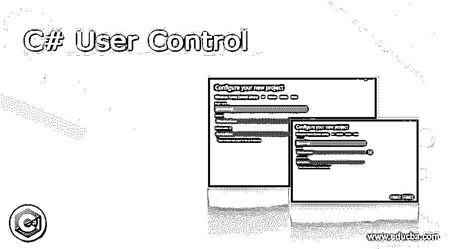
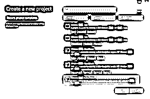
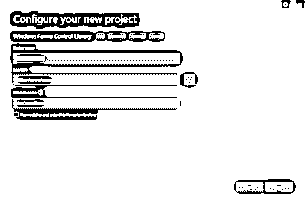

# C#用户控件

> 原文：<https://www.educba.com/c-sharp-user-control/>




## C#用户控件的定义

C#用户控件被定义为 C#编程语言中的一个实现，用于提供一个空控件，并且可以利用该控件来创建其他控件。这种实现为在大型 web 项目中重用控件提供了额外的灵活性。它不仅是关于控件的重用，而且它还帮助用户找到并指出一个 bug，然后在更短的时间内更容易解决这个 bug。通过用户控件，用户可以在一个地方对代码进行任何更改，其效果将在每个 web 窗体或附加到用户控件的 windows 应用程序中的窗体上看到。额外的努力和时间是使用用户控制技术的最大好处。

**语法:**

<small>网页开发、编程语言、软件测试&其他</small>

**要声明为用户控件的类的实例化:**

```
public partial class < class name > : UserControl
{
public < class name >
{
…
}
}
```

**初始化用户控件中使用的类的组件:**

```
public < class name >
{
InitializeComponent();
}
```

**返回申请单中某类的选中项:**

```
get
{
return <component to be returned>
}
```

### 如何用 C#创建用户控件？

现在，为了创建用户控件，除了使用现成可用的控件之外，人们更喜欢创建自己的控件。控件的创建分为以下几类:

扩展:这是通过扩展任何现有控件来实现的，并派生出可重用的内容。用户:这是通过将其他几个控件分组来实现的，并确保分组能够证明将其创建为架构的一部分的原因。
·自定义:这是通过绘制一个控件连同图形设备界面+ (GDI +)来完成的。

根据上面的分类，我们将把精力集中在用户控件的指针上，通常通过组合多个控件来形成一个逻辑上和功能上证明其构建需求的单元，从而确保它执行所需的任务。需求可以是帮助实现某项功能，甚至是提高可重用性。用户控件看起来像任何其他类，逻辑与应用程序的设计相分离。可以在项目本身内部创建用户控件，但是如果需要重用和寻找更好的可维护性，建议在 windows 中创建单独的 dll 或控件窗体库。

在讨论 C#中的用户控件之前，我们需要知道创建用户控件的先决条件，为此我们需要在系统中安装 Microsoft Visual Studio。一旦满足了先决条件，我们现在就来看看用 C#创建用户控件的一步一步的执行过程。

1.为此，我们必须首先在 Visual studio 中创建一个新项目。同样，我们需要打开 visual studio，从 Visual studio 中现有的模板中选择 windows 窗体控件库，并查看启用了 Windows 应用程序的模板。




2.我们现在将根据需要命名项目，然后单击“Next ”,最后选择。NET 框架。




3.表单初始化需要一些时间，其中一个会进入设计页面。

4.从左侧的工具箱中，我们将拖动一个标签并填充文本为“国家”,我们将拖动的另一个元素是组合框。

5.从右侧的解决方案资源管理器中，我们将添加一个名为 countriesClass.cs 的类，并在该类中填入一些代码。

6.现在，在主类(在我们的例子中是 UserControl1.cs)中，我们将添加我们在示例的语法部分提到的代码片段。

7.我们添加一个列表，其中包含该国家和相应国家的货币。

8.最后，当一切都完成后，我们给用户控件的外观设计一些最后的润色。

9.最后，我们在解决方案资源管理器中右键单击项目名称，然后单击 rebuild 生成一个 dll 作为构建结果，并且不会有任何错误。


接下来，我们将看看我们步骤中提到的 2 个类，最终感受一下它的样子。

### 例子

使用不同类的代码片断来制作用户控件。

**语法:**

**countriesClass.cs**

```
using System;
using System.Collections.Generic;
using System.Text;
namespace UserControlDemo
{
public class countriesClass
{
public string currency { get; set; }
public string countryName { get; set; }
}
}
```

**UserControl1.cs**

```
using System;
using System.Collections.Generic;
using System.Security.Permissions;
using System.Windows.Forms;
namespace UserControlDemo
{
public partial class UserControl1 : UserControl
{
public UserControl1()
{
InitializeComponent();
}
public countriesClass SelectedCountry
{
get
{
return (countriesClass)countryCbs.SelectedItem;
}
}
private void UserControl1_Load(object sender, EventArgs e)
{
List<countriesClass> list = new List<countriesClass>();
list.Add(new countriesClass() { currency = "USD", countryName = "United States" });
list.Add(new countriesClass() { currency = "INR", countryName = "India" });
list.Add(new countriesClass() { currency = "AUD", countryName = "Australia" });
list.Add(new countriesClass() { currency = "AED", countryName = "United Arab Emirates" });
list.Add(new countriesClass() { currency = "GBP", countryName = "United Kingdom" });
countryCbs.DataSource = list;
countryCbs.ValueMember = "Currency";
countryCbs.DisplayMember = "Country";
}
private void countryCbs_SelectedIndexChanged(object sender, EventArgs e)
{
}
}
}
```

**输出:**

**用户控件的设计:**


**dll 生成:**


### 结论

在本文中，我们已经完成了在 C#中创建用户控件的任务，最后，我们可以在构建的任何其他 windows 窗体应用程序中使用相同的用户控件。现在，如果一个人改变了用户控件的根并重新构建了 dll，那么 dll 所在的相应应用程序将自动反映出最新的改变，从而实现可重用性！

### 推荐文章

这是一个 C#用户控件的指南。这里我们讨论定义，语法，如何在 C#中创建用户控件？代码实现示例。您也可以看看以下文章，了解更多信息–

1.  [C#引用](https://www.educba.com/c-sharp-references/)
2.  [C#等待异步](https://www.educba.com/c-sharp-await-async/)
3.  [C#动作委托](https://www.educba.com/c-sharp-action-delegate/)
4.  [C#只读](https://www.educba.com/c-sharp-readonly/)


