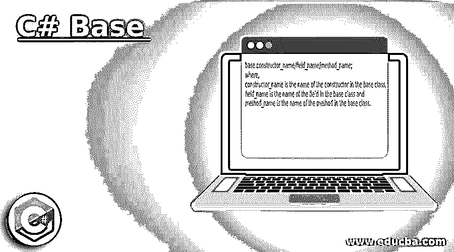

# C#基础

> 原文：<https://www.educba.com/c-sharp-base/>




## C#基础简介

在 C#中，用于访问派生类中基类的基类构造函数、字段和方法的关键字称为 base keyword。此 base 关键字只能在实例方法、实例属性访问器或构造函数中使用，不能在声明为 static 的方法中使用。如果基类和派生类中存在相同的字段，则此 base 关键字很有用。如果基类中存在的字段不是由派生类派生的，则不使用 base 关键字。

**语法**

<small>网页开发、编程语言、软件测试&其他</small>

C# Base 关键字的语法如下:

```
base.constructor_name/field_name/method_name;
```

在哪里，

constructor_name 是基类中构造函数的名称，

field_name 是基类中字段的名称

method_name 是基类中方法的名称。

### C# Base 关键字是如何工作的？

每当需要使用派生类中基类的构造函数或字段或方法时，我们就在派生类中使用关键字 base。

base 关键字只能在实例方法、实例属性访问器或构造函数中使用，而不能在声明为 static 的方法中使用。如果基类和派生类中存在相同的字段，则 Base 关键字是有用的，如果基类中存在的字段不是由派生类派生的，则不使用 base 关键字。

使用 base 关键字可以消除复制代码的必要性。通过使用 base 关键字，在派生类中消除了关于必须从基类引用哪个成员的混淆。

### 实现 C# Base 的示例

下面是提到的例子:

#### 示例#1

C#程序演示了如何使用 base 关键字来引用派生类中基类的变量:

**代码:**

```
using System;
//a class called check is defined which is the base class
public class check
{
//a string variable is defined to store the string
public string string1 = "Welcome to";
}
//another class called check1 is defined which is derived from the base class called check
public class check1: check
{
//another string variable is defined to store the another string
string string2 = "C#";
//a method is defined inside the derived class which displays the string from the base class and the derived class as well
public void displaymsg()
{
Console.WriteLine(base.string1);
Console.WriteLine(string2);
}
}
//another class called check2 is defined within which the main method is called the instance of the derived class is created and the method of the derived class is called which in turn accesses the variable of the base class
public class check2
{
public static void Main()
{
check1 ob = new check1();
ob.displaymsg();
}
}
```

**输出:**


**说明:**在上面的程序中，定义了一个名为 check 的类，它是基类。然后定义一个字符串变量来存储该字符串。然后定义了另一个名为 check1 的类，它是从名为 check 的基类派生而来的。然后定义另一个字符串变量来存储另一个字符串。然后在派生类中定义一个方法，该方法显示基类和派生类中的字符串。然后定义另一个名为 check2 的类，在该类中调用 main 方法，创建派生类的实例，并调用派生类的方法，该方法又访问基类的变量。输出如上面的快照所示。

#### 实施例 2

C#程序演示了如何使用 base 关键字来引用派生类中基类的变量:

**代码:**

```
using System;
//a class called check is defined which is the base class
public class check
{
//a string variable is defined to store the string
public string string1 = "Learning is";
}
//another class called check1 is defined which is derived from the base class called check
public class check1: check
{
//another string variable is defined to store the another string
string string2 = "Fun";
//a method is defined inside the derived class which displays the string from the base class and the derived class as well
public void displaymsg()
{
Console.WriteLine(base.string1);
Console.WriteLine(string2);
}
}
//another class called check2 is defined within which the main method is called the instance of the derived class is created and the method of the derived class is called which in turn accesses the variable of the base class
public class check2
{
public static void Main()
{
check1 ob = new check1();
ob.displaymsg();
}
}
```

**输出:**


**说明:**在上面的程序中，定义了一个名为 check 的类，它是基类。然后定义一个字符串变量来存储该字符串。然后定义了另一个名为 check1 的类，它是从名为 check 的基类派生而来的。然后定义另一个字符串变量来存储另一个字符串。然后在派生类中定义一个方法，该方法显示基类和派生类中的字符串。然后定义另一个名为 check2 的类，在该类中调用 main 方法，创建派生类的实例，并调用派生类的方法，该方法又访问基类的变量。输出如上面的快照所示。

### C#基础的优势

使用 base 关键字有几个优点，它们是:

1.使用 base 关键字可以消除复制代码的必要性。

2.通过使用 base 关键字，在派生类中消除了关于必须从基类引用哪个成员的混淆。

### 结论

在本教程中，我们通过基本关键字的定义、语法和工作原理，通过编程示例及其输出来理解 C#中基本关键字的概念，以及在我们的程序中使用基本关键字的优点。

### 推荐文章

这是一个 C#基础的指南。在这里，我们讨论一个 C#基础介绍，语法，它是如何工作的编程例子。您也可以浏览我们的其他相关文章，了解更多信息——

1.  [C#排序列表](https://www.educba.com/c-sharp-sortedlist/)
2.  [C#动态](https://www.educba.com/c-sharp-dynamic/)
3.  [C#流写入器](https://www.educba.com/c-sharp-streamwriter/)
4.  [C#系统。IO](https://www.educba.com/c-sharp-system-dot-io/)


