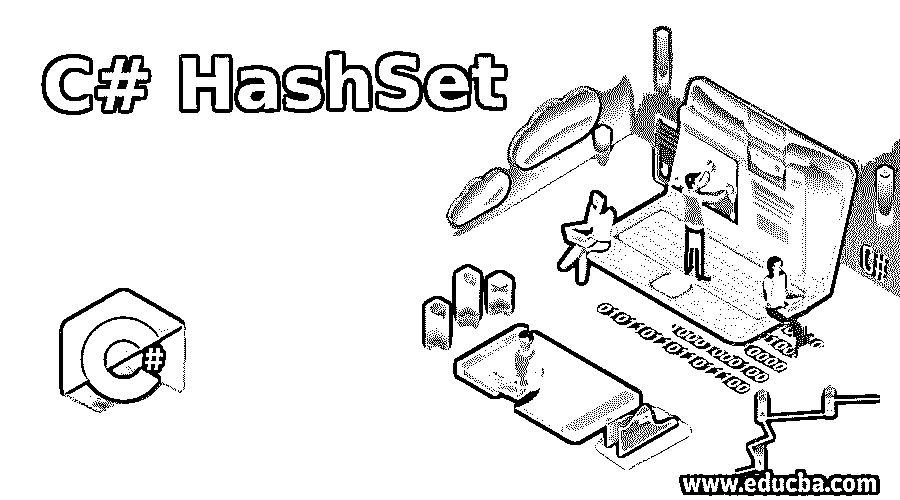
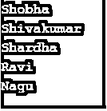
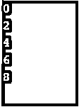

# C# HashSet

> 原文：<https://www.educba.com/c-sharp-hashset/>




## C# HashSet 简介

在 C#中，不按顺序排列的唯一元素集合被称为 HashSet <t>，它位于名称空间系统下。Collections.Generic 在我们的集合中不需要任何重复项时使用，即避免在集合中插入重复项。为了比较 HashSet 的性能，HashSet 提供了比 list 和 Set 操作更好的性能。HashSet 提供了高性能，对象持有的元素数量是 HashSet 的容量，它随着元素数量的增加而增加。</t>

**c#中 HashSet 的语法**

<small>网页开发、编程语言、软件测试&其他</small>

```
HashSet<Type_of_hashset> Hashset_name = new HashSet<Type_of_hashset>();
```

上面的语法表示 C#中的 HashSet。hashset 的类型也可以用大写字母 t 来表示。

### 在 C#中使用 Hashset

C#中的 Hashset 是一个独特的元素集合，没有任何顺序。它属于命名空间系统。当我们的集合中不需要任何副本时，就会使用它，也就是说，它可以避免在集合中插入副本，并比较 HashSet 的性能。与链表集合操作相比，HashSet 提供了更好的性能。为了理解 hashset 的工作原理，让我们从用 C#创建一个简单的 hashset 程序开始。

**代码:**

```
using System;
using System.Collections.Generic;
using System.Linq;
using System.Text;
using System.Threading.Tasks;
namespace HashSet {
class Programcheck {
static void Main(string[] args) {
HashSet < string > nameslist = new HashSet < string > {
"Shobha",
"Shivakumar",
"Shardha"
};
foreach(var nam in nameslist) {
Console.WriteLine(nam);
}
Console.ReadKey();
}
}
}
```

在上面的程序中，创建了一个简单的字符串类型的 hashset。字符串 Shobha、Shivakumar 和 Shardha 被添加到创建的 string 类型的 hashset 中。上面程序的输出显示在下面的快照中:


如前所述，hashset 不允许在集合中添加重复的元素。让我们尝试向上面创建的 strings 类型的 hashset 添加一个复制元素，并理解程序的输出。然后，我们可以使用 add 方法将元素添加到集合中。

**代码:**

```
using System;
using System.Collections.Generic;
using System.Linq;
using System.Text;
using System.Threading.Tasks;
namespace HashSet {
class Programcheck {
static void Main(string[] args) {
HashSet < string > nameslist = new HashSet < string > {
"Shobha",
"Shivakumar",
"Shardha"
};
nameslist.Add("Shobha");
//collection cannot contain duplicate elements.
foreach(var nam in nameslist) {
Console.WriteLine(nam);
}
Console.ReadKey();
}
}
}
```

在上面的程序中，创建了一个简单的字符串类型的 hashset。然后，将字符串 Shobha、Shivakumar 和 Shardha 添加到创建的 strings 类型的 hashset 中。如果我们尝试使用 add 方法向创建的 hashset 添加一个重复的字符串 Shobha，不会显示错误，但是它不会添加重复的字符串，在输出中也可以看到同样的情况。上面程序的输出显示在下面的快照中:


在 C#中，有一个名为 Union 的方法存在于 hashset 中。它用于将两个集合中的元素合并到一个集合中，并在该集合中调用它。考虑下面的程序。

**代码:**

```
using System;
using System.Collections.Generic;
using System.Linq;
using System.Text;
using System.Threading.Tasks;
namespace HashSet {
class Programcheck {
static void Main(string[] args) {
HashSet < string > nameslist = new HashSet < string > {
"Shobha",
"Shivakumar",
"Shardha"
};
HashSet < string > nameslist1 = new HashSet < string > {
"Shobha",
"Shivakumar",
"Shardha",
"Ravi",
"Nagu"
};
nameslist.UnionWith(nameslist1);
foreach(var nam in nameslist) {
Console.WriteLine(nam);
}
Console.ReadKey();
}
}
}
```

在上面的程序中，创建了两个简单的 strings 类型的 hashsets。首先，将字符串 Shobha、Shivakumar 和 Shardha 添加到 string 类型的第一个 hashset 中。然后，将字符串 Shobha、Shivakumar、Shardha、Ravi 和 Nagu 添加到 string 类型的第二个 hashset 中。现在我们使用方法 is hashset 的 union 来组合第一个 hashset 和第二个 hashset 的元素。上面程序的输出显示在下面的快照中:




在 C#中，有一个名为 Intersect 的方法与 hashset 中的方法相同。它用于将两个集合中共同存在的元素合并到一个集合中，并在该集合上调用它。考虑下面的程序。

**代码:**

```
using System;
using System.Collections.Generic;
using System.Linq;
using System.Text;
using System.Threading.Tasks;
namespace HashSet {
class Programcheck {
static void Main(string[] args) {
HashSet < string > nameslist = new HashSet < string > {
"Shobha",
"Shivakumar",
"Shardha"
};
HashSet < string > nameslist1 = new HashSet < string > {
"Shobha",
"Shivakumar",
"Shardha",
"Ravi",
"Nagu"
};
nameslist.IntersectWith(nameslist1);
foreach(var nam in nameslist) {
Console.WriteLine(nam);
}
Console.ReadKey();
}
}
}
```

在上面的程序中，创建了两个简单的 strings 类型的 hashsets。首先，将字符串 Shobha、Shivakumar 和 Shardha 添加到 string 类型的第一个 hashset 中。接下来，将字符串 Shobha、Shivakumar、Shardha、Ravi 和 Nagu 添加到 string 类型的第二个 hashset 中。现在我们使用与方法 is hashset 相交来组合第一个 hashset 和第二个 hashset 中的公共元素。上面程序的输出显示在下面的快照中:


C#中有一个名为 Except with method 的方法存在于 hashset 中。它用于移除所有两个集合中存在的所有元素，调用它的集合除外。考虑下面的程序。

**代码:**

```
using System;
using System.Collections.Generic;
using System.Linq;
using System.Text;
using System.Threading.Tasks;
namespace HashSet {
class Programcheck {
static void Main(string[] args) {
HashSet < string > nameslist = new HashSet < string > {
"Shobha",
"Shivakumar",
"Shardha"
};
HashSet < string > nameslist1 = new HashSet < string > {
"Shobha",
"Shivakumar",
"Shardha",
"Ravi",
"Nagu"
};
nameslist1.ExceptWith(nameslist);
foreach(var nam in nameslist1) {
Console.WriteLine(nam);
}
Console.ReadKey();
}
}
}
```

在上面的程序中，创建了两个简单的 strings 类型的 hashsets。首先，将字符串 Shobha、Shivakumar 和 Shardha 添加到 string 类型的第一个 hashset 中。接下来，将字符串 Shobha、Shivakumar、Shardha、Ravi 和 Nagu 添加到 string 类型的第二个 hashset 中。现在，我们将 Except 与 hashset 中的方法一起使用，以移除所有集合中存在的所有元素，除了调用它的集合。上面程序的输出显示在下面的快照中:


### C# HashSet 的例子

下面给出了 C# HashSet 的例子:

#### 示例#1

C#程序演示了如何创建一个 hashset 并向 hashset 中添加元素。

**代码:**

```
using System;
using System.Collections.Generic;
class Hashset {
// Calling the main method
public static void Main()
{
// An hashset of even numbers is created
HashSet<int> even = new HashSet<int>();
// Adding the elements in to the hashset
for (int i = 0; i < 5; i++) {
even.Add(2 * i);
}
// Printing the elements in the hashset
foreach(int j in even)
{
Console.WriteLine(j);
}
}
}
```

**输出:**




#### 实施例 2

C#程序来说明 hashset 中包含的方法。

**代码:**

```
using System;
using System.Collections.Generic;
class hashset {
// Calling the main method
public static void Main()
{
// An hashset consisting of strings is created
HashSet<string> cl = new HashSet<string>();
// Elements are inserted into the hashset
cl.Add("Shobha");
cl.Add("Shivakumar");
cl.Add("Shardha");
cl.Add("Ravi");
// Using the contains method to check if an element is present in the collection
if (cl.Contains("Shobha"))
Console.WriteLine("The element specified is present");
else
Console.WriteLine("The element specified is not present");
}
}
```

**输出:**


### 推荐文章

这是一个 C# HashSet 的指南。这里我们通过定义讨论 C#中 Hashset 的概念，然后通过示例程序理解 C#中 Hashset 的语法和工作方式。您也可以看看以下文章，了解更多信息–

1.  [c#中的静态关键字](https://www.educba.com/static-keyword-in-c-sharp/)
2.  [C#接口](https://www.educba.com/c-sharp-interface/)
3.  [C#输出参数](https://www.educba.com/c-sharp-out-parameter/)
4.  [c#中的 Goto 语句](https://www.educba.com/goto-statement-in-c-sharp/)


