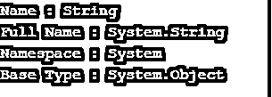
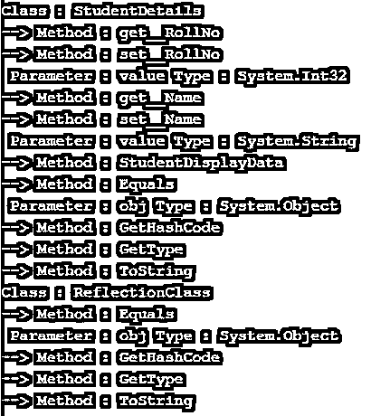

# C#中的反射

> 原文：<https://www.educba.com/reflection-in-c-sharp/>


## C#中反射的定义

C#中的反射是收集关于其特性的信息并对其自身进行操作的过程。收集信息包括对象的属性、类型、事件和方法；反射在查找所有类型的程序集时非常有用。动态地，它调用一个组装方法，我们可以动态地绑定或获取现有对象的类型；反射用于创建该类型的实例。我们可以访问它的属性和字段，反射的主要目的是读取它的元数据，以便在运行时搜索程序集。

### C#中为什么需要反射？

我们需要 C#中的反射来获取运行时的类型信息；它是在运行时观察托管代码以读取其元数据来查找模块和程序集的过程。反射通过从程序集中提取元数据来反映程序，元数据用于修改程序的行为。系统。反射命名空间允许您访问方法、加载类型和字段的托管视图，以动态创建和调用类型。我们要求对下面的申请过程进行反思，

<small>网页开发、编程语言、软件测试&其他</small>

*   在运行时过程中，反射允许查看属性信息。
*   反射允许后期绑定到属性和方法
*   它研究了几种类型的程序集及其类型
*   它允许在运行时创建新类型，并通过遵循这些类型来执行各种任务。

### 反射在 C#中是如何工作的？

C#反射使应用程序能够自己获取信息，同时它也对自己进行操作。它有效地搜索所有类型的程序集，并动态地调用程序集方法。

反射中使用的最重要的类是 System。Type class 是一个抽象类，表示一个称为 CTS(通用类型系统)的类型。使用这个类，我们可以找到我们在命名空间模块中使用的类型，并验证给定的类型是值类型还是引用类型。通过使用以下项目，我们可以解析元数据表，

*   方法
*   性能
*   事件
*   菲尔茨

使用反射，实现了后期绑定；在编译时，由于这些原因，我们可能不知道加载哪个程序集；我们通过要求用户在运行时输入程序集名称和类型来加载适当的程序集。通过对程序集进行直接加载，我们使用系统。反思。程序集通过获取三个静态类型分别是，

*   LoadFrom
*   装载模块
*   LoadWithPartialName

考虑到程序集是一个 exe 或 dll 文件，使该文件成为通用类型系统的可移植可执行文件，其扩展名为。可移植可执行文件是包含如下几个表的元数据，

*   方法定义表
*   类型定义表
*   字段定义表

### C#中的反射示例

下面是 C#中的反射示例:

#### 示例#1

```
using System;
using System.Reflection;
namespace Reflection_Sample {
class Program_1 {
// Main Method
static void Main(string[] args)
{
// to initialize _type as typeof string
Type _type = typeof(string);
// by using the Reflection to find and in any sort of data related to _type
Console.WriteLine("Name : {0}", _type.Name);
Console.WriteLine("Full Name : {0}", _type.FullName);
Console.WriteLine("Namespace : {0}", _type.Namespace);
Console.WriteLine("Base Type : {0}", _type.BaseType);
}
}
}
```

在上面的代码中，我们使用 typeof 方法将 type _type 作为字符串加载。然后，我们将 reflection on _type 与 string class 的信息联系起来，包括名称空间、名称、全名和基本类型。

**输出:**




#### 实施例 2

在这个程序中，我们通过定义 typeof 方法得到程序集，并通过 this way _type 得到。组装。让我们看看示例程序

```
using System;
using System.Reflection;
public class ReflectionExample
{
public static void Main()
{
Type _type = typeof(System.String);
Console.WriteLine(_type.Assembly);
}
}
```

**输出:**


#### 实施例 3

在这个程序中，我们使用反射来显示元数据；它包括方法、类和各种参数化的构造函数。让我们看看下面的例子，

```
using System;
using System.Reflection;
namespace Sample_ReflectionMetadata
{
// to define a class StudentDetails
class StudentDetails
{
// defining the Properties
public int _RollNo
{
get;
set;
}
public string _Name
{
get;
set;
}
// Constructor with no arguments
public StudentDetails()
{
_RollNo = 0;
_Name = string.Empty;
}
// this is a Parameterised Constructor with 2 parameters
public StudentDetails(int _Srollno, string _Sname)
{
_RollNo = _Srollno;
_Name = _Sname;
}
// to invoke method to Display Student Details
public void StudentDisplayData()
{
Console.WriteLine("Roll Number : {0}", _RollNo);
Console.WriteLine("Name : {0}", _Name);
}
}
class ReflectionClass
{
// Main Method
static void Main(string[] args)
{
// to declare Assembly and loading the current assembly
Assembly _executing = Assembly.GetExecutingAssembly();
Type[] _types = _executing.GetTypes();
foreach(var item in _types)
{
Console.WriteLine("Class : {0}", item.Name);
// storing the methods  in array
MethodInfo[] methods = item.GetMethods();
foreach(var method in methods)
{
// for displaying each method
Console.WriteLine("--> Method : {0}", method.Name);
// to store the parameters in array
ParameterInfo[] parameters = method.GetParameters();
foreach(var arg in parameters)
{
Console.WriteLine(" Parameter : {0} Type : {1}",
arg.Name, arg.ParameterType);
}
}
}
}
}
}
```

**输出:**




#### 实施例 4

反射是动态观察和改变其真实结构和行为的过程。在下面的示例程序中，反射的作用是我们可以在运行时分析和改变应用程序中的信息。让我们看看这个例子，

```
using System;
using System.Collections.Generic;
using System.Text;
using System.Reflection;
namespace ReflectionSample
{
class Program
{
private static int value_1= 15, value_2 = 25, value_3 = 30;
static void Main(string[] args)
{
Console.WriteLine("The Values are = " + (value_1 + value_2 + value_3));
Console.WriteLine("Input the Name of variable to be altered:");
string _varName = Console.ReadLine();
Type _type = typeof(Program);
FieldInfo _fieldInfo = _type.GetField(_varName, BindingFlags.NonPublic | BindingFlags.Static);
if(_fieldInfo != null)
{
Console.WriteLine("The Latest Value of " + _fieldInfo.Name + " is " + _fieldInfo.GetValue(null) + ". Input NeW Value:");
string newValue = Console.ReadLine();
int newInt;
if(int.TryParse(newValue, out newInt))
{
_fieldInfo.SetValue(null, newInt);
Console.WriteLine(" Final Values are = " + (value_1 + value_2 + value_3));
}
Console.ReadKey();
}
}
}
}
```

在这里，我们可以通过知道变量名在运行时改变变量值。通过使用反射，我们可以实现这些类型的方法。让我们看看下面的输出:

**输出:**


### 结论

我希望你喜欢这篇文章；C#反射涵盖了。网此处；我们已经了解了 C#中反射的工作原理。Net 的几个例子。希望这篇文章能帮助你很好的理解。

### 推荐文章

这是 C#中的反射指南。在这里，我们讨论小组是如何在 Tableau 和工作和例子。您也可以看看以下文章，了解更多信息–

1.  [c#中的队列](https://www.educba.com/queue-in-c-sharp/)
2.  [c#中的条件运算符](https://www.educba.com/conditional-operators-in-c-sharp/)
3.  [C#文字量](https://www.educba.com/c-sharp-literals/)
4.  [c#中的私有](https://www.educba.com/private-in-c-sharp/)


