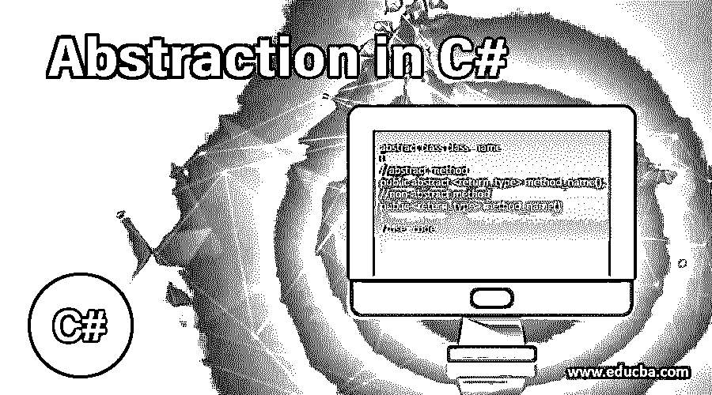
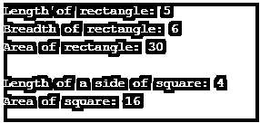
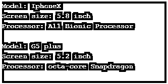
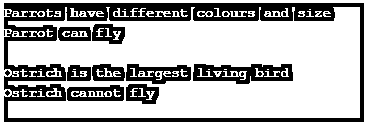
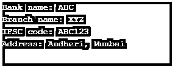

# C#中的抽象

> 原文：<https://www.educba.com/abstraction-in-c-sharp/>




## C#中的抽象介绍

抽象是面向对象编程的一个重要部分。C#支持抽象，这是一个隐藏实现细节并只向用户提供基本信息的过程。在 C#中，我们可以借助抽象类和方法实现抽象。

以下是关于抽象类的一些要点:

<small>网页开发、编程语言、软件测试&其他</small>

*   我们可以通过在类名和方法名前面加上关键字 abstract 来定义抽象类和方法。
*   我们不能创建抽象类的对象。
*   抽象类可以包含抽象和非抽象方法。
*   抽象类不能声明为密封类。

**带解释的语法:**

我们可以在关键字 abstract 的帮助下声明抽象类和方法，如下面的语法所示:

```
//abstract class
abstract class class_name
{
//abstract method
public abstract <return_type> method_name();
}
```

在上面的语法中，我们可以看到抽象方法没有任何人。抽象类的抽象方法的实现是由派生类提供的。我们可以通过从抽象类继承的类来访问抽象类。

我们不能在抽象类之外声明抽象方法，但是抽象类可以包含非抽象方法，如下面的语法所示:

```
abstract class class_name
{
//abstract method
public abstract <return_type> method_name();
//non-abstract method
public <return_type> method_name()
{
//user code
}
}
```

### C#中的抽象示例

有时，用户需要在超类中创建方法和属性的通用形式，这些方法和属性可以由它的整个子类共享，这些子类可以通过相应地提供方法的实现来根据它们的需求使用这些方法和属性。

下面是一些例子:

#### 示例#1

```
using System;
namespace abstraction
{
//abstract class
abstract class Shape
{
//abstract methods
public abstract double calculateArea();
public abstract void displayDetails(double area);
}
//Rectangle class inheriting Shape class
class Rectangle : Shape
{
//private data members
private double length;
private double breadth;
public Rectangle(double length, double breadth)
{
this.length = length;
this.breadth = breadth;
}
//overriding abstract methods of Shape class using 'override' keyword
public override double calculateArea()
{
return (length * breadth);
}
public override void displayDetails(double area)
{
Console.Write("Length of rectangle: "+length);
Console.Write("\nBreadth of rectangle: "+breadth);
Console.Write("\nArea of rectangle: "+area);
}
}
//Square class inheriting Shape class
class Square : Shape{
//private data members
private double side;
public Square(double side)
{
this.side = side;
}
//overriding abstract methods of Shape class using 'override' keyword
public override double calculateArea()
{
return (side * side);
}
public override void displayDetails(double area)
{
Console.Write("Length of a side of square: "+side);
Console.Write("\nArea of square: "+area);
}
}
public class AbstractionDemo
{
public static void Main(string[] args)
{
double area;
//creating reference of Shape class using Rectangle class
Shape shapeRec = new Rectangle(5,6);
area = shapeRec.calculateArea();
shapeRec.displayDetails(area);
Console.WriteLine("\n");
//creating reference of Shape class using Square class
Shape shapeSquare = new Square(4);
area = shapeSquare.calculateArea();
shapeSquare.displayDetails(area);
}
}
}
```

**输出:**




在上面的例子中，在抽象类“Shape”下定义的两个方法都是抽象方法。因此，Shape 是一个纯粹的抽象基类，派生类有必要为 Shape 类的两个方法提供一个实现。

#### 实施例 2

```
using System;
abstract class Mobile
{
public abstract void mobileDetails();
}
class Apple : Mobile
{
public override void mobileDetails()
{
Console.WriteLine("Model: IphoneX");
Console.WriteLine("Screen size: 5.8 inch");
Console.WriteLine("Processor: A11 Bionic Processor");
}
}
class Motorola : Mobile
{
public override void mobileDetails()
{
Console.WriteLine("Model: G5 plus");
Console.WriteLine("Screen size: 5.2 inch");
Console.WriteLine("Processor: octa-core Snapdragon");
}
}
public class AbstractionDemo
{
public static void Main(string[] args)
{
Mobile mobileApple = new Apple();
mobileApple.mobileDetails();
Console.WriteLine("");
Mobile mobileMoto = new Motorola();
mobileMoto.mobileDetails();
}
}
```

**输出:**




#### 实施例 3

抽象类也可以包含非抽象方法，如下例所示:

```
using System;
namespace abstraction
{
abstract class Birds
{
//abstract method
public abstract void birdDetails();
//non-abstract method
public void canFly(bool canFly, string name)
{
if(canFly)
Console.WriteLine(name+" can fly");
else
Console.WriteLine(name+" cannot fly");
}
}
class Parrot : Birds
{
public override void birdDetails()
{
Console.WriteLine("Parrots have different colours and size");
}
}
class Ostrich : Birds
{
public override void birdDetails()
{
Console.WriteLine("Ostrich is the largest living bird");
}
}
public class AbstractionDemo
{
public static void Main(string[] args)
{
Birds birdParrot = new Parrot();
birdParrot.birdDetails();
birdParrot.canFly(true, "Parrot");
Console.WriteLine("");
Birds birdOstrich = new Ostrich();
birdOstrich.birdDetails();
birdOstrich.canFly(false, "Ostrich");
}
}
}
```

**输出:**




#### 实施例 4

除了抽象类和方法，我们还可以使用私有访问修饰符在 C#中实现抽象，如下例所示:

```
using System;
namespace abstraction
{
public class Bank
{
private string name;
private string branch;
private string ifscCode;
public string Name
{
get { return name; }
set { name = value; }
}
public string Branch
{
get { return branch; }
set { branch = value; }
}
public string IfscCode
{
get { return ifscCode; }
set { ifscCode = value; }
}
public void bankDetails()
{
Console.WriteLine("Bank name: " + Name);
Console.WriteLine("Branch name: " + Branch);
Console.WriteLine("IFSC code: " + IfscCode);
}
public void bankAddress()
{
Console.WriteLine("Address: Andheri, Mumbai");
}
private void numberOfAccounts()
{
Console.WriteLine("Account Information");
}
private void numberOfLockers()
{
Console.WriteLine("Locker Information");
}
}
public class AbstractionDemo
{
public static void Main(string[] args)
{
Bank bank = new Bank();
bank.Name = "ABC";
bank.Branch = "XYZ";
bank.IfscCode = "ABC123";
bank.bankDetails();
bank.bankAddress();
//Error -'Bank.numberOfAccounts()' is inaccessible due to its protection level
//bank.numberOfAccounts();
//Error - 'Bank.numberOfLockers()' is inaccessible due to its protection level
//bank.numberOfLockers();
}
}
}
```

**输出:**




在上面的例子中，我们可以看到可以从其他类访问公共方法，但是我们不能从其他类调用私有方法，因此它通过提供唯一必要的信息和隐藏其他细节来帮助实现抽象。

### 结论–c#中的抽象

面向对象编程中的抽象通过隐藏实现细节和只向用户提供必要的信息来提供安全性。我们使用一个抽象类，在抽象方法的帮助下，我们可以隐藏实现细节。抽象也可以通过使用接口来实现。

### 推荐文章

这是 C#中的抽象指南。在这里，我们讨论介绍，语法解释和例子。您也可以看看以下文章，了解更多信息–

1.  [c#中的访问修饰符](https://www.educba.com/access-modifiers-in-c-sharp/)
2.  [JavaScript 的抽象类](https://www.educba.com/abstract-classes-in-javascript/)
3.  [什么是 ARP？](https://www.educba.com/what-is-arp/)
4.  [什么是 C++](https://www.educba.com/what-is-c-plus-plus/)


