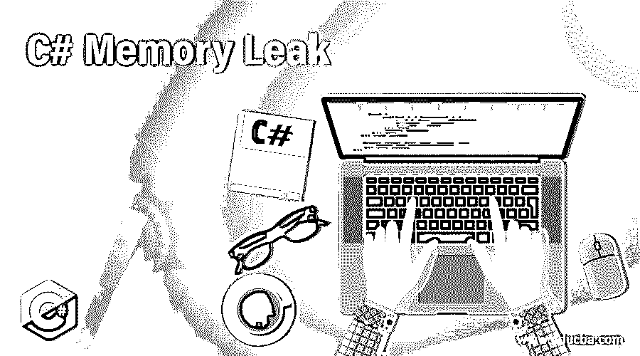
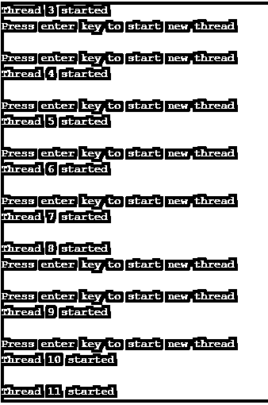

# C#内存泄漏

> 原文：<https://www.educba.com/c-sharp-memory-leak/>




## C#内存泄漏介绍

当程序或应用程序长时间使用系统的主内存时，就会发生内存泄漏。当程序在执行过程中没有释放它所占用的内存时，即使在它完成了它的执行过程之后，那么这个分配的内存空间会降低系统的性能，并且会使它不响应。在这个主题中，我们将学习 C#内存泄漏。

释放未使用的分配内存是垃圾收集器的责任，但是我们仍然会遇到内存泄漏的问题，因为我们有时会从一个变量中引用未使用的对象，而这个变量在应用程序的整个生命周期中都不会超出范围。

<small>网页开发、编程语言、软件测试&其他</small>

**语法**

C#中避免内存泄漏的方法有很多；在使用非托管资源时，我们可以借助“using”语句避免内存泄漏，该语句在内部调用 Dispose()方法。“using”语句的语法如下:

```
using(var  objectName = new AnyDisposableType)
{
//user code
}
```

在上面的语句中，“var”是用于存储任何类型数据的关键字，编译器可以在编译时计算出这种数据类型。“objectName”是用户为对象定义的任何名称。“new”是用于初始化对象的关键字，“AnyDisposableType”可以是任何类，如 StreamReader、BinaryReader、SqlConnection 等。其对象可以借助于“using”语句来处理。

### C#中内存泄漏是如何工作的？

因为。NET 应用程序中，我们有一个垃圾收集器来处理未使用的内存，但我们仍然会遇到内存泄漏的问题。这并不意味着垃圾收集器不能正常工作，但这是由于程序员的无知造成的。

假设我们在很长一段时间内忽略应用程序中的内存泄漏。在这种情况下，我们增加了应用程序的内存消耗，这降低了应用程序的性能，并可能逐渐破坏它，产生 OutOfMemoryException。

C#中内存泄漏有两个主要原因:

*   第一个原因是有一个未使用的对象，它不再需要，但仍被一个变量引用，该变量的作用域贯穿于应用程序的整个生命周期。因为这个对象有一个引用，所以它不会被垃圾回收器销毁，它将永远保留在内存中，并可能成为内存泄漏的原因。这种情况的一个例子是我们已经注册但从未取消注册的事件。
*   第二个原因是为非托管资源分配内存，然后在使用后不释放它。像托管资源一样，非托管资源不能被自动垃圾回收。因此，程序员有责任在使用后释放内存。

C#中导致内存泄漏的一些原因如下:

*   当我们订阅一个事件时，发布该事件的类持有对订阅该事件的类的引用。由于这个原因，垃圾收集器不会释放订阅该事件的类的对象，同时，如果程序员不取消订阅该事件，则会导致内存泄漏。
*   在匿名方法中捕获类成员会导致内存泄漏。
*   静态类和它们相关的静态变量以及这些静态变量引用的任何东西永远不会被垃圾收集，并且会导致内存泄漏。
*   无限期使用缓存功能会导致内存泄漏。
*   如果我们有一个无限运行的线程，它在应用程序中没有任务，但是引用对象，这可能导致内存泄漏。
*   垃圾回收器不管理非托管资源。因此，在使用非托管资源后不释放它会导致内存泄漏。

### C#内存泄漏的例子

下面提到了不同的例子:

#### 示例#1

这个例子显示了一个等待自己终止的线程，因此可能会导致内存泄漏。

**代码:**

```
using System;
using System.Threading;
namespace ConsoleApp4
{
public class Program
{
public static void Main()
{
while (true)
{
Console.WriteLine("Press enter key to start new thread");
Console.ReadLine();
Thread thread = new Thread(new ThreadStart(StartThread));
thread.Start();
}
}
public static void StartThread()
{
Console.WriteLine("Thread " +
Thread.CurrentThread.ManagedThreadId + " started");
//Wait until current thread terminates
Thread.CurrentThread.Join();
}
}
}
```

**输出:**




每当我们在上面的程序中按下' Enter '键，它的内存使用率就会增加。

#### 实施例 2

该示例显示了在“using”语句的帮助下使用非托管资源来避免内存泄漏。

**代码:**

```
using System;
using System.IO;
namespace ConsoleApp4
{
public class Program
{
public static void Main()
{
string filePath = @"E:\Content\memoryLeak.txt";
string content = string.Empty;
try
{
//writing file using StreamWriter
//making use of 'using' statement to dispose object after using it
using (StreamWriter writer = new StreamWriter(filePath))
{
writer.WriteLine("Learning C# programming");
}
//reading file using StreamReader
using (StreamReader streamReader = new StreamReader(filePath))
{
content = streamReader.ReadToEnd();
}
}
catch (Exception exception)
{
Console.WriteLine(exception.Message);
Console.ReadLine();
}
Console.WriteLine(content);
Console.ReadLine();
}
}
}
```

**输出:**


### C#中如何避免 OutOfMemoryException？

为了避免由于 C#中的内存泄漏而导致 OutOfMemoryException，需要记住以下几点:

*   如果我们订阅了一个事件，我们需要从事件中注销事件处理程序。我们可以通过实现 IDisposable 来实现这一点。
*   在匿名方法中捕获局部变量而不是类变量可以避免内存泄漏。
*   避免在我们的应用程序中过多使用静态变量，特别是当这些变量是引用类型时，我们可以避免内存泄漏的情况。
*   如果我们的应用程序中有缓存功能，那么我们需要定期清除缓存，特别是当它长时间没有用的时候。我们还可以限制缓存大小，并利用 WeakReference 来存储缓存的对象。
*   正确管理应用程序中的线程可以避免内存泄漏。

### 结论

当一个应用程序不释放它在执行过程中使用的内存时，这个内存将被阻塞，不能被任何其他进程使用，从而导致内存泄漏。垃圾回收器可以自动释放托管对象，但不能释放非托管对象或资源。

### 推荐文章

这是一个 C#内存泄漏的指南。在这里，我们讨论了内存泄漏在 C#中是如何工作的，以及示例、代码和输出。您也可以看看以下文章，了解更多信息–

1.  [C#链表](https://www.educba.com/c-sharp-linkedlist/)
2.  [c#中的类型转换](https://www.educba.com/type-casting-in-c-sharp/)
3.  [C#数据网格视图](https://www.educba.com/c-sharp-data-grid-view/)
4.  [IEnumerable C#](https://www.educba.com/ienumerable-c-sharp/)


