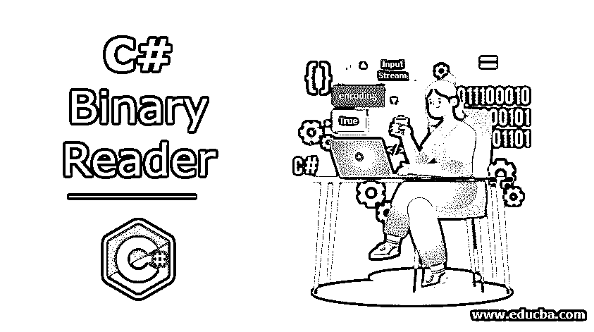

# C#二进制阅读器

> 原文：<https://www.educba.com/c-sharp-binaryreader/>




## C# BinaryReader 简介

在 C#中，BinaryReader 是一个用于处理二进制数据的类。它位于系统下。IO 命名空间。BinaryReader 用于读取特定编码流中作为二进制值的原始数据类型。BinaryReader 使用流对象，也就是说，为了创建 BinaryReader 的对象，我们需要在其构造函数中传递流对象。BinaryReader 类有三个重载的构造函数来处理二进制数据。默认情况下，BinaryReader 使用 UTF-8 编码来读取数据，直到我们在创建其对象时指定其他字符编码。

### 带解释的语法

我们可以用三种方式创建 BinaryReader 的对象，如下所示:

<small>网页开发、编程语言、软件测试&其他</small>

```
BinaryReader binary_reader = new BinaryReader(inputStream);
```

上面的语句通过使用 UTF-8 编码，基于指定的流(inputStream)初始化 BinaryReader 的新实例。

```
BinaryReader binary_reader = new BinaryReader(inputStream, encoding);
```

该语句根据指定的流( *i* nputStream)和 encoding 指定的编码初始化 BinaryReader 的新实例。

```
BinaryReader binary_reader = new BinaryReader(inputStream, encoding, true);
```

此语句的工作方式与上面两个语句相同，只是多了一个 Boolean 类型的参数，用于指定在 BinaryReader 的对象被释放后，用户是否希望保持流打开。此参数需要为“真”以保持流打开，否则需要为“假”。

除了这三种方法，我们还可以使用以下语句创建 BinaryReader:

```
using(BinaryReader binary_reader = new BinaryReader(File.Open(file_path, FileMode.Open)))
{
//user code
}
```

在上面的语句中，文件。Open()方法返回 FileStream 的对象，因此它有助于创建 BinaryReader 的对象。

在“using”块中创建对象的好处是，当对象的工作完成并且不再需要时，它会释放该对象占用的内存。

### BinaryReader 在 C#中是如何工作的？

BinaryReader 用于读取二进制信息，即用于读取存储在二进制文件中的数据。二进制文件以一种机器容易理解的方式存储数据，但是对于人类来说，理解这样的数据是非常困难的。为了帮助理解这些数据，使用了 BinaryReader。为了使用 BinaryReader，我们首先需要导入系统。代码中的 IO 命名空间。在这之后，我们需要在“new”操作符的帮助下创建一个 BinaryReader 的实例，并绕过 BinaryReader 的构造函数内的 Stream 对象。

在创建 BinaryReader 的实例时，我们提供要读取的流，然后我们可以选择指定要使用的字符编码。如果我们不指定编码，默认情况下使用 UTF-8 编码。除此之外，我们还可以选择指定是否希望在 BinaryReader 的对象被释放后打开流，如下面的语句所示。

```
BinaryReader binary_reader = new BinaryReader(inputStream, encoding, true);
```

然后借助为不同数据类型提供的 BinaryReader 的不同 Read()方法，我们可以从文件中读取数据。

BinaryReader 有许多支持不同数据类型的 Read()方法，它们用于从流中读取原始数据类型。例如 BinaryReader 的 ReadString()方法用于读取下一个字节作为字符串值，并且它还将流中的当前位置提升一个字节。

下表中不同类型数据的 BinaryReader 的 Read()方法:

| **方法** | **描述** |
| 阅读() | 它用于从基础流中读取字符，并根据所使用的编码和从流中读取的特定字符来提升流的当前位置。 |
| ReadBoolean() | 它用于从流中读取布尔值，并将流的当前位置提升一个字节。 |
| 读取字节() | 它用于从当前流中读取下一个字节，还将流的当前位置提升一个字节。 |
| ReadChar() | 它用于从当前流中读取下一个字符，并且它还根据所使用的编码和从流中读取的特定字符来提升流的当前位置。 |
| ReadDecimal() | 它用于从当前流中读取十进制值，并使流的当前位置前进 16 个字节。 |
| ReadDouble() | 它用于从当前流中读取一个 8 字节的浮点值，并将流的当前位置提升 8 个字节。 |
| ReadInt32() | 它用于从当前流中读取一个 4 字节的有符号整数，并将流的当前位置提升 4 个字节。 |
| ReadString() | 它用于从当前流中读取一个字符串。 |

### C#二进制阅读器示例

使用 BinaryWriter 创建文件并使用 BInaryReader 读取文件的示例。

**代码:**

```
using System;
using System.Collections.Generic;
using System.Linq;
using System.Text;
using System.Threading.Tasks;
using System.IO;
namespace ConsoleApp4
{
public class Program
{
string filePath = "E:\\Content\\binaryFile.dat";
public void WriteFile()
{
try
{
//checking if the file already exists
if (File.Exists(filePath))
{
File.Delete(filePath);
}
FileStream stream = new FileStream(filePath, FileMode.OpenOrCreate,
FileAccess.Write, FileShare.ReadWrite);
//creating binary file using BinaryWriter
using (BinaryWriter writer = new BinaryWriter(stream))
{
writer.Write("This is string");
writer.Write(100.53);
writer.Write(true);
}
}
catch(Exception ex)
{
Console.WriteLine(ex.Message);
}
}
public void ReadFile()
{
try
{
//creating an object of Stream
FileStream stream = new FileStream(filePath, FileMode.Open,
FileAccess.Read, FileShare.ReadWrite);
//creating BinaryReader using Stream object
using (BinaryReader reader = new BinaryReader(stream))
{
//reading data using Read() methods of different data types
Console.WriteLine("String Value : " + reader.ReadString());
Console.WriteLine("Double Value : " + reader.ReadDouble());
Console.WriteLine("Boolean Value : " + reader.ReadBoolean());
}
}
catch(Exception ex)
{
Console.WriteLine(ex.Message);
}
}
}
public class BinaryReaderDemo
{
static void Main(string[] args)
{
Program obj = new Program();
obj.WriteFile();
obj.ReadFile();
Console.ReadKey();
}
}
}
```

**输出:**


### 结论

BinaryReader 用于读取特定编码流中作为二进制值的原始数据类型。如果没有明确定义，默认情况下，BinaryReader 使用 UTF-8 编码来读取数据。需要在 BinaryReader 的构造函数内部传递流对象，以便创建其实例。

### 推荐文章

这是一个 C#二进制阅读器的指南。这里我们讨论介绍，不同的例子以及 BinaryReader 在 C#中是如何工作的？您也可以看看以下文章，了解更多信息–

1.  [c#中的 Trim()](https://www.educba.com/trim-in-c-sharp/)
2.  C#中的[复选框](https://www.educba.com/checkbox-in-c-sharp/)
3.  [c#中的抽象类](https://www.educba.com/abstract-class-in-c-sharp/)
4.  [c#中的 binary writer](https://www.educba.com/binarywriter-in-c-sharp/)


