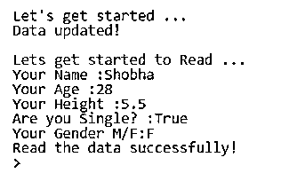

# C#中的文件处理

> 原文：<https://www.educba.com/file-handling-in-c-sharp/>


## C#中的文件处理概述

文件创建、从文件中读取内容、向文件中写入内容、文件附加等操作。，就是[简称文件处理](https://www.educba.com/file-handling-in-python/)。当文件被打开读写时，称为流，是用于通信的字节序列；流有两种类型:读取文件的输入流和写入文件的输出流，这两种流由系统处理。C#中的 IO 命名空间。它由文件结构和目录结构信息组成。系统里有阶级。IO 命名空间支持 c#中的文件处理。类别列表如下:

*   **二进制阅读器**:这个类用于从二进制流中读取原始数据。
*   **二进制写入器**:这个类用于将原始数据写入二进制流。
*   **文件流**:使用这个类从文件中读写数据。

### C#中文件处理的例子

以下是 C#中文件处理的示例:

<small>网页开发、编程语言、软件测试&其他</small>

#### 示例#1

C#程序，演示二进制读取器，二进制写入器，文件流类，创建一个文件，从文件中读取内容，并将内容写入文件。

```
using System;
using System.IO;
public class BinStream
{
public BinStream()
{
Writerfunc();
Readerfunc();
}
public static void Main()
{
BinStream bs1 = new BinStream();
Console.ReadLine();
}
private void Writerfunc()
{
try
{
Console.Out.WriteLine("Let's get started ...");
//a FileStream is opened on the file "new"
FileStream fout1 = new FileStream("new.txt", FileMode.OpenOrCreate,
FileAccess.Write, FileShare.ReadWrite);
//a BinaryWriter is created from the FileStream
BinaryWriter bw1 = new BinaryWriter(fout1);
//arbitrary variables are created
string name1 = "Shobha";
int age1 = 28;
double height1 = 5.5;
bool single1 = true;
char gender1 = 'F';
//values are written to the file
bw1.Write(name1);
bw1.Write(age1);
bw1.Write(height1);
bw1.Write(single1);
bw1.Write(gender1);
//file and free resources are closed
bw1.Close();
Console.WriteLine("Data updated!");
Console.WriteLine();
}
catch (IOException e)
{
Console.WriteLine("occurance of an input output exception :" + e);
}
}
private void Readerfunc()
{
try
{
Console.WriteLine("Lets get started to Read ...");
//FileStream is opened in Read mode
FileStream fin1 = new FileStream("new.txt", FileMode.Open,
FileAccess.Read, FileShare.ReadWrite);
//a BinaryReader is created from the FileStream
BinaryReader br1 = new BinaryReader(fin1);
//start of the file is searched
br1.BaseStream.Seek(0, SeekOrigin.Begin);
//the file is read and the values are stored to the variables
string name1 = br1.ReadString();
int age1 = br1.ReadInt32();
double height1 = br1.ReadDouble();
bool single1 = br1.ReadBoolean();
char gender1 = br1.ReadChar();
//the data is displayed on the console
Console.WriteLine("Your Name :" + name1);
Console.WriteLine("Your Age :" + age1);
Console.WriteLine("Your Height :" + height1);
Console.WriteLine("Are you Single? :" + single1);
Console.WriteLine("Your Gender M/F:" + gender1);
//stream is closed and the resources are freed
br1.Close();
Console.WriteLine("Read the data successfully!");
}
catch (IOException e)
{
Console.WriteLine("occurance of an input output exception :" + e);
}
}
}
```

上述代码的输出如下所示:




*   **缓冲流**:这个类为字节流提供临时存储。
*   **内存流**:使用该类可以随机访问内存中存储的流数据

#### 实施例 2

C#程序，演示缓冲流类和内存流类的使用

```
using System;
using System.Diagnostics;
using System.IO;
public class Program
{
public void Main()
{
var check = Stopwatch.StartNew();
// buffer writes to a MemoryStream by using buffered stream.
using (MemoryStream memory = new MemoryStream())
using (BufferedStream stream = new BufferedStream(memory))
{
// a byte is written 5 million times.
for (int i = 0; i < 5000000; i++)
{
stream.WriteByte(5);
}
}
check.Stop();
Console.WriteLine("BUFFEREDSTREAM TIME: " + check.Elapsed.TotalMilliseconds);
}
}
```

上面代码的输出显示在下面的快照中:


*   **目录**:这个类操纵目录的结构。
*   **目录信息**:使用这个类对目录进行操作。

#### 实施例 3

C#程序，演示目录类和目录信息类的使用

```
using System;
using System.IO;
namespace CSharp
{
class Programcheck
{
static void Main(string[] args)
{
//directory name is provided along with complete location.   DirectoryInfo directory = new DirectoryInfo(@"C:\\Users\\shivakumarsh\\Desktop\\dir1");
try
{
// A check is done to see if directory exists or no
if (directory.Exists)
{
Console.WriteLine("A directory by this name already exists");
return;
}
// a new directory is created.
directory.Create();
Console.WriteLine("New directory is created");
}
catch (Exception e)
{
Console.WriteLine("Directory cannot be created: {0}", e.ToString());
}
}
}
}
```

上面代码的输出显示在下面的快照中:


*   **驱动器信息**:使用该类为驱动器提供信息。

#### 实施例 4

一个 C#程序，演示了驱动信息类的使用

```
using System;
using System.IO;
class Programcheck
{
static void Main()
{
//the drive names are printed.
var drives1 = DriveInfo.GetDrives();
foreach (DriveInfo info in drives1)
{
Console.WriteLine(info.Name);
}
}
}
```

上面程序的输出显示在下面的快照中:


*   **文件**:使用这个类来操作文件
*   **文件信息**:使用该类对文件进行操作。
*   **Path** :使用这个类对路径信息进行操作。
*   **流阅读器**:使用这个类从字节流中读取字符。
*   **流写入器**:使用这个类将字符写入字节流。

#### 实施例 5

C#程序，演示文件的使用，文件信息，路径，流读取器，流写入器类

```
using System;
using System.IO;
class programcheck
{
public static void Main()
{
string path1 = Path.GetTempFileName();
var file1 = new FileInfo(path1);
//A file is created to write into it
using (StreamWriter swe = file1.CreateText())
{
swe.WriteLine("Welcome");
swe.WriteLine("to");
swe.WriteLine("C#");
}
// A file is opened to read from it
using (StreamReader sre = file.OpenText())
{
var sh = "";
while ((sh = sre.ReadLine()) != null)
{
Console.WriteLine(sh);
}
}
try
{
string path22 = Path.GetTempFileName();
var file2 = new FileInfo(path22);
// making sure there is no target
file2.Delete();
// File is copied.
file1.CopyTo(path22);
Console.WriteLine($"{path1} was copied to {path22}.");
// newly created file is deleted.
file2.Delete();
Console.WriteLine($"{path2} was deleted.");
}
catch (Exception e)
{
Console.WriteLine($" failed process: {e.ToString()}");
}
}
}
```

上面代码的输出显示在下面的快照中:


*   **字符串读取器**:使用这个类可以从字符串缓冲区中读取。
*   **字符串写入器**:可以使用这个类写入字符串缓冲区。

#### 实施例 5

C#程序，演示使用字符串读取器和字符串写入器类

```
using System;
using System.IO;
namespace CSharp
{
public class check
{
public static void Main(string[] args)
{
StringWriter strn = new StringWriter();
strn.WriteLine("Welcome to C#");
strn.Close();
// Creating an instance of StringReader and StringWriter is passed
StringReader read = new StringReader(strn.ToString());
// data is being read
while (read.Peek() > -1)
{
Console.WriteLine(read.ReadLine());
}
}
}
}
```

上面代码的输出显示在下面的快照中:


### 推荐文章

这是一个 C#文件处理指南。在这里，我们将讨论 C#中不同的文件处理操作，并举例说明它们。您也可以看看以下文章，了解更多信息–

1.  [受 C#保护](https://www.educba.com/protected-in-c-sharp/)
2.  [C 语言中的文件处理](https://www.educba.com/file-handling-in-c/)
3.  [c++中的文件处理](https://www.educba.com/file-handling-in-c-plus-plus/)
4.  [JavaScript 中的文件处理](https://www.educba.com/file-handling-in-javascript/)


