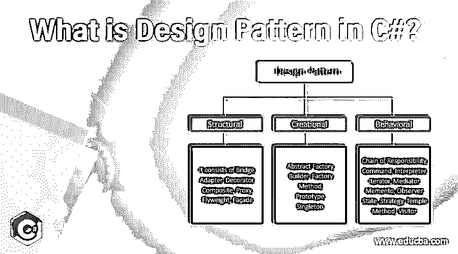

# C#中的设计模式是什么？

> 原文：<https://www.educba.com/what-is-design-pattern-in-c-sharp/>




## C#设计模式简介

以下文章概述了什么是 C#中的设计模式？在一个面向对象的世界里，设计模式是一个通用的解决方案，用来解决在实际环境应用程序开发中出现的软件设计问题。它是如何解决问题的蓝图或解释，可以用在许多情况下。开发人员使用模式通过他们独特的设计来解决他们的问题。不同设计模式之间设计模式的选择和使用取决于个人需求。

### 理解 C#中的设计模式

*   设计模式只不过是解决常见编码问题的公认的正式方法。设计模式帮助用户将基本脚本识别为支持解码问题的应用程序代理。设计模式不仅关注公共编程基础(数据类型、接口、 [switch 语句](https://www.educba.com/switch-statement-in-javascript/)、for-loops ),而且有助于识别和合并有用的模式。
*   在 GOF 模式出现之前，额外的模式已经存在，并且来自各种来源。这些模式设计专注于特定的问题领域，如并行处理。此外，一些模式侧重于构建特定类型的软件应用程序，如网络博客、视频游戏和数据库交互。其他设计模式依赖于构建一个安全的系统或解决其他更高层次的架构问题。
*   [设计模式为](https://www.educba.com/javascript-design-patterns/)提供了一个给定的平台和编程语言，支持用户快捷方式，帮助开发者更容易地实现给定的模式。比如说；Java 开发人员拥有辅助平台和工作空间，可以帮助他们轻松地混合模式。

### C#中的设计模式如何让工作变得如此简单？

*   C#中的设计模式专门通过节省时间和精力来开发伟大的艺术品。设计模式最好的一点是它们在本质上是不可知论的。
*   大多数设计模式并不依赖于特定的语言。这些设计模式可以应用在[各种框架中，比如。NET](https://www.educba.com/install-dot-net/) 、Java 2 以及类似 Delphi、C++、C#等编码语言。这些设计模式是开发人员问题的现成解决方案，一旦了解了模式的行为，开发人员就可以根据自己的需要和选择，使用语言和平台向结构中添加材料。
*   工作和应用程序的性质定义了设计模式的类型。经典的手写方法或特定语言的快捷方式帮助开发人员在应用程序和程序的编码中执行该模式。

### C#公司中的顶级设计模式

在 C#中使用设计模式的一些顶级公司如下:

<small>网页开发、编程语言、软件测试&其他</small>

*   美国著名软件公司
*   神谕
*   微软公司(全球知名的 PC 软件主要厂商)
*   VMWare
*   科雷尔公司。
*   CA 技术公司
*   Com

### C#中设计模式的各种子集

设计模式只是在项目之间和程序员之间重用面向对象代码的简单方法。

GoF 手册定义了 23 种经典模式，分为三大类:

| **各种模式** | **人生意义** | **该类别的经典图案** |
| 结构的 | 结构模式致力于类和对象的分类，并开发更新的工具和功能。 | 它由桥、适配器、装饰器、复合、代理、Flyweight 和外观组成。 |
| 创造型的 | 它们有助于灵活地决定需要为给定主题创建哪些对象。此外，这些还有助于将对象实例化到内存中。 | 抽象工厂，构建器，工厂方法，原型，单例。 |
| 行为的 | 顾名思义，这些模式基于对象之间的通信以及动态程序中流程的操作方式。 | 责任链、命令、解释器、迭代器、中介器、纪念品、观察者、状态、策略、圣殿方法、访问者。 |

### 结构设计模式

以下是一些结构设计模式:

*   **适配器模式:**为了简化编程，适配器模式可以帮助开发人员从一个类到另一个类的结构。
*   桥接模式:它有助于将用户界面从执行中分离出来。
*   **复合模式**:帮助用户在已有对象的框架下创建新的对象。
*   **装饰模式:**它有助于有效地扩展对象的性能。
*   **Facade 模式:**在这个模式的帮助下，开发者可以用一个单独的类来识别对象的集合。
*   **Flyweight 模式:**这些模式有助于维护内存的使用，并在表面上存储共享对象的状态。
*   **代理模式:**它的作用就像一个不同对象的替换物或替代物，以拥有控制入口。
*   **Twin:** 它允许在不支持 Twin 功能的编程脚本中创建两个或多个模型。

### 创造性设计模式

以下是一些创造性的设计模式:

*   抽象工厂模式(Abstract Factory Pattern):它为开发相关对象组提供了一个平台，而无需公开它们现有的类。
*   构建模式:它有助于将复杂物品的制作与展示分离开来。它有助于创建具有相同对象的其他演示文稿。
*   工厂方法模式:它有助于定义开发单个对象的接口。
*   原型模式:它基于从现有对象的结构中创建新对象，有助于提高性能。
*   单体模式:它确认一个类只有一个存在。
*   它确认一个类只有命名的存在。

### 行为设计模式

以下是一些行为设计模式:

*   **责任链模式:**它链接接收对象并传输请求，直到对象控制它。
*   **命令模式:**它将请求作为对象发送。它支持使用不可行的操作。
*   **解释器模式:**它用解释器定义了一个表示，解释器使用这个表示来讲述语言中的句子
*   **迭代器模式:**它允许访问聚合对象的元素。
*   **Mediator Pattern:** 它显示了一组对象如何交互和通信。
*   **Memento Pattern:** 它允许存储和捕获对象的内部属性，这些属性有助于在以后恢复对象的状态。
*   观察者模式:它定义了对象之间的依赖关系，其中一个变化会导致所有依赖对象的修改。
*   空对象:它通过支持默认对象来帮助避免空偏好。
*   访问者:它对对象模型的不同部分进行操作。

### 用 C#设计模式可以做什么？

C#拥有任何其他强大的现代语言的所有特性。C#的语法与 Java、C 或 C++语言的语法非常相似和熟悉。C#是一种区分大小写的语言，与 Visual Basic 不同。C#中的每条语句都以分号结束。

C#的语法是:

```
y= m*x + b;
```

由于 C#是区分大小写的语言，与 Visual Basic 不同，所以它是用小写字母编写的。

### 在 C#中使用设计模式

在 C#中使用设计模式很容易，它加快了解决应用程序相关问题的过程。

C#的主要模式如下:

*   **Singleton:** 这是最常见、最常用的模式。已经做好的框架执行这个模式，比如 Spring，CDI 或者 [EJB](https://www.educba.com/what-is-ejb/) 。使用这种模式的旧方法更加容易和简单。

这种模式的语法如下:

```
public class SingletonSample {
private static SingletonSample instance = null;
private SingletonSample() {
}
public static SingletonSample getInstance() {
if (instance == null) {
instance = new SingletonSample();
}
return instance;
}
}
```

*   二十三个经典设计模式与 UML 符号一起被用来描述它们。
*   UML 是一个简单的符号系统，它帮助用户绘制软件子系统的图表。
*   UML 并不关注实现细节。但是，它只关注被检查项之间的关系。

### 优势

在 C#中使用设计模式的一些主要优点如下:

*   设计模式可以通过提供经过测试和验证的开发解决方案来加速开发过程。开发人员重用设计模式来帮助他们解决各种小问题。这些设计模式使代码开发人员和工程师能够清楚地阅读脚本。
*   设计模式提供了简单易行的通用格式的解决方案，不需要任何需求。这些解决方案可以应用于软件开发的主要和特定的问题。
*   此外，开发人员使用这些设计来传达流行和著名的传输名称。旧的和[通用的设计模式](https://www.educba.com/design-pattern-interview-questions/)可以定期升级和更新。

### 所需技能

*   在开始学习 C#中的设计模式之前，用户应该对使用对象及其问题有很好的了解。
*   C#语言基础知识是学习设计模式的必要要求。
*   因为设计模式被视为计算机编程的直接方法，是编程语言级别和特定类之间的桥梁。
*   因此，对开发人员来说，预先了解这方面的知识将是一个额外的优势。

### C#中为什么要用设计模式？

在设计系统时，应该考虑三个主要用途，它们是:

*   它节省你的时间。用户不需要绞尽脑汁从任何地方重新应用一个可能的解决方案，也不需要浪费宝贵的时间
*   设计模式很常见，也很容易理解。人们知道它们是什么以及为什么被使用。当你说-我用一个工厂来创建这个对象。每个人都会明白你在说什么。
*   这些模式大部分都很容易理解。大多数情况下，解决方案不会像设计模式那样高效和简单。

### 范围

*   C#中的设计模式在很大程度上让开发者受益。
*   C#开发人员可以使用不同的变体和技巧，以现代的方式实现设计模式。
*   C#中设计模式的范围和未来是光明的。因为每个软件解决方案公司都以这样或那样的方式使用设计模式。
*   开发人员正在寻找快速简单解决方案的思路和方法。

### 谁是学习 C#技术中设计模式的合适受众？

C#中的设计模式是一种强大的技术，任何热衷于研究计算机工程和软件解决方案的人都可以学习。从初学者到有经验的人都可以学习这项技术。

不管语言是什么，学习设计模式是一个多步骤的过程。

*   接受
*   承认
*   内在化

首先，开发人员接受设计模式在工作中很重要的基本原则。然后，他们将理解设计模式的需求可视化，以知道何时使用它们。最后，他们最大限度地将模式内在化，这可能有助于他们解决给定的设计问题。

### 这项技术将如何帮助你的职业发展？

*   有各种不同的方法来熟悉设计模式。也强烈建议阅读 Smalltalk Companion 来理解这些模式。因为它支持每种模式的替代描述。
*   有几个为开发人员学习和讨论设计模式的网站。当今的软件世界中存在大量的设计模式，最终没有什么能阻止用户创建他们自己的模式。
*   设计模式支持广义的含义，并满足特定的需求。例如，一个开发人员知道单例模式是如何工作的，因此他会帮助其他开发人员理解项目中使用了单例模式。

### 结论

设计模式已经被证明是软件应用程序开发过程中出现的各种问题的最佳解决方案。设计模式的知识不仅会促进开发人员的职业发展，还会提高他们作为开发人员的技能。在设计模式的帮助下，软件开发变得更加容易。此外，如果在正确的情况下出于正确的原因使用，设计模式是非常有用的。当聪明地使用时，它们可以帮助程序员避免重新发明旧方法，而不是使用其他人已经改进过的方法，从而使程序员稍微更有能力。它们还提供了一种有用的公共交流方式，当与他人讨论或在大型团队中管理编码时，可以可视化重复的问题和解决方案。

### 推荐文章

这是 C#中什么是设计模式的指南？这里我们讨论了 C#中设计模式的基本概念、必备技能和优势。您也可以浏览我们推荐的其他文章，了解更多信息——

1.  [c#的用途](https://www.educba.com/uses-of-c-sharp/)
2.  [C#线程睡眠](https://www.educba.com/c-sharp-thread-sleep/)
3.  [C 与 C#](https://www.educba.com/c-vs-c-sharp/)
4.  [c#中的 JSON 解析器](https://www.educba.com/json-parser-in-c-sharp/)


