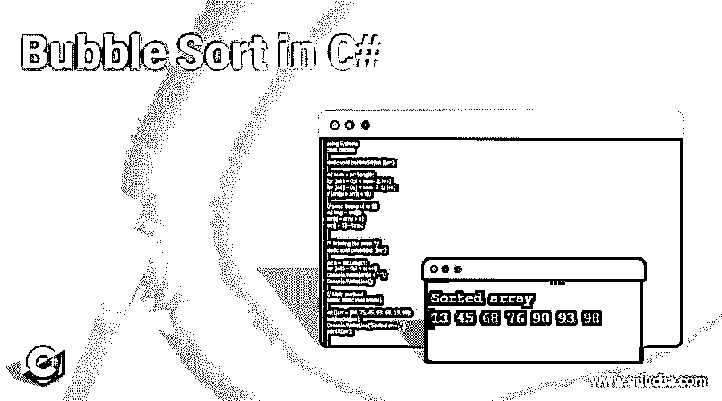

# C#中的冒泡排序

> 原文：<https://www.educba.com/bubble-sort-in-c-sharp/>




## C#中的冒泡排序简介

以下文章提供了 C#中冒泡排序的概述。冒泡排序是一种排序算法，被认为是最简单的算法，它以特定的顺序放置元素或数字，这些元素最终被放置到它们在数组中被排序的适当位置。

### 冒泡排序算法

冒泡排序的基本概念是考虑数组。该数组从第一个索引迭代到最后一个索引。当遍历数组时，与相邻的元素进行比较，如果它们出现在错误的顺序中，则进行交换。这意味着如果数字小于特定索引处的当前元素，那么它们将被交换。重复该过程，直到阵列被完全排序。它以通行证的形式出现。

<small>网页开发、编程语言、软件测试&其他</small>

让我们考虑由七个随机数组成的数组，并对它们进行排序:

冒泡排序以通道的形式工作。这些过程一次获取两个相邻的数字，然后比较这两个数字。如果现在的数字是 N，那么对一个数据集进行排序所需的遍数是 N–1。每一遍都根据这两个数字对数据进行排序，并重复该序列，直到所有数字都没有按照预期的方式排序。

**第一关:**

90   76   45   93   68   13   98

在第一遍中，比较前两个数字。这里将比较 90 和 76。90 大于 76，因此将被交换。

76   90   45   93   68   13   98

现在 90 会和 45 比。(0 也大于 45。因此，这将与 45 交换。

76   45   90   93   68   13   98

现在，数字 90 和 93 已经按顺序排好了。它们不会被交换，将保持原样。因此，根据算法，此过程将被停止。

**第二关:**

76   45   90   93   68   13   98

这一遍将再次从数组中的第一个数字开始。这意味着排序将从 76 开始。76 将与 45 进行比较。小于 76 的 45 将与 76 交换。

45   76   90   93   68   13   98

现在 76 和 90 都要查。它们已经处于正确的顺序，因此数组中不会有任何变化。

这样，遍历将一直进行到数组的末尾。

#### 冒泡排序算法

*   BubbleSort(数组:可排序项目的列表)
*   N=数组。长度
*   设置标志:=真
*   当 Flag == true 时，对 I = 1 到 N-1 重复步骤 3 到 5
*   设置标志:=假
*   集合 i:=0
*   当 i
*   (a)如果 Array[i+1]>Array[i]，那么:
    交换 Array[i]和 Array[i+1]设置标志:= True
*   (b)集合 i :=i+1
*   出口

### C#中的冒泡排序示例

下面是一些例子:

#### 示例#1

实现冒泡排序的 C#程序。

**代码:**

```
using System;
class Bubble
{
static void bubbleSrt(int []arr)
{
int num = arr.Length;
for (int i = 0; i < num - 1; i++)
for (int j = 0; j < num - i - 1; j++)
if (arr[j] > arr[j + 1])
{
// swap tmp and arr[i]
int tmp = arr[j];
arr[j] = arr[j + 1];
arr[j + 1] = tmp;
}
}
/* Printing the array */
static void printIt(int []arr)
{
int n = arr.Length;
for (int i = 0; i < n; ++i)
Console.Write(arr[i] + " ");
Console.WriteLine();
}
// Main method
public static void Main()
{
int []arr = {90, 76, 45, 93, 68, 13, 98};
bubbleSrt(arr);
Console.WriteLine("Sorted array");
printIt(arr);
}
}
```

**输出:**


上面的程序定义了一个方法，使用冒泡排序对数字进行排序。Bubblesort 有两个 for 循环，它们遍历数组并将要交换的数字存储在临时变量 tmp 中。然后，在索引 j 的帮助下，将这个 tmp 值与它应该在的位置进行交换。冒泡排序利用 n–1 次对数组进行排序。

冒泡排序也可以实现降序排序。

#### 实施例 2

实现降序冒泡排序的 C#程序如下:

**代码:**

```
using System;
public class BubbleSrt
{
public static void Main(string[] args)
{
int[]arr=new int[10]{23,98,45,12,9,16,65,74,34,29};//Array created with 10 unsorted numbers
bubblesort(arr,10);
int a;
for(a = 0; a < 10; a++)
Console.Write(arr[a]+"\t");//Printing the array after sorting in descending order
Console.ReadLine();
}
//bubble sort
static void bubblesort(int[] data, int n)
{
int a;
int b;
for(a = 0; a < n; a++)
for (b = n-1; b > a; b--)
if (data[b] > data[b-1])//Condition to arrange array in descending order
{
int temp = data[b];
data[b]=data[b-1];
data[b-1]=temp;
}
}
}
```

**输出:**


这里，我们按降序对数组进行排序。我们声明了一个有十个数字的数组。之后，我们在主程序中调用 bubblesort 函数，然后按降序打印。这里的 bubblesort 函数采用了两个变量来遍历数组。这里，它采用两个 for 循环，遍历数组并比较数组中的值。将比较索引 b 和索引 b–1 处的数据情况。如果 b 处的数字更大，那么它将被交换。这是在内部 for 循环中完成的。一旦它被交换，它将一直持续到数组的末尾。

### 结论

冒泡排序是最简单的排序方法。它遍历整个数组，冒泡弹出数字，这有助于交换和带来正确的序列数组。它比较两个相邻的数字，并在它们不符合预期顺序时弹出它们。使用 C#进行排序非常容易，并且可以通过使用数组中的基本变量来完成。

### 推荐文章

这是一个 C#中冒泡排序的指南。在这里我们讨论介绍，冒泡排序算法，并举例说明。您也可以看看以下文章，了解更多信息–

1.  [Python 排序列表](https://www.educba.com/python-sort-list/)
2.  [Python 排序数组](https://www.educba.com/python-sort-array/)
3.  [c#中的排序](https://www.educba.com/sorting-in-c-sharp/)
4.  [冒泡排序算法](https://www.educba.com/bubble-sort-algorithm/)


