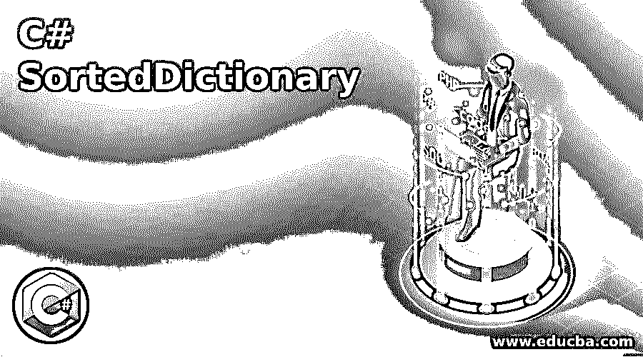

# C#排序字典

> 原文：<https://www.educba.com/c-sharp-sorteddictionary/>




## C# SortedDictionary 简介

C#中的 SortedDictionary 类被表示为 SortedDictionary <tkey tvalue="">，它由键和值集合组成，其中键表示单词，值表示定义，该键和值对基于键进行排序，并且该 SortedDictionary <tkey tvalue="">类属于 System。Collection.Generics 命名空间和 SortedDictionary 中的键总是不同的、不可变的并且不会为 null，但是如果值类型为 type、reference，则值可以为 null，并且使用 SortedDictionary 类可以更快地执行插入和检索操作，并且使用 key value pair 结构可以检索 SortedDictionary 类中的键值对。</tkey></tkey>

**语法:**

<small>网页开发、编程语言、软件测试&其他</small>

```
SortedDictionary<TKey, TValue>variable_name = new SortedDictionary<TKey,  TValue>();
```

### C#中排序字典类的使用

*   ICollection <keyvaluepair tvalue="">>，IEnumerable <t>，IReadOnlyCollection <keyvaluepair tvalue="">>，IEnumerable <keyvaluepair tvalue="">>，ICollection，IDictionary <tkey tvalue="">，IDictionary，IEnumerable，IReadOnlyDictionary <tkey tvalue="">接口由 SortedDictionary 类实现。</tkey></tkey></keyvaluepair></keyvaluepair></t></keyvaluepair>
*   使用 SortedDictionary 类，插入元素和移除元素的操作会更快。
*   关键字必须不同，并且在 SortedDictionary 类中不能有重复的关键字。
*   关键字是唯一的，在 SortedDictionary 类中不会为空。
*   如果值的类型是引用类型，则允许值为空。
*   可以使用 SortedDictionary 类存储相同类型的键和值对。
*   C#中的 SortedDictionary 本质上是动态的，这意味着 SortedDictionary 的大小会根据需要而增加。
*   排序是按照 SortedDictionary 类的降序进行的。
*   SortedDictionary 类可以容纳的键和值对的总数就是 SortedDictionary 类的容量。

### C# SortedDictionary 的构造函数

下面给出了 C# SortedDictionary 的构造函数:

#### 1.排序字典<tkey tvalue="">()</tkey>

初始化 SortedDictionary 类的一个实例，该实例为空，默认情况下，IComparer 的实现用于类型 key。

#### 2.排序字典 <tkey tvalue="">(IComparer)</tkey>

SortedDictionary 类的实例初始化为空，IComparer 的指定实现用于键比较。

#### 3.排序字典 <tkey tvalue="">(IDictionary)</tkey>

初始化 SortedDictionary 类的一个实例，该实例由从 IDictionary 中获取的元素组成，该元素被指定为一个参数，默认情况下，ICompareris 的实现用于类型 key。

#### 4.排序字典 <tkey tvalue="">(IDictionary，IComparer)</tkey>

初始化 SortedDictionary 类的实例，该实例由从 IDictionary 复制的元素组成，该 IDictionary 被指定为参数，并且 IComparer 的指定实现用于键比较。

### C#排序字典的方法

下面给出了一些方法:

*   **Add(TKey，TValue):** 使用 Add(TKey，TValue)方法将具有指定为参数的键和值的元素添加到 SortedDictionary 中。
*   **Remove(Tkey):** 使用 Remove(Tkey)方法从 SortedDictionary 中删除 key 被指定为参数的元素。
*   **contains key(TKey):**contains key(TKey)方法用于确定指定为参数的键是否存在于 SortedDictionary 中。
*   **contains value(TValue):**contains key(TValue)方法用于确定指定为参数的值是否存在于 SortedDictionary 中。
*   **Clear():**Clear()方法用于从 SortedDictionary 中清除所有对象。
*   **CopyTo(KeyValuePair < TKey，TValue > []，Int32):**copy to(KeyValuePair<TKey，TValue > []，int 32)方法用于将 SortedDictionary 的元素复制到参数指定的 key value pair 结构的数组中，该数组从参数中指定的索引开始。
*   **Equals(Object):**Equals(Object)方法用于判断参数指定的对象是否等于当前对象。
*   **get enumerator():**get enumerator()方法用于返回遍历 SortedDictionary 的枚举器。
*   **get hashcode():**get hashcode()方法默认为 hash 函数。
*   **GetType():**GetType()方法返回当前实例类型。
*   memberwisecolone():memberwisecolone()方法用于创建当前对象的浅层副本。
*   ToString()方法用于返回一个代表当前对象的字符串。
*   **TryGetValue(TKey，tValue):**try getvalue(TKey，TValue)方法用于获取与作为参数指定的键相关联的值。

### 例子

下面是提到的例子:

#### 示例#1

C#程序演示了排序字典类的 Add 方法、Remove 方法、ContainsKey 方法、ContainsValue 方法和 TryGetValue 方法。

**代码:**

```
using System;
using System.Collections.Generic;
using System.Linq;
using System.Text;
using System.Threading;
using System.Threading.Tasks;
//a class called program is defined
public class program
{
//main method is called
public static void Main()
{
//a new sorted dictionary is created with key type int and value type string
SortedDictionary<int, string>st = new SortedDictionary<int, string>();
//Add method is used to add objects to the dictionary
st.Add(30,"India");
st.Add(10,"China");
st.Add(20,"Nepal");
st.Remove(10);
Console.WriteLine("If the key 30 is present?{0}", st.ContainsKey(30));
Console.WriteLine("If the key 20 is present? {0}", st.Contains(new KeyValuePair<int, string>(20, "Nepal")));
//new sorted dictionary of both string key and string value types is defined
SortedDictionary<string, string> st1 = new SortedDictionary<string, string>();
st1.Add("Flag","India");
Console.WriteLine("If the value India is present?{0}", st1.ContainsValue("India"));
string rest;
if(st.TryGetValue(30, out rest))
{
Console.WriteLine("The value of the specified key is {0}", rest);
}
else
{
Console.WriteLine("The specified key is not present.");
}
}
}
```

**输出:**


**说明:**

*   在上面的程序中，定义了一个名为 program 的类。然后调用 main 方法。然后用键类型 int 和值类型 string 创建一个新的排序字典。然后使用 Add 方法将对象添加到排序后的字典中。然后使用 Remove 方法从排序的字典中移除对象。
*   然后定义新的字符串键和字符串值类型的排序字典。然后使用包含值方法来确定某个值是否存在于排序的字典中。然后使用 trygetvalue 方法获取指定键的值。

#### 实施例 2

C#程序演示了排序字典类的 Add 方法和 Clear 方法。

**代码:**

```
using System;
using System.Collections.Generic;
//a class called check is defined
class check
{
// main method is called
public static void Main()
{
// a new sorted dictionary is created with key type string and value type string
SortedDictionary<string, string> tam = new SortedDictionary<string, string>();
// using add method in dictionary to add the objects to the dictionary
tam.Add("R", "Red");
tam.Add("G", "Green");
tam.Add("Y", "Yellow");
// a foreach loop is used to loop around every key in the dictionary and to obtain each key value
foreach(KeyValuePair<string,string>ra in tam)
{
Console.WriteLine("The key and value pairs is SortedDictionary are = {0} and {1}", ra.Key, ra.Value);
}
//using clear method to remove all the objects from sorted dictionary
tam.Clear();
foreach(KeyValuePair<string,string>tr in tam)
{
Console.WriteLine("The key and value pairs is SortedDictionary are = {0} and {1}", tr.Key, tr.Value);
}
}
}
```

**输出:**


**说明:**

*   在上面的程序中，check 是定义的类。然后调用 main 方法。然后用键类型字符串和值类型字符串创建一个新的排序字典。然后，我们使用 add 方法将对象添加到排序字典中。
*   然后使用 for each 循环来循环排序字典中的每个键，以获得每个键值。然后使用 clear 方法清除控制台。

### 推荐文章

这是一个 C#分类字典的指南。这里我们讨论 C#中 SortedDictionary 类的工作原理，构造函数，方法以及编程实例。您也可以看看以下文章，了解更多信息–

1.  [C#序列化](https://www.educba.com/c-serialization/)
2.  [c#中的正则表达式](https://www.educba.com/regular-expression-in-c-sharp/)
3.  [C#自定义属性](https://www.educba.com/c-sharp-custom-attribute/)
4.  [c#中的运算符重载](https://www.educba.com/operator-overloading-in-c-sharp/)


