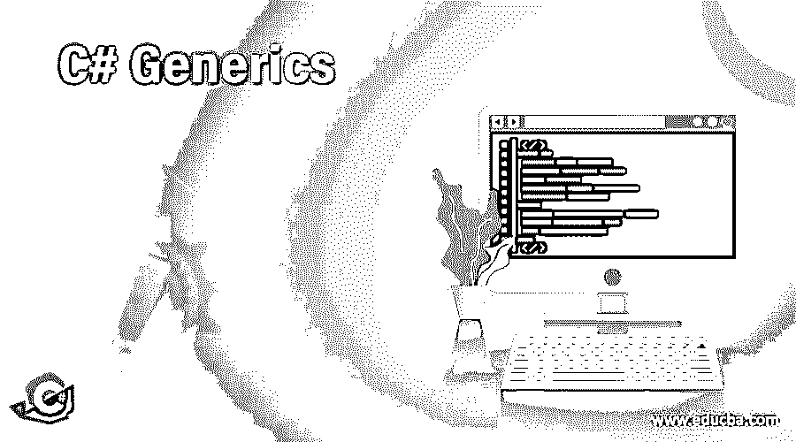

# C#泛型

> 原文：<https://www.educba.com/c-sharp-generics/>




## C#中的泛型介绍

那么，C#中的泛型是什么概念呢？简而言之，它是定义独立于类型的类、接口、方法、委托、属性等的概念。这意味着您可以定义一个泛型类或方法体，并在调用期间提供实际类型。因此，泛型就像代码模板。它们允许您编写类型安全的代码块，而无需引用任何特定的数据类型。代码的类型是在编译时在调用类或方法的过程中确定的。

### C#中泛型的语法

让我们看看 C#中泛型声明的语法。这是一个非常简单的语法。作为一种常见的做法，字母“T”以大写形式出现，并被尖括号括起来，表示 C#中泛型代码的声明。但是，这不是任务。用尖括号括起来的任何大写字母都可以用来表示通用代码。

<small>网页开发、编程语言、软件测试&其他</small>

**声明泛型类:**

```
public class MyGenericClass<U>
```

**实例化一个泛型类:**

```
MyGenericClass<int> = new MyGenericClass<int>();
```

**声明通用派生类:**

```
public class MyGenericDerivedClass<T> : MyGenericBaseClass<T>
```

**声明泛型方法:**

```
public T MyGenericMethod(T item);
```

### C#中泛型是如何工作的？

当您在 C#中声明泛型代码时，编译器会生成一个与该代码等效的模板。除了类型安全之外，将检查该模板的所有编译错误。下一步是在程序的另一部分中调用通用代码。在调用时，指定编译泛型代码时使用的类型。当编译器到达调用点时，它会插入先前编译的模板中指定的类型。然后重新编译以检查类型安全。一旦通过，代码就可以执行了。我们将在下面的例子中看到编译后的代码，以便更好地理解通用模板。

### C#中的泛型示例

下面是泛型的不同例子:

#### 带类的泛型

**代码:**

```
using System;
using System.Collections.Generic;
public class GenericClass<T>
{
List<T> genericList;
public GenericClass()
{
genericList = new List<T>();
}
public void AddToList(T item)
{
genericList.Add(item);
}
public void DisplayList()
{
foreach ( var ele in genericList )
{
Console.Write("{0}\t", ele);
}
}
}
public class Program
{
public static void Main()
{
GenericClass<int> intGenericObj = new GenericClass<int>();
GenericClass<string> stringGenericObj = new GenericClass<string>();
intGenericObj.AddToList(28);
intGenericObj.AddToList(999);
intGenericObj.AddToList(0);
intGenericObj.AddToList(-123);
intGenericObj.AddToList(100);
stringGenericObj.AddToList("Hello");
stringGenericObj.AddToList("Bonjour");
stringGenericObj.AddToList("Ola");
stringGenericObj.AddToList("Ciao");
stringGenericObj.AddToList("Hallo");
intGenericObj.DisplayList();
Console.WriteLine("\n");
stringGenericObj.DisplayList();
}}
```

**输出:**


同样的代码也可以重写如下。这说明了定义一个泛型类的强大功能，该类可以在单个对象中对多种类型进行类型安全。

```
using System;
using System.Collections.Generic;
public class GenericClass<T, U>
{
List<T> genericList1;
List<U> genericList2;
public GenericClass()
{
genericList1 = new List<T>();
genericList2 = new List<U>();
}
public void AddToList(T item1, U item2)
{
genericList1.Add(item1);
genericList2.Add(item2);
}
public void DisplayList()
{
foreach (var ele in this.genericList1)
{
Console.Write("{0}\t", ele);
}
Console.WriteLine("\n");
foreach (var ele in this.genericList2)
{
Console.Write("{0}\t", ele);
}
}
}
public class Program
{
public static void Main()
{
GenericClass<int, string> genericObj = new GenericClass<int, string>();
genericObj.AddToList(28, "Hello");
genericObj.AddToList(999, "Bonjour");
genericObj.AddToList(0, "Ola");
genericObj.AddToList(-123, "Ciao");
genericObj.AddToList(100, "Hallo");
genericObj.DisplayList();
}
}
```

**输出:**


**编译代码:**

为了了解泛型中的数据类型是如何解析的，让我们看一下在上面的例子中用整数和字符串类型实例化类时生成的编译代码。

```
using System;
using System.Collections.Generic;
public class GenericClass
{
List<int> genericList1;
List<string> genericList2;
public GenericClass()
{
genericList1 = new List<int>();
genericList2 = new List<string>();
}
public void AddToList(int item1, string item2)
{
genericList1.Add(item1);
genericList2.Add(item2);
}
public void DisplayList()
{
foreach (var ele in this.genericList1)
{
Console.Write("{0}\t", ele);
}
Console.WriteLine("\n");
foreach (var ele in this.genericList2)
{
Console.Write("{0}\t", ele);
}
}
}
public class Program
{
public static void Main()
{
GenericClass genericObj = new GenericClass();
genericObj.AddToList(28, "Hello");
genericObj.AddToList(999, "Bonjour");
genericObj.AddToList(0, "Ola");
genericObj.AddToList(-123, "Ciao");
genericObj.AddToList(100, "Hallo");
genericObj.DisplayList();
}
}
```

#### 具有方法的泛型

**代码:**

```
using System;
using System.Collections.Generic;
public class Program
{
public static void Main()
{
int[] intArr = {12, 23, 43, 94, 35};
double[] doubleArr = {12.3, 45.6, 98.7, 1.45, 82.653};
string[] strArr = {"Hello", "Bonjour", "Ola", "Ciao", "Hallo"};
Console.WriteLine("The largest integer in the array is {0}", findMax(intArr));
Console.WriteLine("The largest floating-point number in the array is {0}", findMax(doubleArr));
Console.WriteLine("The largest string in the array is {0}", findMax(strArr));
}
static T findMax<T>(T[] items)
where T : IComparable<T>
{
T max = items[0];
int position = 0;
for (int i = 1; i < items.Length; i++)
{
if (items[i].CompareTo(max) > 0)
{
max = items[i];
position = i;
}
}
return max;
}
}
```

**输出:**


#### 系统。Collections .泛型命名空间

系统。C# 中的 Collections.Generic [名称空间包含定义泛型集合的接口和类。它们允许程序员创建性能更好的泛型集合，并且像非泛型集合一样具有强类型。这个名称空间包含列表、字典、链表、散列、键值对、堆栈等，所有这些在本质上都是通用的。程序员可以在他们的代码中实现它们。](https://www.educba.com/namespaces-in-c-sharp/)

### C#泛型的重要性

下面是 C#泛型的重要性如下:

*   泛型允许代码重用:良好编程的基本原则。您不需要为每个预期的数据类型编写相同的代码。您只需定义一个独立于类型的代码，并告诉编译器实际的数据类型将在代码调用时提供。
*   **防止装箱和解箱的代价:**当然可以通过 object class 绕过泛型的使用。下面两段代码的任务是相同的。

**通用代码:**public T my func(T item)；

**非通用代码:**公共对象 MyFunc(对象项)

object 类取代了所有的类，因此上面的非泛型代码也可以用来生成与类型无关的代码模板。但是，这两种代码之间存在巨大的性能差距。使用 object 类会导致对数据类型进行装箱和拆箱的额外开销。泛型消除了这一点，因此性能更好。

### 结论

因此，我们已经看到了泛型是一个必须学习的编程特性。这是一个非常有用的概念，不仅在 C#中，而且在大多数现代编程语言中。此外，强烈建议了解该系统。C#中的通用命名空间。此外，为了理解泛型的性能，深入研究装箱和取消装箱对内存和执行时间的影响。

### 推荐文章

这是 C#泛型的指南。在这里，我们讨论了 C#中泛型的重要性、工作方式以及不同的例子和代码实现。您也可以浏览我们推荐的其他文章，了解更多信息——

1.  [C#或运算符](https://www.educba.com/c-sharp-or-operator/)
2.  [C#排序集](https://www.educba.com/c-sharp-sortedset/)
3.  [C#最后](https://www.educba.com/c-sharp-finally/)
4.  [C#堆栈](https://www.educba.com/c-sharp-stack/)


