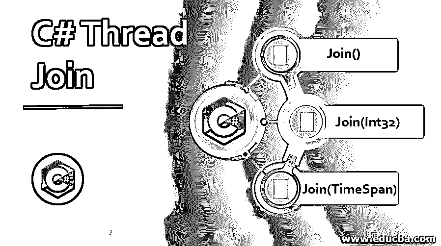
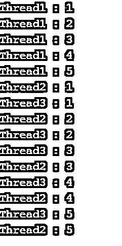
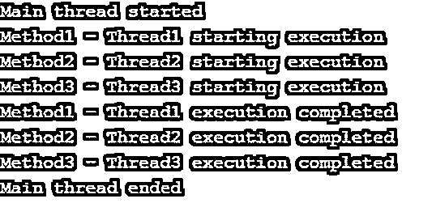
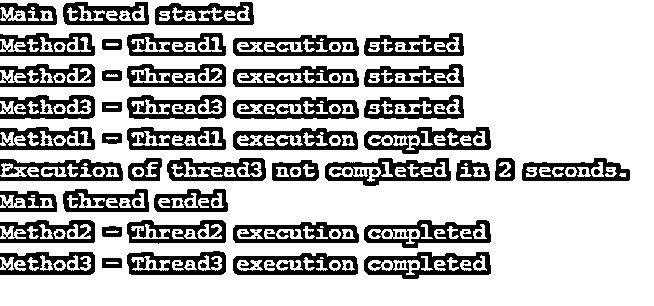

# C#线程连接

> 原文：<https://www.educba.com/c-sharp-thread-join/>




## C#线程连接概述

在 C#中，系统线程命名空间下的 thread join 类由许多处理线程的方法组成。一种这样方法是穿线。加入()。该方法用于使所有调用线程等待，直到当前线程终止或完成其任务。线程中的 Join()方法可以用来实现同步，也可以用来确保某个特定的线程已经被终止。

C#提供了 Join()方法的三种重载，如下所示:

<small>网页开发、编程语言、软件测试&其他</small>

*   加入()
*   Join(Int32)
*   加入(时间跨度)

**语法**

Join()方法的所有三个重载的语法如下:

```
public void Join();
```

上面的 Join()方法不接受任何参数，并阻塞调用线程，直到由当前实例表示的线程完成其执行或在执行标准 COM 和 SendMessage 泵送时终止。

```
public bool Join(int millisecondsTimeout);
```

上面的 Join()方法将一个整数作为参数，并阻塞调用线程，直到由当前实例表示的线程完成其执行或终止，或者在执行标准 COM 和 SendMessage 泵送时经过了使用整数参数“millisecondsTimeout”指定的时间(毫秒)。

```
public bool Join(TimeSpan timeout);
```

此 Join()方法接受 TimeSpan 类型的参数，并阻塞调用线程，直到由当前实例表示的线程完成其执行或终止，或者在执行标准 COM 和 SendMessage 泵送时经过了使用参数“timeout”指定的时间。

### C#中 Thread Join()方法是如何工作的？

要在 C#中使用线程，我们需要首先导入系统。线程命名空间，这样我们就可以访问线程命名空间中的类。

Threading 命名空间下的 Thread 类包含 Join()方法，该方法通过阻塞调用线程，直到已经调用 Join()方法的线程完成其任务并终止，从而使多个线程以同步方式工作。如果调用 Join()方法的线程没有终止，调用线程将被无限期阻塞。因此，join()方法帮助我们确保特定的线程已经被终止。

Join()方法作用于处于活动状态的线程，我们可以通过使用 thread 来检查这一点。IsAlive 财产。如果我们在线程启动之前调用 Join()方法，那么 Join()方法将立即返回。同样，如果在线程已经终止时调用 Join()方法，那么 Join()方法也会立即返回。因此，如果线程没有运行，Join()方法会立即返回。

我们不应该调用表示当前线程的线程对象的 Join()方法。这将使我们的应用程序无响应，因为当前线程将无限期地等待自己。

下面的表格显示了关于 Join()方法的三种重载的重要细节:

| **方法** | **参数** | **返回** |
| **public void Join()** | 这不需要任何争论。 | 返回 void。 |
| **public bool Join(int millisendstimeout)** | 一个整数，表示等待线程终止所需的毫秒数。 | 返回布尔值；如果线程已终止，则返回 true 如果参数指定的时间已过，而线程尚未终止，则返回 false。 |
| **公共布尔联接(TimeSpan 超时)** | 一个 TimeSpan，指示等待线程终止所需的时间。 | 返回布尔值；如果线程已终止，则返回 true 如果参数指定的时间已过，而线程尚未终止，则返回 false。 |

### C#线程连接示例

以下是 c#线程连接的示例:

#### 示例#1

示例显示了在第一个线程和代码中的其他两个线程上使用 Join()方法，等待第一个线程完成其执行。

**代码:**

```
using System;
using System.Threading;
namespace ConsoleApp4
{
public class Program
{
public void Display()
{
for (int i = 1; i <= 5; i++)
{
Console.WriteLine(Thread.CurrentThread.Name+" : " + i);
//suspending thread for specified time
Thread.Sleep(200);
}
}
}
public class ThreadDemo
{
public static void Main()
{
Program obj = new Program();
Thread thread1 = new Thread(new ThreadStart(obj.Display));
thread1.Name = "Thread1";
Thread thread2 = new Thread(new ThreadStart(obj.Display));
thread2.Name = "Thread2";
Thread thread3 = new Thread(new ThreadStart(obj.Display));
thread3.Name = "Thread3";
//starting thread1
thread1.Start();
//calling Join() on thread1
thread1.Join();
//starting thread2
thread2.Start();
//starting thread3
thread3.Start();
Console.ReadLine();
}
}
}
```

**输出:**




#### 实施例 2

在所有线程上调用 Join()方法的示例。

**代码:**

```
using System;
using System.Threading;
namespace ConsoleApp4
{
public class Program
{
public static void Main(string[] args)
{
Console.WriteLine("Main thread started");
Thread thread1 = new Thread(Method1);
Thread thread2 = new Thread(Method2);
Thread thread3 = new Thread(Method3);
thread1.Start();
thread2.Start();
thread3.Start();
thread1.Join();
thread2.Join();
thread3.Join();
Console.WriteLine("Main thread ended");
Console.ReadLine();
}
public static void Method1()
{
Console.WriteLine("Method1 - Thread1 starting execution");
Thread.Sleep(1000);
Console.WriteLine("Method1 - Thread1 execution completed");
}
public static void Method2()
{
Console.WriteLine("Method2 - Thread2 starting execution");
Thread.Sleep(2500);
Console.WriteLine("Method2 - Thread2 execution completed");
}
public static void Method3()
{
Console.WriteLine("Method3 - Thread3 starting execution");
Thread.Sleep(5000);
Console.WriteLine("Method3 - Thread3 execution completed");
}
}
}
```

**输出:**




#### 实施例 3

Join(int millisecondsTimeout)方法的示例。

**代码:**

```
using System;
using System.Threading;
namespace ConsoleApp4
{
public class Program
{
public static void Main(string[] args)
{
Console.WriteLine("Main thread started");
Thread thread1 = new Thread(Method1);
Thread thread2 = new Thread(Method2);
Thread thread3 = new Thread(Method3);
thread1.Start();
thread2.Start();
thread3.Start();
if (thread3.Join(2000))
{
Console.WriteLine("Execution of thread3 completed in 2 seconds.");
}
else
{
Console.WriteLine("Execution of thread3 not completed in 2 seconds.");
}
Console.WriteLine("Main thread ended");
Console.ReadLine();
}
public static void Method1()
{
Console.WriteLine("Method1 - Thread1 execution started");
Thread.Sleep(1000);
Console.WriteLine("Method1 - Thread1 execution completed");
}
public static void Method2()
{
Console.WriteLine("Method2 - Thread2 execution started");
Thread.Sleep(2500);
Console.WriteLine("Method2 - Thread2 execution completed");
}
public static void Method3()
{
Console.WriteLine("Method3 - Thread3 execution started");
Thread.Sleep(5000);
Console.WriteLine("Method3 - Thread3 execution completed");
}
}
}
```

**输出:**




### 结论

C#中的 Join()方法使一个线程等待另一个线程完成任务并终止。C#中 Join()方法有三种重载。Join()方法作用于处于活动状态的线程。它有助于在处理多线程时实现同步。

### 推荐文章

这是一个 C#线程连接的指南。这里我们讨论一下基本概念，各种例子以及 c#中 thread join()方法是如何工作的？您也可以浏览我们推荐的其他文章，了解更多信息——

1.  [c#中的多线程](https://www.educba.com/multithreading-in-c-sharp/)
2.  [克隆 C#中的()](https://www.educba.com/clone-in-c-sharp/)
3.  [c#中的 Goto 语句](https://www.educba.com/goto-statement-in-c-sharp/)
4.  [C#流写入器](https://www.educba.com/c-sharp-streamwriter/)


