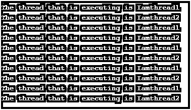
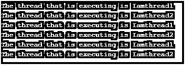

# C#线程睡眠

> 原文：<https://www.educba.com/c-sharp-thread-sleep/>


## C#线程睡眠简介

可以使用 C#中称为 Sleep()方法的方法将当前正在执行的线程暂停或临时暂停一段指定的时间，该时间必须以毫秒为单位指定，并作为参数传递给我们试图暂停的线程，或者使用 timespan 属性，该属性具有以小时、分钟和秒为单位指定时间的权限，以便线程可以根据我们的需要暂停更长时间，而不仅仅是毫秒。

**语法:**

<small>网页开发、编程语言、软件测试&其他</small>

```
Thread.Sleep(Time_in_milliseconds);
```

或者

```
TimeSpaninstance_name = new TimeSpan(Time_in_hours_minutes_seconds);
Thread.Sleep(instance_name);
```

其中，实例名称是 TimeSpan 类实例的名称。

### C#线程睡眠的工作原理

*   每当需要暂停一个线程的执行，以便其他线程可以接管并开始执行时，我们就使用称为 Sleep()方法的方法。
*   线程需要暂停的时间可以用毫秒指定并作为参数传递给 Sleep()方法，也可以使用 timespan 属性用小时、分钟和秒指定。
*   如果作为参数传递给 Sleep()方法的时间(以毫秒为单位)为负数，该方法将引发 ArgumentOutOfRangeException。
*   如果作为参数传递给 timespan 属性的时间为负数，Sleep()方法将引发 ArgumentOutOfRangeException。
*   如果作为参数传递给 Sleep()方法的时间(以毫秒为单位)为零，那么另一个准备运行的相同优先级的线程将开始执行。
*   如果作为参数传递给 timespan 属性的时间为零，那么准备运行的相同优先级的另一个线程开始执行。

### 在 C#中实现线程休眠的示例

下面是 C #线程睡眠的例子:

#### 示例#1

演示 Sleep()方法的 C#程序，以毫秒为单位的时间作为参数传递。

**代码:**

```
using System;
using System.Threading;
//a class called program is created
public class program
{
//a method called samplemethod which accepts a parameter is created
public void samplemethod(object str)
{
for (int z = 0; z < 5; z++)
{
Console.WriteLine("The thread that is executing is {0}", str);
Thread.Sleep(200);
}
}
}
//a class called check is created
public class check
{
//main method is called
public static void Main()
{
//two string variables are created which are passed as parameter previously created method in program class
string Iamthread1 = null;
string Iamthread2 = null;
//an instance of the program class is created
program d = new program();
Thread firstthread = new Thread(new ParameterizedThreadStart(d.samplemethod));
Thread secondthread=new Thread(new ParameterizedThreadStart(d.samplemethod));
firstthread.Start("Iamthread1");
secondthread.Start("Iamthread2");
}
}
```

**输出:**




**说明:**在上面的程序中，创建了一个名为 program 的命名空间，在该命名空间中创建了一个名为 sample method 的方法，该方法接受一个参数，在该方法中操作的线程通过使用 Sleep()方法被暂停一段时间。然后创建一个名为 check 的类，在该类中调用 main 方法，在该方法中创建线程的两个实例，然后使用 Start()方法开始在 sample 方法上执行它们。由于 Sleep()方法用于在采样方法上运行的线程，因此线程不会连续执行。

#### 实施例 2

使用 TimeSpan 属性演示 Sleep()方法的 C#程序。

**代码:**

```
using System;
using System.Threading;
//a class called program is created
public class program
{
//a method called samplemethod which accepts a parameter is created
public void samplemethod(object str)
{
//TimeSpan property is used to specify the duration of time for which the thread must be paused
TimeSpan timeout = new TimeSpan(0, 0, 3);
for (int z = 0; z < 3; z++)
{
Console.WriteLine("The thread that is executing is {0}", str);
Thread.Sleep(timeout);
}
}
}
//a class called check is created
public class check
{
//main method is called
public static void Main()
{
//two string variables are created which are passed as parameter previously created method in program class
string Iamthread1 = null;
string Iamthread2 = null;
//an instance of the program class is created
program d = new program();
Thread firstthread = new Thread(new ParameterizedThreadStart(d.samplemethod));
Thread secondthread = new Thread(new ParameterizedThreadStart(d.samplemethod));
firstthread.Start("Iamthread1");
secondthread.Start("Iamthread2");
}
}
```

**输出:**




**解释:**在上面的程序中，创建了一个名为 program 的命名空间，在这个命名空间中创建了一个名为 sample method 的方法，该方法接受一个参数，在这个方法中，使用 TimeSpan 属性将操作该方法的线程暂停一段时间。然后创建一个名为 check 的类，在该类中调用 main 方法，在该方法中创建线程的两个实例，然后使用 Start()方法开始在 sample 方法上执行它们。由于 Sleep()方法用于在采样方法上运行的线程，因此线程不会连续执行。输出显示在上面的快照中。

### 结论

在本教程中，我们通过编程示例及其输出，了解了 C#中 ThreadSleep 方法的定义、语法和工作原理。

### 推荐文章

这是一个 C#线程睡眠指南。在这里，我们讨论了 C#线程睡眠的介绍及其工作方式，并给出了示例和代码实现。您也可以浏览我们推荐的其他文章，了解更多信息——

1.  [c#中的随机数生成器是什么？](https://www.educba.com/random-number-generator-in-sharp/)
2.  [Java | Working | Applications 中的静态构造函数](https://www.educba.com/static-constructor-in-java/)
3.  [c#中的 text writer |示例](https://www.educba.com/textwriter-in-c-sharp/)
4.  如何在 C#中使用静态构造函数？


