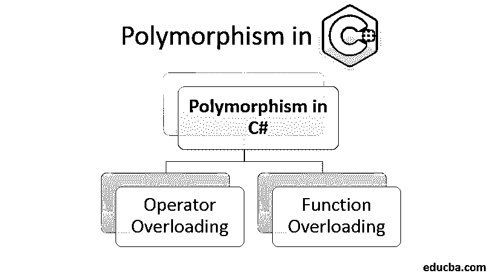
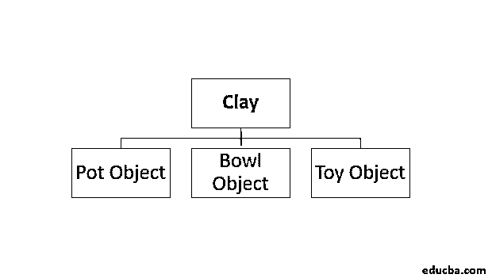

# C#中的多态性

> 原文：<https://www.educba.com/polymorphism-in-c-sharp/>




## C#中的多态性介绍

[多态性](https://www.educba.com/what-is-polymorphism/)是在 C#等面向对象编程语言中实现的一个概念，其中一个操作符或一个函数方法在整个执行过程中可以采用不止一种形式。它广泛用于程序中继承的实现，这分为两种方法，即操作符重载和函数重载。简而言之，多态性可以解释为一种使用派生类来改变基类的技术，其中两个类拥有不同的属性。

下图说明了多态的工作原理:

<small>网页开发、编程语言、软件测试&其他</small>




这幅图说明了粘土是制作壶、碗和玩具的母体。所有这些物体都互不相同，但它们都具有粘土的特性。这三个物体有不同的形状和不同的用途，即使它们是由相同的材料粘土制成的。

### 多态性的形式

以下是多态性的两种形式:

#### 1.运算符重载

运算符可以根据所运算的操作数类型给出不同的输出。这称为运算符重载。例如，运算符“+”可以对两个整数执行加法运算，同时可以连接两个字符串。因此，同一个操作符可以以两种不同的方式使用。加法运算符通常将两个数相加。但是在复数的情况下，加法就有点不一样了，这里对应的实部和虚部是分开相加的。下面是一个示例代码，展示了如何重载“+”运算符来添加复数。

**代码:**

```
using System;
namespace Overload {
class Complex
{
public double x;
public double y;
// no-argument constructor
public Complex() {}
// parameterized constructor
public Complex(double real, double img)
{
x = real;
y = img;
}
// Overloading of Binary "+" operator
public static Complex operator + (Complex c1,
Complex c2)
{
Complex c3 = new Complex();
c3.x = c1.x + c2.x;
c3.y = c1.y + c2.y;
return c3;
}
// function to display result
public void display()
{
Console.WriteLine("{0} + {1}i", x,y);
}
}
class CalNum {
// Driver Code
static void Main(string[] args)
{
Complex num1 = new Complex(2.5,3.5);
Complex num2 = new Complex(1.2,6.5);
Complex num3 = num1 + num2;
Console.Write("c1 = ");
num1.display();
Console.Write("c2 = ");
num2.display();
Console.Write("c3 = ");
num3.display();
}
}
}
```

**输出:**


此输出说明了运算符重载以将两个复数相加。代码显示了操作符重载和函数重载。

#### 2.函数重载

一个函数可以根据参数的数量、参数的返回类型和函数的返回类型给出不同的输出。上述代码还涵盖了使用构造函数的函数重载。代码中有 2 个构造函数；一个是默认构造函数，保留为空，而另一个是参数化构造函数，用于用作为参数提到的值初始化复数。

以图中所示的例子为例，功能是模制粘土，笔画方向是为模制粘土而提供的构件。根据不同的笔画方向，粘土分别被转化为壶、碗和玩具。

**代码:**

```
using System;
using System.Collections.Generic;
public class Clay
{
// A few example members
public int Height { get; set; }
public int strokeDirection { get; set; }
// Virtual method
public virtual void Mould()
{
Console.WriteLine("Beginning to mould the clay");
}
}
class Pot : Clay
{
public override void Mould()
{
// Code to make a pot Console.WriteLine("Making a pot");
base.Mould();
}
}
class Bowl : Clay
{
public override void Mould()
{
// Code to make a bowl
Console.WriteLine("Making a bowl");
base.Mould();
}
}
class Toy : Clay
{
public override void Mould()
{
// Code to make a toy
Console.WriteLine("Making a toy");
base.Mould();
}
}
class Program
{
static void Main(string[] args)
{
// Illustrating Polymorphism #1: a Pot, Bowl and Toy
// can all be used wherever Clay is expected. No cast is
// needed because an implicit conversion exists from a derived
// class to its base class.
var items = new List<Clay>
{
new Pot(),
new Bowl(),
new Toy()
};
// Polymorphism at work #2: the virtual method Mould is
// invoked on each of the derived classes, not the base class.
foreach (var item in items)
{
item.Mould();
}
}
}
```

**输出:**


正如您可能已经在代码中注意到的，clay 类是其子类是 pot、toy 和 bowl 类的父类。方法“模具”是在父类和子类中用相同的函数签名定义的。因此，当子类的一个对象被创建并调用方法 Mould 时，基类方法被子类方法覆盖。因此，我们看到了子类方法的输出。上面的代码显示了[方法覆盖而不是重载](https://www.educba.com/overloading-vs-overriding/)来说明多态性。

### C#中多态性的注意事项

对于 C#中的多态性，需要记住以下几点:

*   重载不同于重写。重载有不同的函数签名，而重写有相同的函数签名。
*   多态性指的是改变子类中超类的行为。
*   继承是指在子类中使用超类的结构和行为。

**以下是几个要点:**

*   多态是面向对象编程的主要范例之一。
*   函数重载根据继承类中函数的返回类型和参数修改函数。
*   运算符重载根据给定的参数修改运算符定义。
*   [多态性](https://www.educba.com/polymorphism-in-java/)用于实现继承。它决定在运行时使用方法重写来调用子类方法。

### 推荐文章

这是 C#中多态性的指南。在这里，我们讨论多态的工作原理，两种形式的多态，示例代码和一些关键要点。您也可以阅读以下文章，了解更多信息——

1.  [复制 C#中的构造函数](https://www.educba.com/copy-constructor-in-c-sharp/)
2.  [c#中什么是多线程？](https://www.educba.com/what-is-multithreading-in-c-sharp/)
3.  [c#中的构造函数](https://www.educba.com/constructor-in-c-sharp/)
4.  [c#中的多线程](https://www.educba.com/multithreading-in-c-sharp/)


