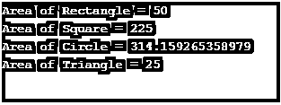

# C#中的虚拟关键字

> 原文：<https://www.educba.com/virtual-keyword-in-c-sharp/>


## C#中的虚拟关键字介绍

虚拟关键词是什么？在进入 C#视角之前，理解或修改面向对象编程世界中的继承、重写和虚拟关键字的概念是很重要的。

方法重写是一个与继承紧密结合的 OOPs 概念。当子类方法覆盖具有相同名称、参数和返回类型的父类方法时，称为方法覆盖。虚拟关键字向编译器表明方法可以在派生类中被重写。

<small>网页开发、编程语言、软件测试&其他</small>

从 C#的角度来看，虚拟关键字用于修改任何属性、方法或事件的声明，以允许在派生类中重写。简单来说，virtual 关键字实现了 C#中的方法重写概念。

**语法**

通过在基类中添加 virtual 关键字并在派生类中添加 override 关键字，可以重写任何属性、方法或事件。

在基类声明中添加虚拟关键字:

```
public class Base {
public virtual int abc { get; set; } // this property can be overridden
public virtual void Xyz() { }         // this method can be overridden
}
```

在基类声明中添加 override 关键字:

```
public class Derived : Base {
public override int abc { get; set; } // this overrides the base class property
public override void Xyz() { }        // this overrides the base class method
}
```

### C#中虚拟是如何工作的？

重载和重写之间最基本的区别在于，前者是一种编译时机制，而后者是在运行时发挥作用的。虚拟关键字在运行时起作用，因此实现了方法覆盖概念。

当调用或访问任何虚拟方法或属性时，编译器会检查该方法或属性的重写成员。如果找到一个，就调用它。如果没有找到，则调用原始方法或属性。

这里出现了一个很好的问题——在多级继承的情况下会发生什么？好吧，如果任何类成员在不止一个级别中被重写，最深的被重写成员被调用(最大派生类中的成员)。

### 例子

下面是 C#中虚拟关键字的例子

#### 单级继承

让我们举一个例子来理解当单个子类继承父类时，即没有多级继承时，虚拟关键字的工作。

**代码:**

```
using System;
public class Polynomial
{
public virtual double len
{
get;
set;
}
public virtual double wid
{
get;
set;
}
public virtual double Area()
{
return len * wid;
}
}
public class Rectangle: Polynomial
{
}
public class Square : Polynomial
{
public override double len
{
get;
set;
}
public override double Area()
{
return len * len;
}
}
public class Circle : Polynomial
{
public double radius
{
get;
set;
}
public override double Area()
{
return Math.PI * radius * radius;
}
}
public class Triangle : Polynomial
{
public override double Area()
{
return 0.5 * len * wid;
}
}
public class Program
{
public static void Main()
{
var rect = new Rectangle();
rect.len = 5;
rect.wid = 10;
Console.WriteLine("Area of Rectangle = " + rect.Area());
var sq = new Square();
sq.len = 15;
Console.WriteLine("Area of Square = " + sq.Area());
var cir = new Circle();
cir.radius = 10;
Console.WriteLine("Area of Circle = " + cir.Area());
var tri = new Triangle();
tri.len = 5;
tri.wid = 10;
Console.WriteLine("Area of Triangle = " + tri.Area());
}
}
```

**输出:**




##### 上面的代码是如何工作的？

在基类多项式中，我们将两个属性和一个方法声明为虚拟的。这些现在可以在子类中被覆盖。现在我们创建继承多项式类的不同形状的各种子类。

在 Rectangle 类中，我们不需要覆盖任何属性或方法。对于 Rectangle 类，基类实现将按原样工作。

在 Square 类中，我们没有 width 属性。所以我们覆盖长度属性和面积方法来返回长度的平方。

在圆类中，我们既没有长度也没有宽度。因此，我们声明了一个新的特定于类的 radius 属性，并相应地覆盖了 are a 方法。

在 Triangle 类中，我们简单地覆盖了 Area 方法，属性是从基类多项式继承的。

当我们创建派生类的对象时，编译器会在基类构造过程中遇到虚拟关键字，从而查找被重写的成员。然后相应地调用被重写的成员。

#### 多层次继承

让我们修改上面的例子来包含多级继承。

**代码:**

```
using System;
public class Polynomial
{
public virtual double len {       get; set; }
public virtual double wid {       get; set; }
public virtual double Area()
{ return 0; }
}
public class Rectangle : Polynomial
{
public override double Area()
{ return len * wid; }
}
public class Square : Rectangle
{
public override double len { get; set; }
public override double Area()
{ return len * len; }
}
public class Program
{
public static void Main()
{
var rect = new Rectangle();
rect.len = 5;
rect.wid = 10;
Console.WriteLine("Area of Rectangle = " + rect.Area());
var sq = new Square();
sq.len = 15;
Console.WriteLine("Area of Square = " + sq.Area());
}
}
```

**输出:**


### 优势

虚拟成员在基类和派生类中都有声明和定义。当派生类中需要一些额外的功能时，虚成员是很有优势的。它们作为附件。

#### 规则

*   变量不能声明为虚拟的。只有属性、方法和事件可以声明为虚拟的。
*   静态成员不能声明为虚拟的。
*   抽象成员不能声明为虚拟的。
*   私有成员不能声明为虚拟的。
*   不能重写非虚拟成员。
*   虚拟成员和重写成员的访问级别、类型和名称必须相同。例如，如果虚拟方法是公共的，则重写方法也必须是公共的。

### 结论

在本文中，我们理解了 C#中的虚拟概念。我们看到了 C#如何在运行时实现虚拟关键字，并查看了示例。

虚拟成员是面向对象编程的一个伟大概念。然而，为了获得深入知识，强烈建议学习抽象关键字、接口和新关键字。这将大大有助于理解它们之间的差异。这有助于了解何时使用，何时不使用虚拟。

### 推荐文章

这是一个 C#中虚拟关键字的指南。在这里，我们讨论虚拟如何在 C#中工作，多级继承以及优势和规则。你也可以看看下面的文章来了解更多-

1.  [复制 C#中的构造函数](https://www.educba.com/copy-constructor-in-c-sharp/)
2.  [c#中的继承](https://www.educba.com/inheritance-in-csharp/)
3.  [C#函数](https://www.educba.com/csharp-functions/)
4.  [C# if 语句](https://www.educba.com/c-sharp-if-statement/)
5.  [Python 中的 If 语句](https://www.educba.com/if-statement-in-python/)


