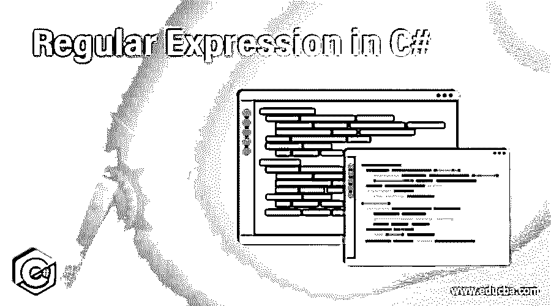

# C#中的正则表达式

> 原文：<https://www.educba.com/regular-expression-in-c-sharp/>




## C#正则表达式简介

模式匹配是在 C#中使用正则表达式完成的，C#的 regex 类用于在 C#中创建正则表达式，字符串中模式匹配和替换的标准是使用正则表达式设置的，它通过用户告诉计算机如何在字符串中查找特定模式，以及当它找到它正在查找的特定模式时必须做出什么响应，regex 是正则表达式的缩写， C#中的整体正则表达式是一种强大的方法，可以识别和替换以特定格式定义的字符串中的文本。

### 句法

以下是 C#中正则表达式的基本语法列表。它们是:

<small>网页开发、编程语言、软件测试&其他</small>

#### 1.量词

重要的量词列表如下:

*   *:前面的字符匹配零次或多次。考虑正则表达式 c*。这个表达式匹配 d，cd，ccd，cccd，…c 的 nd 次方。
*   +:前面的字符匹配一次或多次。考虑正则表达式 c+d，这个表达式匹配 cd，ccd，cccd，…c 的 nd 次方。
*   **？:**前面的字符匹配零次或一次。考虑正则表达式 c？d .这个表达式匹配 d，cd。

#### 2.特殊字符

重要的特殊字符列表如下:

*   **^:** 使用这个特殊字符匹配字符串的开头。以^Karnataka.为例这个表达符合卡纳塔克邦是我们的邦。
*   **$:** 使用这个特殊字符匹配字符串的结尾。以卡纳塔克邦为例。这个表达符合我们的邦是卡纳塔克邦。
*   **点(。):**任何字符使用这个特殊字符只匹配一次。考虑例子 l.t(长度= 3)。这个表达式匹配 lit，lot，let。
*   **\d:** 使用这个特殊字符匹配一个数字字符。考虑示例 Regex-[0-9]。该表达式匹配 123、456、254 等。
*   **\D:** 使用此特殊字符匹配任何非数字字符。以 Regex-[^0-9].为例该表达式匹配除由 0-9 之间的数字组成的数字之外的所有内容。
*   **\w:** 一个字母数字字符加上“_”可以使用这个特殊字符进行匹配。考虑示例 Regex- A 到 Z，0 到 9，A 到 Z，_(下划线)。该表达式匹配字母数字字符“_”。
*   **\W:** 使用这个特殊字符匹配任何非单词字符。考虑示例\W。该表达式匹配“.”在“IR B2.8”中
*   **\s:** 使用此特殊字符匹配空白字符。考虑示例\w\s。此表达式匹配“IC B1.5”中的“C”
*   **\S:** 使用此特殊字符匹配非空白字符。考虑示例\s\S。此表达式匹配“IC__B1.5”中的“_”

#### 3.字符类别

可以通过将字符放在方括号中来对它们进行分组。通过这样做，输入中至少有一个字符将与类中的任何字符匹配。

**[]:** 可以使用[]匹配一系列字符。以[Xyz]为例。该表达式匹配 x、y 和 z 中的任何一个。

考虑例子[c-r]。该表达式匹配 c 和 r 之间的任何字符。

#### 4.分组和备选方案

可以使用括号(和)将事物组合在一起。

*   **():** 表达式可以使用()进行分组。考虑例子(ab)+这个表达式匹配 ab，abab，不匹配 aabb。
*   **{}:** 匹配前面的字符特定的次数..可以使用以下内容指定次数:
*   **n:** 前一个元素精确匹配 n 次。考虑示例“，\d{3}”。此表达式匹配 1，123.40 中的 123
*   **{n，m}:** 前一个元素至少匹配 n 次但不超过 m 次。考虑示例“，\d{2，3}”。此表达式匹配 1，123.40 中的，12 和，123

### C#中正则表达式的使用

基本上，正则表达式引擎有两种类型。它们是面向文本的引擎和面向正则表达式的引擎。面向正则表达式的引擎扫描正则表达式，尝试将正则表达式中的下一个标记与下一个字符匹配。如果找到匹配，正则表达式前进，否则它返回到正则表达式和要解析的字符串中的前一个位置，在那里它可以尝试正则表达式中的不同路径。文本导向引擎扫描字符串，在移动到字符串中的下一个字符之前尝试正则表达式的所有排列。在文本导向引擎中没有回溯或后退。正则表达式引擎总是返回最左边的匹配，即使以后有可能找到精确的匹配。每当要对字符串应用正则表达式时，引擎都从字符串的第一个字符开始。所有可能的排列都应用于第一个字符，结果似乎失败了，然后排列被移动到字符串的第二个字符，这个过程继续下去，直到正则表达式引擎找到精确的匹配。

考虑这个例子，在洗澡前检查浴缸的水。要求正则表达式引擎从上面的句子中找到单词 bath。正则表达式引擎将第一个字符 C 与 b 匹配，这是一个失败。因此，下一个字符 H 试图通过正则表达式引擎匹配 b，这又是一次失败。这样继续下去，当正则表达式引擎试图将第 24 个<sup>个</sup>字符与 b 匹配时，它匹配了。因此，它继续将 bath 中的单词 bath 与单词 bath 进行匹配，并且引擎将 bath 中的单词 bath 报告为正确匹配，它不会在语句中继续查看是否有任何其他匹配。这就是正则表达式引擎的内部工作方式。

### C#中正则表达式的方法

C#中的正则表达式使用了以下方法。它们是:

*   **public bool is match(string input):**regex 构造函数指定的正则表达式使用这个方法与指定的输入字符串匹配。
*   **public bool is match(string input，int startat):**regex 构造函数指定的正则表达式与指定起始位置的指定输入字符串匹配，使用此方法。
*   **public static bool is match(string input，string pattern):** 方法[用指定的输入字符串匹配指定的正则表达式](https://www.educba.com/regular-expression-in-ruby/)。
*   ****public match collection 匹配(字符串输入):**在指定的输入字符串中搜索正则表达式的所有出现，使用此方法。**
***   **public string Replace(string input，string replacement):** 指定的匹配正则表达式的字符串全部被替换字符串替换，使用此方法。*   **public string[]Split(string input):**正则表达式指定的位置是使用此方法将字符串数组拆分为子字符串数组的位置。**

 **### C#中正则表达式的例子

一个 C#程序，演示了使用正则表达式来验证手机号码。

**代码:**

```
using System;
using System.Text.RegularExpressions;
class Check {
static void Main(string[] args)
{
//Mobile numbers are given as a input to an array of strings
string[] nos = {"9902147368",
"9611967273", "63661820954"};
foreach(string s in nos)
{
Console.WriteLine("The mobile number {0} {1} a valid number.", s,
checkvalid(s) ? "is" : "is not");
}
Console.ReadKey();
}
// Regex expressions are verified through this code block
public static bool checkvalid(string Number)
{
string cRegex = @"(^[0-9]{10}$)|(^\+[0-9]{2}\s+[0-9]
{2}[0-9]{8}$)|(^[0-9]{3}-[0-9]{4}-[0-9]{4}$)";
Regex res = new Regex(cRegex);
if (res.IsMatch(Number))
return (true);
else
return (false);
}
}
```

**输出:**


### 推荐文章

这是 C#中正则表达式的指南。在这里，我们还将讨论 c#中正则表达式的介绍和语法，以及方法和示例。您也可以看看以下文章，了解更多信息–

1.  [c#中的 binary writer](https://www.educba.com/binarywriter-in-c-sharp/)
2.  [c#中的反序列化](https://www.educba.com/deserialization-in-c-sharp/)
3.  [在 C#中反转字符串](https://www.educba.com/reverse-string-in-c-sharp/)
4.  [c#中的元数据](https://www.educba.com/metadata-in-c-sharp/)


**