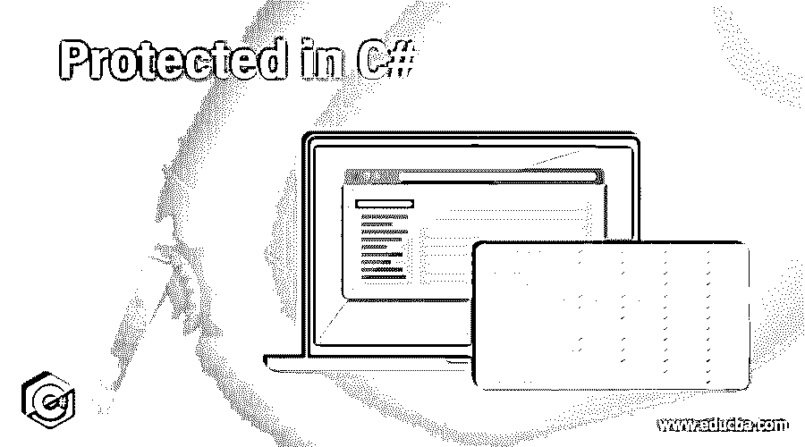

# 在 C#中受保护

> 原文：<https://www.educba.com/protected-in-c-sharp/>




## C#中受保护的简介

在本文中，我们将详细了解如何在 c#中实现 protected。借助访问修饰符，我们可以限制参数和类的可访问性级别。C#中有以下访问修饰符

*   公共
*   私人的
*   保护
*   内部的

### C#中受保护的修饰符

在 c#中，我们可以使用 protected 修饰符来指定访问仅限于包含类型。此外，我们可以将它用于从包含类派生的类型。单词 protected 意味着它本身以及派生类可以访问或看到它。

<small>网页开发、编程语言、软件测试&其他</small>

借助此成员或类型，只能由同一类中使用的代码或派生类中使用的代码访问。关键字 protected 介于 private 和 public 修饰符之间。它几乎与私有修饰符相同，但它允许成员访问派生类。当我们想让父母访问孩子的财产时，我们通常使用 protected 关键字。所以我们可以在 protected 关键字的帮助下重用逻辑。

**举例:**

```
using System;
class Test
{
protected int _x; private int _y;
}
class Test1 : Test
{
public Test1 ()
{
// In this we can  access the variable protected int but we cannot access private int variable
Console.WriteLine(this._x);
}
}
class Program
{
static void Main()
{ Test1 b = new Test1 (); }
}
```

考虑两个类，Test 和 Test1。类 Test1 是从 Test 派生的。如果我们看看类 Test 的内部，我们可以看到两个 int 字段已经被声明。1 个受保护，1 个私有。

在类 B Test1 中，我们可以访问受保护的 int，但不能访问私有 int。所以 protected 修饰符在派生类中给了我们额外的访问权限。所以借助 protected 关键字，我们可以访问包含所有派生类的受保护字段。

类也可以被保护。下面是如何声明它的示例

**语法**:

```
public class Test
{
protected class Child
{
}
}
```

只有在嵌套类中，我们才能将类声明为受保护的。我们不能在名称空间中定义它。

### 在 C#中实现 Protected 的示例

下面的例子展示了我们如何用 C#实现 protected:

#### 示例# 1–没有实现子类

**代码:**

```
using System;
using System.Collections.Generic;
using System.Linq;
using System.Text;
using System.Threading.Tasks;
namespace ProtectedExample
{
class demo
{
// String Variable declared as protected
protected string name;
public void print()
{
Console.WriteLine("\name is " + name);
}
}
class Program
{
static void Main(string[] args)     // main method
{
demo d = new demo();
Console.Write("Enter your name:\t");
d.name = Console.ReadLine();
d.print();
Console.ReadLine();
}
}
}
```

在上面的示例中，字符串被声明为 protected。该程序将引发一个错误，因为 protected 将对其他类隐藏其成员。所以它只能在子类中访问。

#### 示例 2–通过继承实现

**代码:**

```
using System;
using System.Collections.Generic;
using System.Linq;
using System.Text;
using System.Threading.Tasks;
namespace ProtectedExample
{
class Demo
{
protected string name = "Protected Keyword";
protected void Display(string val)
{
Console.WriteLine("This is " + val);
}
}
class Program : Demo   // inheritance
{
static void Main(string[] args)
{
Program program = new Program();
// Accessing protected variable
Console.WriteLine("This is " + program.name);
// Accessing protected function
program.Display("protected example");
Console.ReadLine();
}
}
}
```

在上面的例子中，父类由受保护的成员组成。Protected 用于声明字符串。现在子类是从父类派生的，继承的概念被用来访问受保护的成员。

**输出:**


#### 实施例 3

**代码:**

```
using System;
using System.Collections.Generic;
using System.Linq;
using System.Text;
using System.Threading.Tasks;
namespace ProtectedExample
{
class Parent
{
private String Private = "My name is John";    // string declared as private
protected String Protected = "My name is Dan"; //  string declared as protected
}
class Child : Parent // inheritance
{
public void Show()
{
Console.WriteLine(Protected);
}
}
class Program
{
static int Main(string[] args)  // main method
{
Child child = new Child();    // child object
child.Show();
Console.ReadKey();
return 0;
}
}
}
```

在上面的例子中，父类包含私有和受保护的字符串。子类是从父类派生的。Show()虽然不能访问 private，但是可以访问 protected。子类对象用于调用该方法。Protected 用于保护成员不被类外访问。

**输出:**


我们也可以将构造函数声明为受保护的。因此，通过将任何构造函数声明为 protected，我们可以从子类中调用它。

**语法:**

```
public class TEst : Test1
{
public Test() : base() // here we can Call the protected base constructor
{
}
}
```

我们不能调用受保护的方法。我们可以从派生类中调用受保护的构造函数。

### 受保护的内部访问修饰符

在 protected internal 的帮助下，我们可以指定访问仅限于从包含类派生的当前类型。因此，这确保了成员和类型可以被同一个类中的代码或在另一个程序集中编写的派生类访问。

**举例:**

```
using System;
using System.Collections.Generic;
using System.Linq;
using System.Text;
using System.Threading.Tasks;
namespace ProtectedExample
{
class Demo
{
protected internal string name;    // variable is declared as protected internal
public void print()
{
Console.WriteLine("name is " + name);
}
}
class Program
{
static void Main(string[] args) // main method
{
Demo d = new Demo();
Console.Write("Enter your name:\t");
// Accepting value in protected internal variable
d.name = Console.ReadLine();
d.print();
Console.ReadLine();
}
}
}
```

**输出:**


### 在 C#中受保护的重要性

Protected 关键字很有用，因为在同一类中使用的代码可以访问这种类型的变量。当我们想给子类授权以便它可以访问父类成员时，这是很有用的。因此，从这个意义上说，实现代码的可重用性是很重要的。

### 结论

所以我们可以使用受保护的变量，并使用继承概念来访问它们。它可以在类本身或子类可以访问成员的地方使用。

### 推荐文章

这是一个在 C#中受保护的指南。在这里，我们讨论 C#中实现 protected 以及 protected 访问修饰符的介绍和各种示例。您也可以阅读以下文章，了解更多信息——

1.  [c#中的集合](https://www.educba.com/collections-in-c-sharp/)
2.  [C#泛型](https://www.educba.com/c-sharp-generics/)
3.  [c#中的 Yield 关键字](https://www.educba.com/yield-keyword-in-c-sharp/)
4.  [c#中的私有](https://www.educba.com/private-in-c-sharp/)


