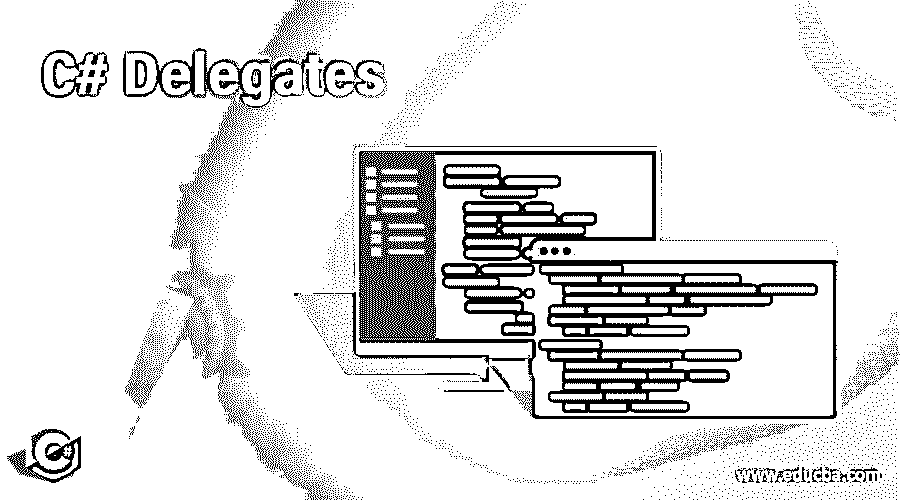

# C#委托

> 原文：<https://www.educba.com/c-sharp-delegates/>




## C#委托简介

当我们希望在代码中处理任何事件或回调时，或者我们可以说一个函数有多个不同数据类型的参数，但我们希望传递函数本身而不是参数时，C#委托起着重要的作用。在这种情况下，委托出现在图片中，因为它的作用就像一个指向函数的指针，因为它是一个引用数据类型，因此它保存了方法的引用。代表是系统的一部分。C#中的委托类。它们类似于 C 和 C++编程中的函数指针。

### 句法

让我们看看 C #中声明委托的语法

<small>网页开发、编程语言、软件测试&其他</small>

```
<access modifier> delegate < return type > < delegate_name > ( <parameters>)
```

解释:在上面的语法中，访问修饰符必须在声明委托之前声明，因为它可以是 public、private 或 protected。现在，为了声明 delegate，我们必须使用关键字 delegate，后跟函数返回类型。举个例子，

```
public delegate void Show ( char ch );
```

上面使用的 show 委托用于指向与函数 Show()具有相同参数和返回类型的任何方法。

### 实现 C#委托的示例

下面是上面提到的例子

#### 示例#1

演示单次造型委托工作的代码:

**代码:**

```
using System;
class Singlecast_Delegates
{
public delegate void Delete_func() ;
public class SD
{
public static void text_display()
{
Console.WriteLine ( " Hey hello ! , How are you " ) ;
}
public static void text_show()
{
Console.WriteLine ( " Hi ! How is everything ? " ) ;
}
public void print()
{
Console.WriteLine ( " Print " ) ;
}
}
static void Main(string[] args)
{
Delete_func del_var1 = SD.text_show ;
Delete_func del_var2 = new Delete_func ( SD.text_display ) ;
SD obj = new SD() ;
Delete_func del_var3 = obj.print ;
del_var1() ;
del_var2() ;
del_var3() ;
Console.ReadLine () ;
}
}
```

**输出:**


**解释:**在上面的代码中，你可以看到我们将类 SD 的静态方法 text_show()分配给 Delete_func()，然后我们使用 new 运算符将类 SD 的静态方法 text_display()分配给 Delete_func()。此外，我们可以使用这两种方法来分配委托功能。因此，首先，我们创建了一个 SD 类的实例，并将方法 print()分配给 delegate，这意味着 delegate with class。最后，我们为 SD 类创建了对象，这样我们就可以逐个调用我们在代码中创建的函数。

#### 实施例 2

演示双重造型委托工作的代码:

**代码:**

```
using System ;
namespace Educba {
// Here we are declaring the class with name " Edu "
class Edu {
// In this class we will declare the delegates
// Here the return type and parameter type must be same as the return and parameter type
// of the 2 methods
// "number_addition" and "number_substraction" are 2 given delegate names by user
public delegate void number_addition ( int x , int y ) ;
public delegate void number_substraction ( int x , int y ) ;
// here we are declaring the "total" method
public void total ( int x , int y )
{
Console.WriteLine( " (50 + 10) = {0} " , x + y ) ;
}
// here we are declaring the "substraction" method
public void substraction ( int x , int y )
{
Console.WriteLine( " ( 95 - 30 ) = {0} ", x - y ) ;
}
// Main Method declaration
public static void Main(String []args)
{
// creating an object " obj " for "Edu"
Edu obj = new Edu() ;
number_addition delegate1 = new number_addition ( obj.total ) ;
number_substraction delegate2 = new number_substraction( obj.substraction ) ;
// creating an object of the delegate class named as " delegate1 "
// for method "total" and "delegate2" for method "substraction" &
// pass the parameter of the  2 methods by class object "obj"
// by instantiating the delegates
// passing the below values to the methods by declared delegate object
delegate1( 50 , 10) ;
delegate2( 95 , 30);
}
}
}
```

**输出:**


**解释:**在上面的代码中，你可以看到我们使用了双造型委托，这与单造型委托不同。我们已经声明了名为 Edu 的类，这个类声明了两个委托，其中一个用于两个整数的加法，另一个用于一次减去两个给定的整数。之后，我们声明了一个方法 total 来存储加法委托的结果。同样，我们还声明了一个存储减法委托结果的方法。在主类中，我们创建了 Edu 类的对象，这样我们就可以调用委托函数对任意两个给定的整数进行加减运算。我们将传递值并得到结果。

#### 实施例 3

演示匿名委托工作的代码:

**代码:**

```
using System;
// declaring delegate method Demo of void type
public delegate void Demo() ;
// creating a class for declaring a static method inside this class.
public class First_Program
{
static int Main()
{
Demo Display = delegate()
{  // displaying the output on the user screen
Console.WriteLine ( " Here is the Anonymous delegate method " ) ;
};
// Here we are calling the display function.
Display() ;
return 0 ;
}
}
```

**输出:**


### 结论

每当一个程序员需要传递一个方法作为其他方法的参数时，我们就使用委托，或者我们可以说委托是一个类，通过它我们可以封装一个函数签名。这更像是在 C#中给一个方法参数命名。

### 推荐文章

这是 C#委托指南。为了更好地理解，我们在这里用适当的语法和相应的示例代码来讨论对 C#委托的介绍。您也可以浏览我们的其他相关文章，了解更多信息——

1.  [C#泛型](https://www.educba.com/c-sharp-generics/)
2.  [c#中的命名空间](https://www.educba.com/namespaces-in-c-sharp/)
3.  [在 C#中断言](https://www.educba.com/assert-in-c-sharp/)
4.  [c#中的元数据](https://www.educba.com/metadata-in-c-sharp/)


