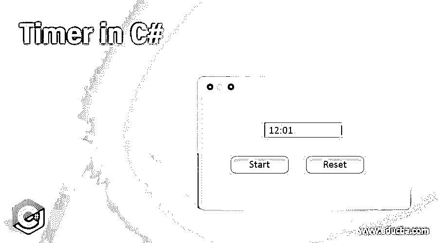

# C#中的定时器

> 原文：<https://www.educba.com/timer-in-c-sharp/>




## C#中定时器的介绍

C#中的定时器是编程世界中最好的特性之一。计时器在服务器端和客户端的软件程序开发中起着至关重要的作用。它们主要用于在没有任何其他干扰的情况下，以特定的时间间隔触发事件。Timer 在后台工作，因为它没有任何可视化表示。因此，当我们在固定时间检查代码或执行任何事件时，我们可以使用 timer 对象，因为我们可以借助 C #中的时间通过增加或减少时间速度来安排动画序列。

### C#中计时器的语法

让我们看看用 C#表示计时器的语法:

<small>网页开发、编程语言、软件测试&其他</small>

```
timer = new System.Timers.Timer(3000) ;
```

这里我们创建了一个 3 秒钟的定时器对象。在创建一个定时器对象后，我们可以为逝去的事件设置定时器，然后我们可以通过下面的语法启动定时器。

```
timer.Elapsed += OnTimedEvent ;
timer.Enabled = true ;
```

为了准确理解 C #中定时器的工作、实现和功能，下面给出了定时器函数的解释示例。

### 用 C#实现定时器的例子

下面是演示计时器工作的 C#代码示例:

#### 示例#1

**代码:**

```
using System ;
using System.Timers ;
class Timer_Example
{
public static void Main()
{
Timer newTimer = new Timer() ;
newTimer.Elapsed += new ElapsedEventHandler(DisplayTimeEvent ) ;
newTimer.Interval = 2000 ;
newTimer.Start() ;
while ( Console.Read() != 'q' )
{
;    // we can write anything here if we want, leaving this part blank won’t bother the code execution.
}
}
public static void DisplayTimeEvent( object source, ElapsedEventArgs e )
{
Console.Write( " \r{0} " , DateTime.Now ) ;
}
}
```

**输出:**


在上面的代码中，我们声明了一个 Timer_Example 类来演示 C#中计时器的基本功能和工作方式。之后，我们通过命名为 new timer 来声明一个新的计时器。因此，使用这个新计时器，我们调用计时器函数的运行时间和间隔功能。我们已经将计时器值设置为 2 秒，然后初始化计时器函数，直到 while 条件为真。一旦我们调用 DateTime.now，输出屏幕将显示日期和时间。

#### 实施例 2

**代码:**

```
using System ;
using System.Timers ;
public class Test_Timers {
private static Timer timer ;
public static void Main() {
timer = new System.Timers.Timer() ;
timer.Interval = 6000 ;
timer.Elapsed += OnTimedEvent ;
timer.AutoReset = true ;
timer.Enabled = true ;
Console.WriteLine( " Please enter any key to exit from the code anytime... " ) ;
Console.ReadLine() ;
}
private static void OnTimedEvent(Object source, System.Timers.ElapsedEventArgs e) {
Console.WriteLine( " Event  : {0} " , e.SignalTime ) ;
}
}
```

**输出:**


在上面的代码中，我们声明了一个名为“Test_timers”的类，其中我们声明了一个名为“Timer”的私有静态计时器，在公共静态 main 中，我们将 Timer 设置为等于新计时器，时间间隔为 6 秒。通过 onTimedEvent 方法，我们可以打印日期和时间，每 6 秒钟打印一次，直到条件成立。正如您在输出中看到的，这两个事件之间的间隔为 6 秒，它将继续重复，直到条件为真。

#### 实施例 3

**代码:**

```
using System ;
using System.Collections.Generic ;
using System.Timers ;
static class DemoTimers
{
static Timer time ;
static List <DateTime> output = new List <DateTime> () ;
public static void Start()
var timer = new Timer(5000) ;
timer.Elapsed += new ElapsedEventHandler(Elapsed_time ) ;
timer.Enabled = true ;
time = timer ;
}
static void Elapsed_time( object sender , ElapsedEventArgs e )
{
otuput.Add(DateTime.Now) ;
}
public static void PrintTimes()
{
if ( otuput.Count> 0 )
{
Console.WriteLine( " TIMERS : " ) ;
foreach ( var time in otuput )
{
Console.Write(time.ToShortTimeString() + " " ) ;
}
Console.WriteLine() ;
}
}
}
class Program
{
static void Main()
{ DemoTimers.Start() ;
while ( true )
{
DemoTimers.PrintTimes() ;
Console.WriteLine( " WAITING To Print" ) ;
System.Threading.Thread.Sleep( 2000 ) ;
}
}
}
```

**输出:**


在上面的代码中，你可以看到我们正在使用 System。集合。泛型，使用系统。计时器类，这样我们就可以使用它们的功能。我们声明了一个静态类 DemoTimers，其中我们创建了一个名为 time 的静态计时器，之后，我们创建了一个名为 DateTime 的静态列表，它将存储在输出中。为了在我们的代码中开始使用计时器，我们创建了一个 start()方法，我们将计时器设置为 5 秒，然后添加 elapsed 事件处理程序，然后我们必须将条件设置为 true。

还有一个名为 Elapsed_time 的方法，我们可以在其中为每个可能的事件添加日期和时间，这将有助于找出事件的当前时间和日期。然后我们又声明了一个名为 void 类型的 PrintTimes 的方法。在这种方法的帮助下，我们可以打印出所有记录的时间。如果添加了条件，它将一直打印计时器，直到条件为真。因为它将在输出列表中为每个 var 时间打印。

最后，我们创建了一个名为 Program 的类，在其中声明了静态 void main，然后我们启动了 timer 类。我们每 3 秒钟调用一次 PrintTimes 函数，如果条件成立，它将在每个事件发生之间 3 秒钟中断后继续打印结果。

### 结论

在 timer 类的帮助下，程序员可以在几分钟或几秒钟的时间内定期调用代码。因此，要监控节目的整体质量，定时器是用来监控节目的。它是一个静态类，所以它不能有实例成员。

### 推荐文章

这是一个用 C#编写的定时器指南。在这里，我们讨论一个 C#定时器的简要概述，它的例子，以及它的代码实现和输出。您也可以浏览我们推荐的其他文章，了解更多信息——

1.  [c#中的私有](https://www.educba.com/private-in-c-sharp/)
2.  [c#中的元数据](https://www.educba.com/metadata-in-c-sharp/)
3.  [C#自定义属性](https://www.educba.com/c-sharp-custom-attribute/)
4.  的 C#名称


