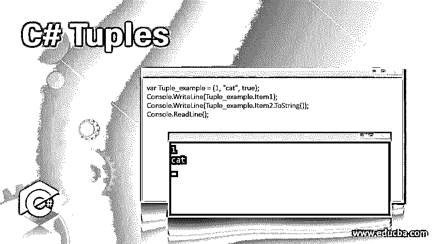
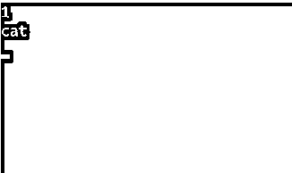
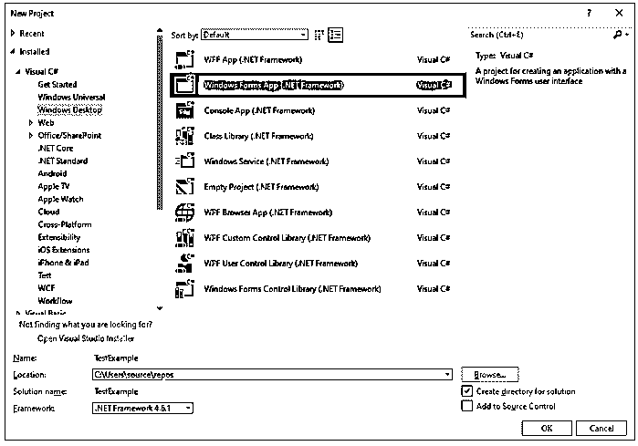
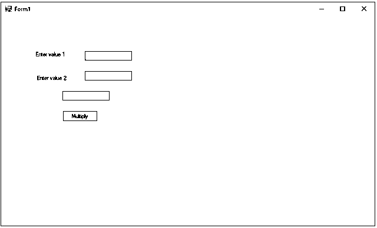
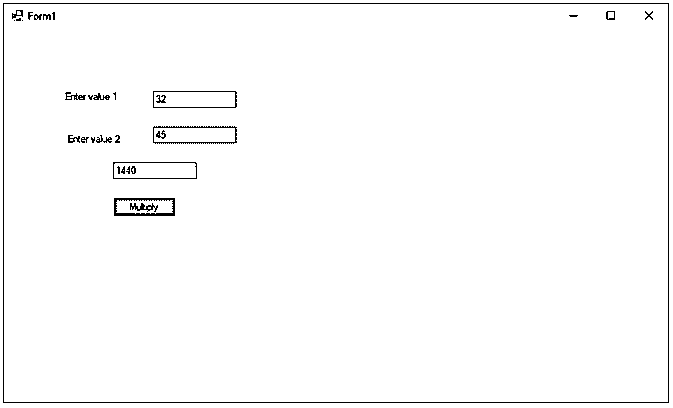

# C#元组

> 原文：<https://www.educba.com/c-sharp-tuples/>




## C#元组简介

C#元组是 C#中引入的一种数据结构。net 4.0 版。元组数据结构被设计成保存不同数据类型的元素。元组有助于在单个参数中从类方法返回多个值，这比 Out 参数、类或结构类型或动态返回类型有许多优势。当参数被传递到单个数据集时，访问该数据集并对其执行不同的操作变得很容易。

### 如何创建 C#元组？

可以用两种不同的方式创建元组

<small>网页开发、编程语言、软件测试&其他</small>

#### 1.使用构造函数

用于创建元组的构造函数存在于元组<t>类中。缩写“T”表示创建元组时指定的多种数据类型。存储在 tuple 中的元素编号为 0 到 7，即任何普通的 tuple 只包含 8 个元素，如果试图输入 8 个以上的元素，编译器会抛出错误。</t>

##### 单元素元组

```
Tuple <T1> (T1)
```

**举例:**

```
Tuple<int> Tuple_example = new Tuple<int>(27);
Console.WriteLine(Tuple_example);
Console.ReadLine();
```

**输出:**


##### 多元元组

```
Tuple <T1, T2> (T1, T2)
```

**举例:**

```
Tuple<int, string, bool> tuple = new Tuple<int, string, bool>(1, "cat", true);
Console.WriteLine(tuple.Item1);
Console.WriteLine(tuple.Item2.ToString());
Console.ReadLine();
```

**输出:**


#### 2.创建方法

C#提供了静态创建方法来创建元组，如下所示

##### 单元素元组

```
Create (T1);
```

**举例:**

```
var Tuple_example = Tuple.Create(27);
Console.WriteLine(Tuple_example);
Console.ReadLine();
```

**输出:**


##### 多元元组

```
Create (T1, T2);
```

**举例:**

```
var Tuple_example = Tuple.Create(1, "cat", true);
Console.WriteLine(Tuple_example.Item1);
Console.WriteLine(Tuple_example.Item2.ToString());
Console.ReadLine();
```

**输出:**


使用构造函数时，我们需要在创建元组时指定每个元素的数据类型。Create 方法帮助我们消除了上面显示的繁琐的编码。

##### 值元组

泛型元组是一种引用类型，这意味着值存储在堆中，这使得它的使用在内存和性能方面代价很高。C#7.0 在泛型 tuple 上引入了一个新的改进版本 Tuple，并将其命名为 ValueTuple。ValueTuple 存储在堆上，很容易检索。值元组是自带的。NET Framework 4.7 或。NET 图书馆 2.0。要单独安装 tuple 功能，需要安装名为 System.Value.Tuple 的 NuGet 包。

关于 ValueTuple 的要点

*   创建 ValueTuple 很容易

**举例:**

```
var Tuple_example = (1, "cat", true);
Console.WriteLine(Tuple_example.Item1);
Console.WriteLine(Tuple_example.Item2.ToString());
Console.ReadLine();
```

**输出:**




这相当于:

```
var Tuple_example = Tuple.Create(1, "cat", true);
Console.WriteLine(Tuple_example.Item1);
Console.WriteLine(Tuple_example.Item2.ToString());
Console.ReadLine();
```

*   ValueTuple 也可以在不使用“var”关键字的情况下声明。在这种情况下，我们需要提供每个成员的数据类型

**举例:**

```
(int, string, bool) Tuple_example = (1, "cat", true);
Console.WriteLine(Tuple_example.Item1);
Console.WriteLine(Tuple_example.Item2.ToString());
Console.ReadLine();
```

**输出:**


*   可以使用从 ValueTuple 返回值

**举例:**

```
details.Item1;   – returns 28
details.Item2; -- returns ”CBC”
```

*   与普通元组不同，ValueTuple 不能只包含一个元素。

**举例:**

```
var detail = (28);  --this is not a tuple
var details = (28, “CBC”); -- this is a tuple
```

在第一条语句中，编译器不会将“detail”视为一个元组，相反，它会被视为一个普通的“var”类型。

*   ValueTuple 可以保存八个以上的值，而不必在第七个位置嵌套另一个元组。
*   ValueTuple 中的属性可以具有与 Item1、Item2 等不同的名称。

```
(int ID, String Firstname, string SecondName) details = (28, “CBC”, “C# Tuples”);
```

*   根据编程的需要，ValueTuples 中的元素也可以被分离或丢弃。在上面的例子中，元素“FirstName”可以被丢弃，并且包含第一个元素和第三个元素的元组可以作为方法的返回类型被传递。

### 元组是如何工作的？

1.  C#框架只允许在元组中有八个元素，这意味着我们可以有从 0 到 7 的值，如果你想创建一个元组，那么指定第七个元素 TRest 作为嵌套元组

```
var nestedtuple_example = new Tuple <int, string, string, int, int, int, string, Tuple<double, int, string>> (5, “This”, “is”, 7,8,9, “number”, Tuple.Create (17.33, 29,”April”));
```

2.  元组的一个重要用途是将它作为单个实体传递给方法，而不使用传统的“out”和“ref”关键字。“out”和“ref”参数的使用可能会很困难和混乱，而且“Out”和“ref”参数不能与“asnyc”方法一起使用。例如 public void TupleExampleMethod(Tuple<int int="">tupleexample)</int>

```
{
Var multiplication = tupleexample.Item1 * tupleexample.Item2;
Console.WriteLine (“Multiplication is”, {0}, multiplication);
}
```

方法 TupleExampleMethod 的将类似于

```
TupleExampleMethod(new Tuple<int, int> (34,56));
```

3.  dynamic 关键字也可以用于从任何方法返回值，但是由于性能问题，很少使用它。从方法中返回元组。

```
public static Tuple <int, string> GetPerson()
{
return Tuple.Create (1, “abc”);
}
```

让我们用 Visual 创建一个程序来理解 tuple 是如何工作的。

*   启动 Visual Studio 并创建一个 windows 项目。




*   我们正在创建一个简单的乘法程序，它展示了通过一个方法传递元组。创建如下的示例窗口。




来自两个文本框的值被放入一个元组中，该元组被传递给一个方法。

```
using System;
using System.Collections.Generic;
using System.ComponentModel;
using System.Data;
using System.Drawing;
using System.Linq;
using System.Text;
using System.Threading.Tasks;
using System.Windows.Forms;
namespace WindowsFormsApp1
{
public partial class Form1 : Form
{
public Form1()
{
InitializeComponent();
}
private void btnMultiply_Click(object sender, EventArgs e)
{
int value1 = Convert.ToInt32(txtVal1.Text);
int value2 = Convert.ToInt32(TxtVal2.Text);
CallMethod(new Tuple<int, int>(value1, value2));
}
private void CallMethod(Tuple<int, int> tuple)
{
txtResult.Text = Convert.ToString(tuple.Item1 * tuple.Item2);
Console.ReadLine();
}
}
}
```

结果显示在名为 txtResult 的第三个文本框中。最终结果是这样的。




### 结论

元组数据结构是一种引用类型，这意味着值存储在堆中而不是堆栈中。这使得在程序中使用元组和访问它们成为一项密集的 CPU 任务。元组属性中仅有 8 个元素是元组的主要缺点之一，因为嵌套元组更容易引起歧义。此外，使用条目<number>访问元组中的元素也是不明确的，因为必须记住元素在什么位置才能访问它。C#7 引入了 ValueTuple，它是元组的值类型表示。它只适用于。NET Framework 4.7，因此需要与 Nuget 包系统分开安装。值元组包。</number>

### 推荐文章

这是一个 C#元组的指南。在这里，我们还讨论了简介以及如何创建 c#元组，并给出了示例及其代码实现。您也可以看看以下文章，了解更多信息–

1.  [C#版本](https://www.educba.com/c-sharp-versions/)
2.  [C#排序字典](https://www.educba.com/c-sharp-sorteddictionary/)
3.  [C #λ表达式](https://www.educba.com/c-sharp-lambda-expression/)
4.  [在 C#中断言](https://www.educba.com/assert-in-c-sharp/)


