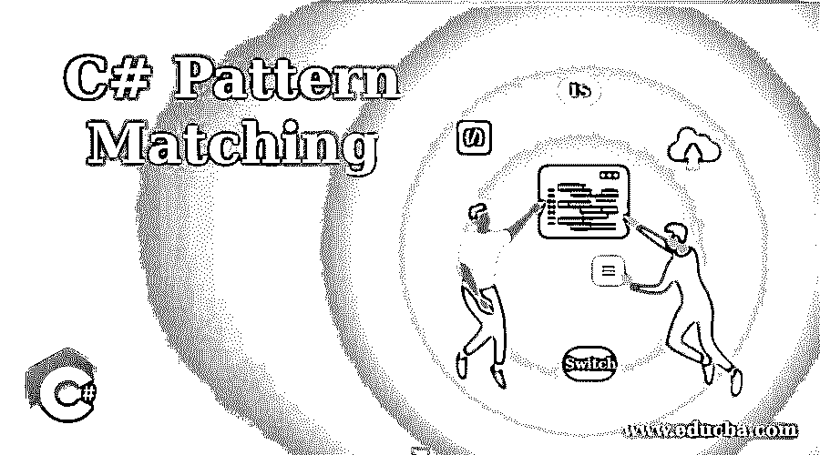

# C#模式匹配

> 原文：<https://www.educba.com/c-sharp-pattern-matching/>




## C#模式匹配简介

C#中用于匹配任何数据或任何对象的功能称为模式匹配，这种模式匹配是使用表达式 is 和 switch 语句执行的，其中 is 表达式检查数据或对象是否与指定的类型兼容，switch 语句用于匹配 C#中的不同模式。通过在 C#中使用表达式 is 和 switch 语句进行模式匹配，可以将编写应用程序的方式改为可读性更强、更易于维护和更易于理解的方式。

### C#模式匹配的方法

C#中有两种模式匹配方法。它们是:

<small>网页开发、编程语言、软件测试&其他</small>

#### 1.是表达

is 表达式用于检查数据或对象与指定类型的兼容性。

##### 示例#1

**C#程序演示的是程序中的一个表达式。**

**代码:**

```
using System;
//a namespace called program is defined
namespace program
{
//a class called subject is defined in which a subject is assigned to a string variable
class Subject
{
public string SubName{ get; set; } = "C Sharp";
}
//a class called check is defined
class check
{
//main method is called
public static void Main(string[] args)
{
//an instance of the subject class is created
Subject sub = new Subject();
//is expression is used to check if the instance of the subject class is compatible with the type of the value assigned to the string variable in subject class
if(sub is Subject)
{
Console.WriteLine(sub.SubName);
}
}
}
}
```

**输出:**


**解释:**在上面的程序中，定义了一个名为 program 的命名空间。然后定义一个名为 Subject 的类，在这个类中，一个主题名被分配给一个字符串变量。然后定义一个名为 check 的类，在这个类中调用 main 方法。然后创建 subject 类的一个实例。然后，使用 is 表达式检查 subject 类的新创建的实例是否与 subject 类中分配给字符串变量的值的类型兼容。如果兼容，主题名称将显示为输出。程序的输出显示在上面的快照中。

##### 实施例 2

**C#程序演示的是程序中的表达式。**

**代码:**

```
using System;
//a namespace called program is defined
namespace program
{
//a class called Writer is defined in which a name of the writer is assigned to a string variable
class Writer
{
public string WriterName{ get; set; } = "ShobhaShivakumar";
}
//a class called check is defined
class check
{
//main method is called
public static void Main(string[] args)
{
//an instance of the Writer class is created
Writer write = new Writer();
//is expression is used to check if the instance of the Writer class is compatible with the type of the value assigned to the string variable in Writer class
if(write is Writer)
{
Console.WriteLine(write.WriterName);
}
}
}
}
```

**输出:**


**解释:**在上面的程序中，定义了一个名为 program 的命名空间。然后定义一个名为 writer 的类，在这个类中，Writer 的名称被赋给一个字符串变量。然后定义一个名为 check 的类，在其中调用 main 方法。然后创建 Writer 类的一个实例。然后，使用 is 表达式检查新创建的 Writer 类实例是否与类 Writer 中赋给字符串变量的值的类型兼容。如果兼容，则输出中将显示编写器的名称。程序的输出显示在上面的快照中。

#### 2.交换语句

在 C#中，switch 语句用于匹配不同的模式。

##### 示例#1

**C#程序演示程序中的 Switch 语句。**

**代码:**

```
using System;
//a class called check is defined
class check
{
//main method is called
public static void Main()
{
//a name is assigned to a string variable
string val = "Shobha_Shivakumar";
//switch statement is used to switch between the values that is assigned to the string variable and anything else
switch (val)
{
case "Shobha_Shivakumar":
Console.WriteLine("The assigned value is Shobha_Shivakumar");
break;
case "not_assigned":
Console.WriteLine("The assigned value is not_assigned");
break;
}
}
}
```

**输出:**


**说明:**在上面的程序中，定义了一个名为 check 的类。然后调用 main 方法，在该方法中，将一个名称赋给一个字符串变量。然后，switch 语句用于在赋给字符串变量和其他变量的值之间切换。如果分配给字符串变量的名称是开关大小写，则显示相应的输出。同样，如果是其他内容，将显示相应的输出。程序的输出如上面的快照所示。

##### 实施例 2

**C#程序演示程序中的 Switch 语句:**

**代码:**

```
using System;
//a class check is defined
class Check
{
//main method is called
static void Main()
{
while(true)
{
Console.WriteLine("Type any alphabet between A and Z");
try
{
//a string is expected as the input by the user
string r = Console.ReadLine();
//switch statement is used to parse the input given by the user and display the output accordingly
switch(r)
{
case "A":
{
Console.WriteLine("This is Alphabet A");
break;
}
case "B":
{
Console.WriteLine("This is alphabet B");
break;
}
default:
{
Console.WriteLine("This is something other than Alphabets A and B");
break;
}
}
}
catch
{
}
}
}
}
```

**输出:**


**说明:**在上面的程序中，定义了一个名为 check 的类。然后调用 main 方法，其中期望字母 A 到 Z 之间的字符串作为来自用户的输入。然后，使用 switch 语句解析用户提供的输入，并相应地显示输出。如果输入的是除 A 和 B 之外的任何字母，则同样会显示在输出中。上面程序的输出显示在上面的快照中。

### 结论

在本教程中，我们通过例子及其输出，通过模式匹配的定义和方法来理解 C#中模式匹配的概念。

### 推荐文章

这是一个 C#模式匹配的指南。这里我们讨论 C#模式匹配及其方法的介绍，以及它的例子和代码实现。您也可以浏览我们推荐的其他文章，了解更多信息——

1.  [c#中的随机数生成器](https://www.educba.com/random-number-generator-in-sharp/)
2.  [Java 中的静态构造函数](https://www.educba.com/static-constructor-in-java/)
3.  [c#中的 text writer](https://www.educba.com/textwriter-in-c-sharp/)
4.  [c#中的静态构造函数](https://www.educba.com/static-constructor-in-c-sharp/)


