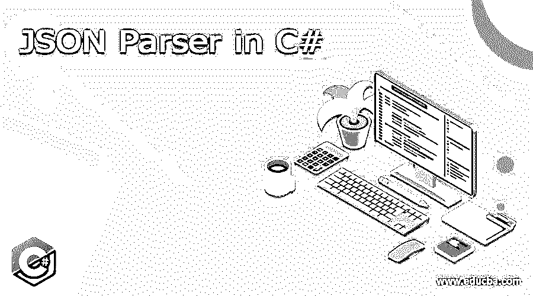

# C#中的 JSON 解析器

> 原文：<https://www.educba.com/json-parser-in-c-sharp/>




## C#中的 JSON 解析器简介

JSON(JavaScript Object Notation)parse 是独立于语言的，它是一种轻量级的数据交换格式，自我描述，易于理解。JSON parser 是 XML 的替代方案，它以结构化文本格式表示对象，以键值对存储数据。json 文件名的扩展名是. JSON。JSON 的类允许将对象序列化为 JSON 文本，也允许将 JSON 文本反序列化为对象，内置了对 UTF-8 的支持。

**语法:**

<small>网页开发、编程语言、软件测试&其他</small>

让我们看看 JSON (JavaScript 对象表示法)的语法如下，

*   job object。Parse()方法是一个对象类方法，该方法用于将 JSON 字符串解析成 C#的对象。基于键值，它解析字符串的数据，然后通过使用键值来检索数据。对于解析方法，语法如下:

```
Jobject.Parse(jsonStringName);
```

*   使用 JsonConvert 解析 JSON 字符串的另一种方法。属于 JsonConvert 类的 DeserializeObject()。让我们看看下面的语法，

```
JsonConvert.DeserilizeObject<CustomClassName>(JsonStringName);
```

*   使用 JavaScriptSerialize()解析 JSON 字符串。Deserialize()方法，此方法仅适用于最新版本的。NET，让我们看看下面的语法

```
JavaScriptSerializer(). Deserialize<CustomClassName>(jsonString);
```

### JSON 解析器在 C#中是如何工作的？

JSON (JavaScript Object Notation)是一种轻量级的数据交换格式，易于人类读写，并且可以被机器解析。它提供了高性能、更少的内存空间分配。有许多第三方控件以 JSON 字符串格式从客户端向服务器端提供数据，并且有必要将 JSON 字符串转换为合适的对象来访问数据，第三方控件如 Kendo UI grid 等等。在这方面，有 UTF-8 内置的支持。
Jobject。Parse()方法是一个对象类方法，该方法用于将 JSON 字符串解析成 C#的对象。根据键值对字符串数据进行解析，最后使用键值对数据进行检索。下面我们来看看 JSON 解析格式和工作流程，

```
{
string jsonString = @"{
'user_FirstName':'Peter',
'user_LastName':'Paul'
}";
By using the JSON parsing method we can convert and retrieve as follows,
var getResult = JObject.Parse(jsonString);
```

这样我们可以检索数据。

使用 JsonConvert 解析 JSON 字符串的另一种方法。DeserializeObject()属于 JsonConvert 类，该方法称为 JsonConvert。用于将 JSON 字符串转换为 C#对象的 DeserializeObject()。这些对象是由 JSON 字符串创建的。该方法使用的格式如下:

```
JsonConvert.DeserilizeObject<CustomClassName>(JsonStringName);
```

要检索该方法的结果，我们可以这样使用，创建一个具有属性 First_Name 和 Last_Name 的 UserDetails 类，以 JSON 格式输入数据，如下所示

```
var get_jsonString = @"{'First_Name': 'Peter', 'Last_Name': 'Paul'}";
```

要按如下方式转换数据，

```
var result = JsonConvert.DeserializeObject < UserDetails > (get_jsonString);
```

使用 JavaScriptSerialize()解析 JSON 字符串。Deserialize()方法，此方法仅适用于更高版本的。NET 中，这个方法不适用于早期版本，为此，我们可以使用前两种方法将 JSON 字符串转换为 C#对象。该方法使用的格式如下:

```
JavaScriptSerializer().Deserialize<CustomClassName>(jsonString);
To create the class with UserDetails as follows,
class UserDetails
{
public string userName { get; set; }
public int userAge { get; set; }
}
```

要输入从 JSON 到 c#对象转换的用户详细信息，如下所示:

```
var input_json = @"{""name"":""Peter Paul"",""age"":49}";
```

要使用下面的 serializer()方法将 json 转换为 c#对象，如下所示:

```
var resultObject = new JavaScriptSerializer().Deserialize<UserDetails>(input_json);
```

.NET framework 支持反序列化和序列化到 JSON 的类，方法是使用我们与 DataContractJsonSerializer 一起使用的类。通过使用下面的代码我们可以反序列化 JSON 对象，对于使用该方法我们需要如下一些步骤:

应用程序必须有系统的引用。运行时。序列化库。

整个类应该具有 DataContract，并且属性必须具有 DataMember 属性。

```
[DataContract]
public class USerDetails
{
[DataMember]
public string First_Name {
get; set;
}
[DataMember]
public string Last_Name {
get; set;
}
}
```

*   对于序列化和反序列化，我们需要使用 WriteObject 方法来序列化对象，并使用 ReadObject 方法来反序列化 JSON 对象。

```
string get_json = "{ \"First_Name\":\"Smith\",\"LastName\":\"Rio\" }";
```

datacontractjsonserializar = newdatacontractjsonserializar(type of(user details))；

Json.NET 是最佳的工作环境框架。网。JSON 有很多好处和特性如下:

*   它是 JSON 序列化程序在。NET 对象和 JSON
*   对 JSON 会有 LINQ 的手动编写和阅读 JSON
*   它的工作速度比。它有内置的 JSON 序列化器和高性能数据。
*   JSON 易读，写缩进。
*   JSON 和 XML 之间的转换很容易。

### 例子

#### 程序#1

job object。Parse()方法是一个对象类方法，该方法用于将 JSON 字符串解析成 C#的对象。根据键值对字符串数据进行解析，最后使用键值对数据进行检索。让我们看看下面的 JSON 解析实现，

```
using System;
using Newtonsoft.Json.Linq;
namespace JSONParsing
{
public class Parsing
{
public static void Main(string[] args)
{
string jsonString = @"{
'user_FirstName':'Peter',
'user_LastName':'Paul'
}";
//Using the JSON-parse method here
var getResult = JObject.Parse(jsonString);
Console.WriteLine("\n\tUsing JSON-Parse Method");
Console.WriteLine(string.Concat("\n\tDisplaying User First and Last Name: ", getResult["user_FirstName"], " " + getResult["user_LastName"], "."));
}
}
}
```

**输出:**


#### 程序#2

使用 JsonConvert 解析 JSON 字符串。DeserializeObject()属于 JsonConvert 类，该方法称为 JsonConvert。用于将 JSON 字符串转换为 C#对象的 DeserializeObject()。这些对象是由 JSON 字符串创建的。

```
using System;
using Newtonsoft.Json;
namespace JSONParse_Program
{
public class UserDetails
{
public string First_Name
{
get; set;
}
public string Last_Name
{
get; set;
}
}
public class Parsing
{
public static void Main(string[] args)
{
var get_jsonString = @"{'First_Name': 'Peter', 'Last_Name': 'Paul'}";
//Use of the method
var result = JsonConvert.DeserializeObject < UserDetails > (get_jsonString);
Console.WriteLine("JSON-Parse Method\n");
Console.WriteLine(string.Concat("\nDisplaying First and Last Name, ", result.First_Name, " " + result.Last_Name, "."));
}
}
}
```

**输出:**


### 结论

在这篇文章中，我解释了 JSON 解析器的用法，例如，通过使用这些方法，我们可以在 C#程序中解析 JSON 并提取值。

### 推荐文章

这是一个用 C#编写的 JSON 解析器的指南。这里我们讨论 C#中 JSON 解析器的介绍、语法、工作原理？和示例。您也可以看看以下文章，了解更多信息–

1.  [c#中的静态类](https://www.educba.com/static-class-in-c-sharp/)
2.  [C#对象发送方](https://www.educba.com/c-sharp-object-sender/)
3.  [C#对象初始化器](https://www.educba.com/c-sharp-object-initializer/)
4.  [C#对象到字典](https://www.educba.com/c-object-to-dictionary/)


