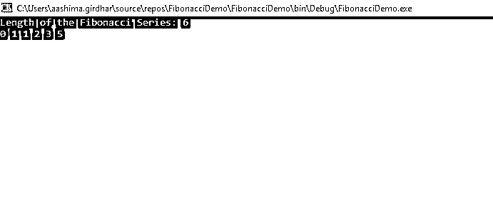
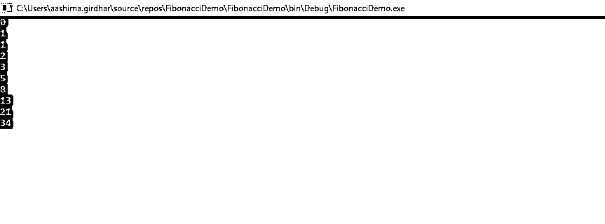

# C#中的斐波那契数列

> 原文：<https://www.educba.com/fibonacci-series-in-c-sharp/>


## C#中斐波那契数列的介绍

斐波那契数列中 C#中的斐波那契数列是著名的数列之一。顺序是 0，1，1，2，3，5，8…斐波纳契数列从 0 和 1 开始，下一个数字是前面两个数字的和。据说 13 世纪莱昂纳多·皮萨诺·比戈洛先生创造的斐波那契数列。斐波那契数列在某些情况下很有用。基本上，它最初用于解决兔子问题，即一对兔子中出生的兔子数量。斐波那契数列在其他问题中也是有用的。

### 斐波那契数列逻辑

在斐波纳契数列中，这个数是它前面两个数的和。因此，如果我们有一个斐波纳契数列，比如说 0，1，1，2，3，5，8，13，21…根据这个数字，下一个数字将是前两个数字的和，比如 13 和 21。所以下一个数字是 13+21=34。

<small>网页开发、编程语言、软件测试&其他</small>

下面是生成斐波那契数列的逻辑

F(n)= F(n-1) +F(n-2)

其中 F(n)是项数，F(n-1) +F(n-2)是前面值的和。

所以如果我们有系列 0，1，1，2，3，5，8，13，21，34，55，89…

根据逻辑 F(n)= F(n-1) +F(n-2)

F(n)= 55+89

F(n)= 144

下一项将是 144。

### 创建斐波那契数列的各种方法

斐波纳契数列可以通过多种方式生成。

#### 1.迭代方法

这种方式是生成数列最简单的方式。

**代码:**

```
using System;
using System.Collections.Generic;
using System.Linq;
using System.Text;
namespaceFibonacciDemo
{
classProgram
{
staticint Fibonacci(int n)
{
intfirstnumber = 0, secondnumber = 1, result = 0;
if (n == 0) return 0; //It will return the first number of the series
if (n == 1) return 1; // it will return  the second number of the series
for (int i = 2; i<= n; i++)  // main processing starts from here
{
result = firstnumber + secondnumber;
firstnumber = secondnumber;
secondnumber = result;
}
return result;
}
staticvoid Main(string[] args)
{
Console.Write("Length of the Fibonacci Series: ");
int length = Convert.ToInt32(Console.ReadLine());
for(int i = 0; i< length; i++)
{
Console.Write("{0} ", Fibonacci(i));
}
Console.ReadKey();
}
}
}
```

#### 2.递归方法

这是解决这个问题的另一种方法。

**方法 1**

```
using System;
using System.Collections.Generic;
using System.Linq;
using System.Text;
namespaceFibonacciDemo
{
classProgram
{
staticint Fibonacci(int n)
{
intfirstnumber = 0, secondnumber = 1, result = 0;
if (n == 0) return 0; //it will return the first number of the series
if (n == 1) return 1; // it will return the second number of the series
return Fibonacci(n-1) + Fibonacci(n-2);
}
staticvoid Main(string[] args)
{
Console.Write("Length of the Fibonacci Series: ");
int length = Convert.ToInt32(Console.ReadLine());
for(int i = 0; i< length; i++)
{
Console.Write("{0} ", Fibonacci(i));
}
Console.ReadKey();
}
}
}
```

**方法二**

```
using System.Collections.Generic;
using System.Linq;
using System.Text;
namespace FibonacciSeries
{
class Program
{
public static void Fibonacci
(
int firstnumber,
int secondnumber,
int count,
int length,
)
{
if (count <= length)
{
Console.Write("{0} ", firstnumber);
Fibonacci(secondnumber, firstnumber + secondnumber, count + 1, length);
}
}
public static void Main(string[] args)
{
Console.Write("Length of the Fibonacci Series: ");
int length = Convert.ToInt32(Console.ReadLine());
Fibonacci(0, 1, 1, length);
Console.ReadKey();
}
}
}
```

**输出:**




#### 3.使用数组的斐波那契数列

**代码:**

```
using System;
using System.Collections.Generic;
using System.Linq;
using System.Text;
public class Program
{
public static int[] Fibonacci(int number)
{
int[] a = new int[number];
a[0] = 0;
a[1] = 1;
for (int i = 2; i < number; i++)
{
a[i] = a[i - 2] + a[i - 1];
}
return a;
}
public static void Main(string[] args)
{
var b = Fibonacci(10);
foreach (var elements in b)
{
Console.WriteLine(elements);
}
}
}
```

**输出:**




### 如何求斐波那契数列的第 n 项？

以下是一些方法

#### 方法 1

**代码:**

```
using System;
namespace FibonacciSeries
{
class Program {
public static int NthTerm(int n)
{
if ((n == 0) || (n == 1))
{
return n;
}
else
{
return (NthTerm(n - 1) + NthTerm(n - 2));
}
}
public static void Main(string[] args)
{
Console.Write("Enter the nth term of the Fibonacci Series: ");
int number = Convert.ToInt32(Console.ReadLine());
number = number - 1;
Console.Write(NthTerm(number));
Console.ReadKey();
}
}
}
```

上面的代码是求斐波那契数列中[的第 n 项。例如，如果我们想找出数列中的第 12 个<sup>第</sup>项，那么结果将是 89。](https://www.educba.com/fibonacci-series-in-java/)

#### 方法 2

(O(Log t)时间)。

如果 t 是偶数，那么还有另一个递推公式可以用来求出第 t 个斐波那契数= t/2:

F(t) = [2*F(k-1) + F(k)]*F(k)

如果 t 是奇数，那么 k = (t + 1)/2

F(t) = F(k)*F(k) + F(k-1)*F(k-1)

斐波那契矩阵

得到行列式后，我们会得到(-1)t = Ft+1Ft-1–Ft2

FmFt + Fm-1Ft-1 = Fm+t-1

通过设置 t = t+1，

FmFt+1 + Fm-1Ft = Fm+t

假设 m = t

F2t-1 = Ft2 + Ft-12

F2t =(英尺-1 +英尺+1)英尺=(2 英尺-1 +英尺)英尺

为了得到公式，我们将执行以下操作

如果 t 是偶数，设 k = t/2

如果 t 是奇数，设 k = (t+1)/2

因此，通过对这些数字进行排序，我们可以防止不断使用堆栈的内存空间。它给出了 O(n)的时间复杂度。递归算法效率较低。

**代码:**

```
int f(n) :
if( n==0 || n==1 )
return n;
else
return f(n-1) + f(n-2)
```

现在当上述算法运行 n=4 时

fn(4)

第三层第二层

f(2) f(1) f(1) f(0)

f(1) f(0)

所以它是一棵树。为了计算 f(4 ),我们需要计算 f(3)和 f(2)等等。对于较小的值 4，f(2)计算两次，f(1)计算三次。这种增加的数量会随着数量的增加而增加。

有一个猜想，计算 f (n)所需的加法次数是 f (n+1) -1。

### 结论

在这里，迭代法总是首选，因为它有一个更快的方法来解决这类问题。这里，我们将斐波纳契数列的第一个和第二个数字存储在前一个数字和前一个数字中(这是两个变量)，并且我们还使用当前数字来存储斐波纳契数列。

### 推荐文章

这是一个用 C#编写的斐波那契数列指南。这里我们用不同的方法讨论斐波那契数列逻辑，以及如何求斐波那契数列的第 n 项。您也可以浏览我们的其他相关文章，了解更多信息-

1.  [C 中的斐波那契数列](https://www.educba.com/fibonacci-series-in-c/)
2.  [C# For 循环](https://www.educba.com/c-sharp-for-loop/)
3.  [c++中的斐波那契数列](https://www.educba.com/fibonacci-series-in-c-plus-plus/)
4.  [JavaScript 中的斐波那契数列](https://www.educba.com/fibonacci-series-in-javascript/)


