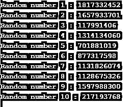
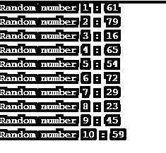
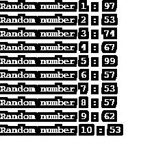
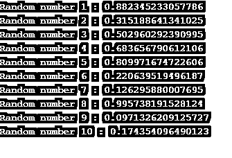
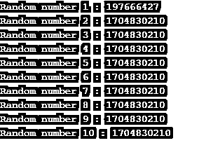

# C#中的随机数生成器

> 原文：<https://www.educba.com/random-number-generator-in-sharp/>


## C#中的随机数生成器是什么？

随机数生成器是 C#中的内置库，可以随机生成整数和浮点数。每次调用该库的相关方法时，它都会返回一个随机数。一系列随机数是一组不遵循任何模式的数字。C#中的随机数生成器倾向于在调用时生成这样一个序列。

### C#中的随机类

*   那么，C#是如何生成一系列随机数的呢？答案就在 C#系统命名空间的 Random 类中。
*   Random 类是一个伪随机数生成器类。这意味着这个类的任务是生成一系列不遵循任何模式的数字。但是，机器真的能够产生随机数吗？机器怎么知道下一步要生成哪个数字呢？毕竟，机器是设计来遵循指令和执行算法的。
*   不，机器不能自己产生随机数。基于机器的当前时钟和状态，有一个定义好的数学算法，指导它从一组数字中挑选数字。集合中的所有数字被选中的概率相等。因此，它们不是完全随机的。他们确实遵循一种模式。只是模式足够随机，符合人类的实际需求。

### 伪安全

下一个想到的问题是为什么他们称之为伪随机数生成器类？让我们通过现实生活中的人类行为来理解这一点。当一个人被要求随机选择一种颜色时，他会选择某种颜色。假设他选了黄色。是什么原因导致他选择了黄色？这可能是他最喜欢的颜色，也可能是他周围的颜色，或者他当时正在想一些黄色的东西。这种驱使人们决定随机选择某样东西的人类行为被称为随机世界中的种子。种子是随机性的触发器或起始点。

<small>网页开发、编程语言、软件测试&其他</small>

现在，当种子是可预测的时，随机数变得不那么随机。然后它们被称为伪随机数。当不可预测时，它们被称为安全随机数。

C#随机类使用当前时间戳作为种子，这是很容易预测的。因此，术语伪随机数发生器类。

### RNGCryptoServiceProvider 类

系统中的 RNGCryptoServiceProvider 类。安全。加密命名空间能够生成安全的随机数，可以用作密码。

### C#中的随机数生成器函数

在 C#中生成随机数的第一件事就是初始化 random 类。这可以由类的两个构造函数中的任何一个来完成:

*   **Random():** 使用基于时间的种子值初始化 Random 类的对象。种子值是机器的当前时间戳。但是，在后来的版本中，这被更改为基于 GUID。
*   **Random(Int32):** 使用指定的种子值初始化 Random 类的对象。为了从序列中获得下一个随机数，我们调用 random 类的 next()方法。
*   **Next():** 返回一个非负伪随机 Int32 整数。
*   **Next(Int32):** 返回一个小于指定整数的非负伪随机 Int32 整数。
*   **Next(Int32，Int32):** 返回指定范围内的非负伪随机 Int32 整数。

### C#中的随机数生成器整数

让我们看一个如何生成随机整数的例子:

#### 示例#1

以下示例生成随机 Int32 数。

**代码:**

```
using System;
public class Program
{
public static void Main()
{
Random rnd = new Random();
for (int i = 0; i < 10; i++)
Console.WriteLine("Random number {0} : {1}", i + 1, GenerateRandomInt(rnd));
}
public static int GenerateRandomInt(Random rnd)
{
return rnd.Next();
}
}
```

**输出:**




#### 实施例 2

以下示例生成 0 到 100 范围内的随机 Int32 数。

**代码:**

```
using System;
public class Program
{
public static void Main()
{
Random rnd = new Random();
for (int i = 0; i < 10; i++)
Console.WriteLine("Random number {0} : {1}", i + 1, GenerateRandomInt(rnd));
}
public static int GenerateRandomInt(Random rnd)
{
return rnd.Next(100);
}
}
```

**输出:**




#### 实施例 3

以下示例生成 50 到 100 范围内的随机 Int32 数。

**代码:**

```
using System;
public class Program
{
public static void Main()
{
Random rnd = new Random();
for (int i = 0; i < 10; i++)
Console.WriteLine("Random number {0} : {1}", i + 1, GenerateRandomInt(rnd));
}
public static int GenerateRandomInt(Random rnd)
{
return rnd.Next(50, 100);
}
}
```

**输出:**




### 在 C#中生成浮点数

让我们看一个如何生成随机浮点数的例子:

#### 示例#1

以下示例生成随机 Int32 数。

**代码:**

```
using System;
public class Program
{
public static void Main()
{
Random rnd = new Random();
for (int i = 0; i < 10; i++)
Console.WriteLine("Random number {0} : {1}", i + 1, GenerateRandomInt(rnd));
}
public static double GenerateRandomInt(Random rnd)
{
return rnd.NextDouble();
}
}
```

**输出:**




### 一个很常见的错误

开发人员在生成随机数时最常犯的错误是，对于每个随机数，他们都创建了一个新的随机类对象。如下例所示:

#### 示例#1

**代码:**

```
using System;
public class Program
{
public static void Main()
{
for (int i = 0; i < 10; i++)
Console.WriteLine("Random number {0} : {1}", i + 1, GenerateRandomInt());
}
public static int GenerateRandomInt()
{
Random rnd = new Random();  //a very common mistake
return rnd.Next();
}
}
```

**输出:**




### 随机数怎么都一样，为什么会这样？

正如在随机类的工作中所解释的，生成的数字基于种子值和机器的当前状态。Random 类的任何实例都以种子值开始，保存当前状态并使用它来生成下一个随机数。在上面的代码中，错误在于在循环的每次迭代中都创建了 Random 类的一个新实例。因此，在内部时钟的时间改变之前，代码被完全执行，并且 Random 类的每个实例被用相同的种子值实例化。这导致每次都生成相同的一组数字。

### 结论

在本文中，我们学习了 C#中的随机数生成器，以及它如何在内部生成随机数。我们还简要学习了伪随机数和安全随机数的概念。这些信息足以让开发人员在他们的应用程序中使用 Random 类。深潜，如果有兴趣探索更多关于密码和一次性密码的随机数。

### 推荐文章

这是一个用 C#编写的随机数生成器指南。这里我们讨论随机数发生器如何工作，伪随机数和安全随机数的概念以及随机数的使用。您也可以浏览我们的其他相关文章，了解更多信息——

1.  [Python 中的反数](https://www.educba.com/reverse-number-in-python/)
2.  [Matlab 中的随机数生成器](https://www.educba.com/random-number-generator-in-matlab/)
3.  [JavaScript 中的随机数生成器](https://www.educba.com/random-number-generator-in-javascript/)
4.  [PHP 中的随机数生成器](https://www.educba.com/random-number-generator-in-php/)


