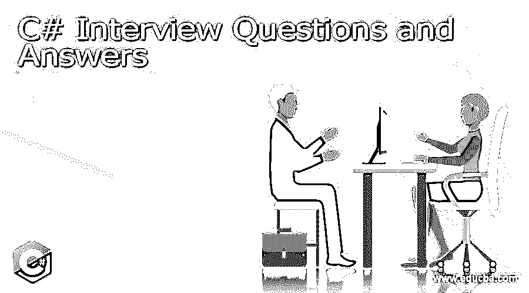

# C#面试问答

> 原文：<https://www.educba.com/c-sharp-interview-questions-and-answers/>




## C#面试问答介绍

C#是一种面向对象的语言，由。Net 框架，并作为一种中间语言。它是类型安全的托管语言。它被许多操作系统使用，因此你必须对这种语言有很深的理解。它的需求量很大，由于它的多功能性，它可以支持许多操作系统。

所以你终于在 C#中找到了你梦想的工作，但是想知道如何破解 2022 C#面试，以及可能的 C#面试问题。每次面试都不一样，工作范围也不一样。牢记这一点，我们设计了最常见的 C#面试问题和答案，以帮助您在面试中取得成功。

<small>网页开发、编程语言、软件测试&其他</small>

下面是几个 2022 C#面试中被问到的问题，会帮助你详细理解 C#。这个问题分为两部分如下:

### 第 1 部分–c#面试问题(基础)

第一部分涵盖了基本的 C#面试问题和答案

#### Q1。什么是托管和非托管代码？

**答:**
托管代码在[执行。Net 平台](https://www.educba.com/what-is-dot-net/)。它将 CLR(公共语言运行时)用于基于该平台的所有应用程序代码。之所以说它是托管的，是因为 of.Net 框架使用内部垃圾收集器来清除未使用的内存。
另一方面，非托管代码代表由应用程序运行时在除 than.Net 框架之外的任何其他框架上执行的代码。应用程序在运行时会考虑内存、安全性和其他与性能相关的因素。这是面试中被问到的基本 C#面试问题。

#### Q2。C#中有哪些不同类型的类？简单解释一下每节课？

**答案:**
c#中有四种类型的类。分别是:
1) **静态类:**这个类不允许继承。这个类中的成员是静态的，用关键字 static 表示。当使用这个关键字时，编译器会检查静态类的意外实例(如果有的话)。
2) **抽象类:**这个[类用关键字 Abstract 表示](https://www.educba.com/abstract-class-in-c-sharp/)。这些类的对象不能被实例化。该类只能被继承，并且必须至少包含一个方法。
3) **密封类:**该类不能继承。要访问该类的对象，应该创建。它是使用关键字 Sealed 创建的。
4) **分部类:**一个类可以用关键字 Partial 表示为 this one。它有助于其成员被多个。cs 文件。

让我们继续下一个 C#面试问题

#### Q3。什么是 C# I/O 类？哪些是常用的类？

**答案:**
C#采用系统。IO 名称空间，由执行各种操作(如创建、删除、打开、关闭等)的类组成。常用的 I/O 类有:

*   **文件:**帮助对文件执行各种操作。它有助于文件的创建和操作。
*   **StreamWriter:** 用于向流中写入字符。
*   **StreamReader:** 用于从流中读取字符。
*   **StringWriter:** 用于将字符串写入缓冲区。
*   **StringReader:** 用于从缓冲区读取字符串。
*   **路径:**当用户想要执行与路径相关的操作时，可以使用该选项。

#### Q4。解释 StreamReader/ StreamWriter 类？

**答案:**
这是面试中常见的 C#面试问题。这两个类都属于名称空间 System.IO。当用户想要分别读取或写入字符、基于读取器的数据时，会使用这两个类。
StreamReader 类包含的成员有:close()、read()、Readline()。
StreamWrier 类包含像 close()、write()、writeline()这样的成员。

```
Class Program1
{
using(StreamReader sr = new StreamReader("C:\ReadMe.txt")
{
//----------------code to read-------------------//
}
using(StreamWriter sw = new StreamWriter("C:\ReadMe.txt"))
{
//-------------code to write-------------------//
}
}
```

#### Q5。解释一下装箱和拆箱的概念？

**答:**
当一个值被转换为引用类型时，它被称为装箱。

**举例:**

```
Int value -= 20;
//-----------Boxing------------//
Object boxValue= value;
```

这里，boxValue 引用“值”。从引用类型转换回值类型被称为取消装箱。这种转换是显式完成的。

**举例:**

```
//————UnBoxing——————//
int UnBoxing = int (boxedValue);
```

取消引用到原始值的装箱。

### 第 2 部分–c#面试问题(高级)

现在让我们来看看高级 C#面试题。

#### Q6。什么是正则表达式？写一个正则表达式来查找一个字符串。

**答案:**
正则表达式模式将模板匹配给定的一组输入。这些模式可能包含运算符、字符、符号等。当用户想要解析字符串或替换字符串中的一个或多个字符时，使用 Regex。它可以用来在给定的文件或输入中查找任何类型的模式。

**举例:**

```
static void Main(string[] args)
{
string[] lang = { "C#", "Python", "Java" };
foreach(string s in lang)
{
if(System.Text.RegularExpressions.Regex.IsMatch(s,"Python"))
{
Console.WriteLine("Match found");
}
}
}
```

在这个例子中，Python 中搜索的语言在给定的数组中。正则表达式。这里使用 IsMatch 来查找正确的匹配。只要找到给定的模式，它就返回 true。任何正则表达式都可以用来查找输入中的特定匹配。

#### Q7。有哪些不同类型的代表？

**答案:**
不同类型的代表有:

*   **单个委托:**当一个委托调用一个方法时，它就是一个单个委托。
*   **多播委托:**当一个委托调用多个方法时，它就是一个多播委托。用户可以使用+和–运算符来订阅和取消订阅。
*   通用委托:通用委托有三种类型。它们是动作、函数和谓词。
    *   动作:使用动作关键字替换委托和事件的定义。它定义了一个可以在参数上调用的方法，并且不返回结果。
    *   func——这个委托帮助定义一个可以调用参数并返回结果的方法。
    *   谓词:它定义了一个可以调用参数的方法，并且总是返回 bool 值。

让我们继续下一个 C#面试问题。

#### Q8。解释事件中的发布者和订阅者？

**答案:**
这个类发布一个不同类型的其他类的消息。这条消息只会是一个事件。当事件成功运行时，会生成该消息。如果一个事件运行，那么依赖于它的其他类会收到这个消息。
订阅者接收他们感兴趣的消息，并希望获得更新。当任何事件成功运行并且订户需要关于它的信息时，订户将获得该特定事件的消息。

#### Q9。什么是 Get 和 Set 访问器属性？

**答案:**
这是面试中经常被问到的 C#面试问题。这些访问器由属性使用。这些属性使用户能够对私有字段读写值。为了确保这些字段是私有的，使用了访问器。Get property 用于返回属性的值。set 访问器用于设置属性的值。

#### Q10。解释一下 Thread 类的一些性质？

**回答:**
线程类的属性有:
1)**:is alive:**当线程活动时包含 True
2)**Name:**返回线程的名称
3) **Priority:** 返回任务集的优先级值
4) **ThreadState:** 描述线程的状态。

### 推荐文章

这是一个 C#面试问答列表的指南。这里我们列出了面试中常见的 10 个面试问题和答案，并给出了详细的回答。您也可以阅读以下文章，了解更多信息——

1.  [Java 面试题](https://www.educba.com/java-interview-questions/)[](https://www.educba.com/ab-initio-interview-questions/)
2.  [从头开始面试问题](https://www.educba.com/ab-initio-interview-questions/)
3.  [Linux 面试问题](https://www.educba.com/linux-interview-questions/)
4.  [反应本土面试问题](https://www.educba.com/react-native-interview-questions/)


