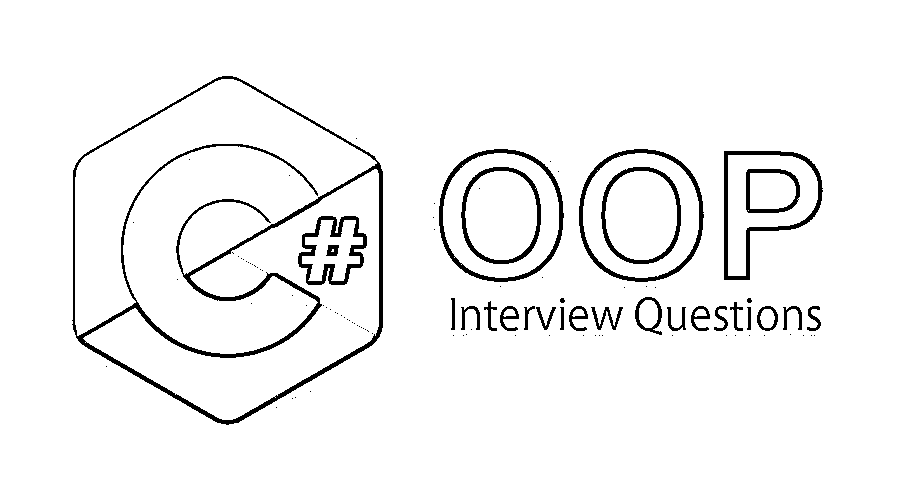

# C# OOP 面试问题

> 原文：<https://www.educba.com/c-sharp-oop-interview-questions/>




## 简介 C# OOP 面试问答

C#是一种面向对象、函数式、通用和面向组件的编程语言。它用于构建各种应用程序，尤其擅长构建 Windows 桌面应用程序和游戏。 [Web 开发](https://www.educba.com/web-development-interview-questions/)也可以用 C#高效地完成，它在移动开发中越来越受欢迎。因此，对于任何希望从事网页和游戏开发的程序员来说，这是一个极好的选择。它是一种静态类型的语言，所以编写的源代码在变成应用程序之前要经过彻底的检查。这是一门复杂的语言，学习和掌握它需要大量的时间。有各种各样的跨平台工具，允许用 C#编写的应用程序可以在移动和桌面上使用。

如果你想找一份与 C# OOP 相关的工作，你需要准备 2022 年 C# OOP 面试题。虽然每个面试都是不同的，工作范围也是不同的，但我们可以帮助你解决 C# OOP 面试中的一些问题和答案，这将帮助你迈出这一步，让你在面试中获得成功。

<small>网页开发、编程语言、软件测试&其他</small>

以下是 2022 年 C# OOP 面试中最常被问到的问题。这些最常被问到的问题分为以下两个部分:

### 第 1 部分–c# OOP 面试问题(基础)

第一部分涵盖了基本的 C# OOP 面试问题和答案

#### 1.接口和抽象类有什么区别？

**答案:**
下面列出一些区别:

*   一个[抽象类](https://www.educba.com/abstract-class-in-c-sharp/)可以有非抽象方法(具体方法),而在接口的情况下，所有方法都必须是抽象的。
*   抽象类可以声明或使用任何变量，而接口不允许这样做。
*   在抽象类中，所有的数据成员或函数默认情况下都是私有的，而在接口中，所有的数据成员或函数都是公共的，我们不能手动更改它们。
*   抽象类使用构造函数，而在接口中我们没有任何类型的构造函数。
*   一个类可以实现任意数量的接口，但是一个子类最多只能使用一个抽象类。

#### 2.什么是委托及其用途？

**答:**
委托对象是引用类型变量，用来保存对方法的引用。引用可以在运行时更改，它由委托的对象持有。一个委托对象可以保存许多函数引用，也称为调用列表，引用序列 FIFO 中的函数，我们可以在运行时通过+=操作符在此列表中引用新函数，并可以通过-=操作符删除。
委托特别用于实现事件和回调方法。所有委托都是从系统隐式派生的。委托类。

让我们进入下一个 C# [OOP](https://www.educba.com/advantages-of-oop/) 面试问题

#### 3.后期绑定和早期绑定有什么区别？

**答:**
在编译时多态或早期绑定中，我们会使用多个同名但参数类型不同的方法，或者可能是不同的参数类型，因此我们可以在同一个类中用相同的方法名执行不同的任务，这也称为方法重载。

```
public class TestData
{
public int Add(int a, int b, int c)
{
return a + b + c;
}
public int Add(int a, int b)
{
return a + b;
}
}
class Program
{
static void Main(string[] args)
{
TestData dataClass = new TestData();
int add2 = dataClass.Add(45, 34, 67);
int add1 = dataClass.Add(23, 34);
}
}
```

动态/运行时多态性也称为后期绑定。这里，方法名和方法签名(参数数量和参数类型必须相同，并且可以有不同的实现)。[方法覆盖](https://www.educba.com/method-overriding-in-c/)是动态多态的一个例子。

```
public class Drawing
{
public virtual double Area()
{
return 0;
}
}
public class Square : Drawing
{
public double Length { get; set; }
public Square()
{
Length = 6;
}
public override double Area()
{
return Math.Pow(Length, 2);
}
}
public class Rectangle : Drawing
{
public double Height { get; set; }
public double Width { get; set; }
public Rectangle()
{
Height = 5.3;
Width = 3.4;
}
public override double Area()
{
return Height * Width;
}
}
class Program
{
static void Main(string[] args)
{
Drawing square = new Square();
Console.WriteLine("Area :" + square.Area());
Drawing rectangle = new Rectangle();
Console.WriteLine("Area :" + rectangle.Area());
}
}
```

#### 4.如果继承的接口有冲突的方法名，会发生什么？

**答案:**
这是面试中常见的 C# OOP 面试问题。如果我们在同一个类中有冲突的方法，由于相同的名字和相同的签名，我们不能在同一个类中独立地实现它们的主体，所以我们必须在方法名之前使用接口名来消除这种方法混淆。

```
interface testInterface1 {
void Show();
}
interface testInterface2 {
void Show();
}
class Abc: testInterface1,
testInterface2 {
void testInterface1.Show() {
Console.WriteLine("For testInterface1 !!");
}
void testInterface2.Show() {
Console.WriteLine("For testInterface2 !!");
}
}
 5\. What are the different ways a method can be overloaded?
```

**答:**
方法重载是编译时多态性的另一个名称，在这里我们可以创建一个名称相同但签名不同的方法。这是在编译时完成的，我们可以用多种方法来完成，但是方法名保持不变。

许多参数可以不同。
参数类型可以不同。
参数的顺序可以不同。

**示例—**

```
static int volume ( int x ){
return (x * x * x);
}
static double volume (float f, int i){
return 3.14 * f * f * I;
}
static long volume (long l, int b, int n){
return l * b * h;
}
```

### 第 2 部分–c# OOP 面试问题(高级)

第一部分涵盖了高级 C# OOP 面试问题和答案

#### 6.什么是可访问性修饰符，C#中有多少个？

**答:**
访问修饰符是用来指定一个成员或者一个类型声明的可访问性的关键字。在 C#中，有几种类型的访问修饰符。

public–对访问公共成员没有限制。
Private–类定义中的受限访问，如果没有指定，则这是默认设置。
Protected–访问被限制在类定义和从该类继承的任何类内。
内部——访问仅限于当前项目定义的类
受保护的内部——成员可以在同一程序集中的任何地方访问，也可以通过继承该类来访问，但只能在派生类中的程序集外访问。

#### 7.C#中什么是虚方法？

**答案:**
虚方法是可以在派生类中重新定义的方法。虚方法在基类中有一个实现，并且是从类派生的。当一个方法的基本功能是相同的，但有时在派生类中需要更多的功能时，就使用它。虚拟方法是在基类中创建的，可以在派生类中重写。我们使用[虚拟关键字](https://www.educba.com/virtual-keyword-in-c-sharp/)在基类中创建一个虚拟方法，并使用 override 关键字在派生类中重写该方法。
当调用一个虚拟方法时，检查对象的运行时类型是否有一个覆盖成员。调用最大派生类中的重写成员，如果没有派生类重写该成员，该成员可能是原始成员。默认情况下，方法是非虚拟的。我们不能重写非虚方法。

让我们继续下一个 C# OOP 面试问题

#### 8.C#中如何避免 NULL？

**答案:**
Null 不是宾语。我们可以有一个类，但是一个空值的变量意味着它没有指向任何对象。我们可能会遇到一段包含许多条件语句的代码，这些语句会检查变量值是否为空。让我们检查一个静态方法:

```
public static string DisplayUpperString( string s ){
string upper = string.Empty;
If( s == null ) {
upper = null;
}
else {
upper = s.ToUpper();
}
return upper;
}
```

这段代码很好，把一个给定的字符串转换成大写。但是从面向对象的角度来看，考虑构造一个不表示任何东西的对象，而不是评估它是否为空。

```
public static String DisplayUpperString ( PossibleString s ){
string upper = s.ToPossibleUpper();
return upper;
}
```

现在，函数不那么混乱，可读性更好，并且不再使用空值检查。

#### 9.C#中的扩展方法是什么，如何使用它们？

**答案:**
这是面试中经常被问到的 C# OOP 面试问题。扩展方法是一种特殊的静态方法，但是调用它们时就好像它们是扩展类型上的实例方法一样。此方法使您能够向现有类型添加方法，而无需创建新的派生类型、重新编译或修改原始类型。只有在使用 using 指令将命名空间显式导入源代码时，扩展方法才在范围内。

#### 10.“this”关键字可以在静态方法中使用吗？

**答案:**
由于“this”关键字返回的是一个类的当前实例的引用，所以我们不能在静态方法内部使用这个。和静态成员在没有该类的任何实例的情况下存在，并使用该类的名称而不是实例来调用。因此，我们可以说“this”关键字是一种特殊类型的引用变量，它被隐式定义在每个构造函数和非静态方法中，作为定义它的类型类的第一个参数。

### 推荐文章

这是一个 C# OOP 面试问题和答案列表的指南。这里我们列出了最有用的 10 组面试问题，这样求职者就能轻松应对面试。您也可以阅读以下文章，了解更多信息——

1.  [Hadoop 管理员面试问题](https://www.educba.com/hadoop-admin-interview-questions/)
2.  [星火面试试题](https://www.educba.com/spark-interview-questions/)
3.  [从头开始面试问题](https://www.educba.com/ab-initio-interview-questions/)
4.  [计算机科学面试问题](https://www.educba.com/computer-science-interview-questions/)


